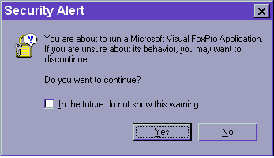
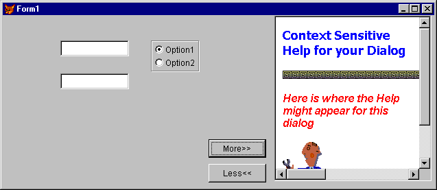
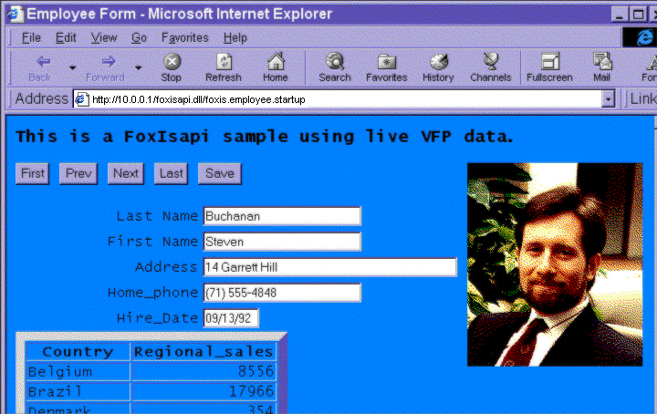

## "Ah, What a Tangled Web We Weave"

The Internet. Unless you've been hiding in a cave for most
of the past decade, you know that the Internet, and particularly the World Wide
Web, has captured the lion's share of the publicity in the computer world. What
is it about the Web that has attracted so much attention? What can we FoxPro
developers do to capture some portion of this market? And what *should* we do?

This is not a primer on the technologies of the
Internet&mdash;there are many fine books on that subject. Nor is it an in-depth
examination of the techniques needed to assemble a robust VFP Web-based
application&mdash;that's well covered in other volumes in the Essentials series,
which includes the fine volume you're reading now. Check out Rick Strahl's
awesome *Internet Applications with Visual
FoxPro 6.0,* and also *WebRAD: Building Database Websites with Visual
FoxPro and Web Connection*, by Harold Chattaway, Randy Pearson, and Whil
Hentzen, both available from Hentzenwerke Publishing. Our goal is to give you a
brief overview of the stuff that's involved, and then we'll dig into the stuff
you can do with Visual FoxPro.

### HTML is Just Text!

The idea behind the Web is that specially formatted, plain
old text can be used as the communication medium between any two computers. With
special formatting marks to designate relative font size, italics, font
strength, and so forth, each computer application can read the text and render
it in a means appropriate for its display device. The basic language involved
is Hypertext Markup Language, HTML. It consists of *tags*, usually in begin-end pairs, set off from the main text with
greater-than and less-than brackets, which set the format of the text between
them. Tags are typically reduced to a few mnemonic characters, so &lt;I&gt;
stands for italic and &lt;BR&gt; for line break. When paired, the ending tag
begins with a slash. So, text wrapped in the &lt;STRONG&gt; and &lt;/STRONG&gt;
tags appears as strong text (usually represented by bold).

Right away, you should be realizing that HTML itself is
pretty plain vanilla, and that, if text manipulation is all that's involved,
well, Visual FoxPro's textmerge capabilities, as well as functions like
`StrToFILE()`, make VFP an ideal language for generating HTML. True enough. But
wait, there's more ...

HTML was designed as a language primarily to let viewers on
different computers with different capabilities see a document as similarly as
could be rendered by their software and hardware. HTML serves adequately as a
markup language for generating static pages. It isn't a typographer's dream,
being limited to a few relative font sizes and a couple of simple
enhancements&mdash;bold, italic and so forth. In addition, basic HTML supports simple
input via text boxes, command buttons, option buttons and combos. But that's
about the limit of the language. In order to get much further than that, you
need to look into extensions to the basic language and into scripting
languages.

We love standards. That's why we have so many. HTML is no
exception. Over its short lifetime, it has gone through a number of revisions,
with version 4.01 the currently accepted standard. HTML was reformulated to
include many of the rules within the eXtensible Markup Language, XML, resulting
in XHTML 1.0. 

It's important that you know what your customers will be
using to access your Web pages so you can ensure that your pages don't present
content your customers can't read. Different browsers and different versions of
the same browser support different versions of HTML and the various extensions.
HTML 4.01, XML 1.0, and XHTML are the latest in languages and standards&mdash;if
you're dealing with an in-house application, or can limit your customer base to
those with the latest compatible browsers, this is what you'll want to code in.
But plan on testing, testing and more testing, as every variation may work
differently. For example, Internet Explorer 5.x on the Macintosh platform is
very nearly 100% standards-compliant, while IE 5 on Windows platforms widely
missed the mark. 

### Script Me a Part

The technologies discussed to this point generally have more
to do with static layout. For more sophisticated work than layout, enter
scripting languages. Scripts are blocks of code in HTML that run within their
interpreter. Java, JavaScript (no relation), VBScript and ECMAScript (the
European Community standard of JavaScript) are among the more popular. These
scripts perform many of the interesting things that go on within a displayed
page, such as highlighting areas as the mouse floats over them. Scripts can be
client-side&mdash;that is, run in the user's browser&mdash;or server-side, running on the
Web server to modify the HTML before it's sent to the client browser.

There are a bunch of scripting languages, and they present
many of the same compatibility issues as do the varied versions of HTML. Java
is considered to be the "universal" language for browsers. Developed
and licensed by Sun Microsystems, Java took the world by storm a few years ago.
We're a little envious of the Java language, because it was built from the
ground up as a new language with the latest technological bells and whistles
and none of the baggage of supporting legacy applications that many languages
suffer from today. At the same time, it's faced great challenges in being
developed to run within a Java Virtual Machine (JVM) on any number of otherwise
incompatible platforms, running on each platform securely and efficiently.
Quite a task. With Java, Sun likes to claim you can "Code once, run
everywhere." If you are coding an application for a limited number of
platforms, Java may be the leading choice.

Whether Java is or is not included with Microsoft platforms
is the ping-pong ball of the moment. Microsoft and Sun have been batting things
back and forth in court for most of a decade, with Sun claiming that Microsoft
is trying to destroy Java's universality with proprietary extensions, and
Microsoft counter-claiming that Sun doesn't really mean to allow licensing of
the platform. If it doesn't come pre-installed on your clients' machines, you
can count on being able to download Java from Sun's site at <a href="http://java.sun.com/" target="_blank">http://java.sun.com</a>. 

### Serve It Up!

Okay, you've got some idea of what you want to present and
what languages you'll use to present it. Now, how do you get that cool Web site
up onto that World Wide Web? First, obviously, you need a connection into the
Internet. While many larger firms have full-time Internet access in-house, a
number of smaller firms depend on an outside vendor, an Internet Service
Provider (ISP), to host and maintain their Web sites. Choosing whether to use
an ISP or supporting a Web server in-house is primarily an economic decision,
but whichever way you go, make sure the server you are using can support the
server-side work you'll want to perform. Many ISPs run their machines on UNIX
or other operating systems that won't support FoxPro runtimes or ISAPI
interfaces. Others have a policy against anything but Active Server Pages
(ASP). Make sure you find an ISP who understands what FoxPro is, or is willing
to let you rent a machine and do whatever you want on it. Everyone's policies
are different, so shop around.

In a typical Web site scenario, clients connect to your Web
site, requesting a particular Web page via a Uniform Resource Identifier (URI).
Your server receives this request, finds the specified page, and returns it.
The actual mechanism for finding the page depends on the request. If it was
just for "somepage.html", the server may just pull a static page off
disk. If the request includes specific keywords, it triggers the server to run
certain programs and return the HTML those programs generate. Like every other
aspect of Web technology we've talked about so far, yes, there are many
techniques to choose from, and yes, different solutions have advantages and
disadvantages, compatibility issues and limitations.

As we've said before, we can't possibly go into all of the
details of all the ways a server can interact with data, but here are some
basics to give you an idea of what's out there. 

CGI&mdash;Common Gateway Interface&mdash;really is the common way to
interact with Internet servers. You've probably seen "cgi" in URIs
while browsing the Internet. CGI is a standardized interface to communicate
with servers&mdash;you can count on it being available on pretty much any server out
there. If your site is hosted on an ISP, there's very little chance this
interface is not supported, whether they run IIS on Windows NT or the Apache
server on Linux, or JoeBob's WonderServer on some operating system you've never
heard of. 

ISAPI, the Internet Server Application Programming
Interface, is a proposed Microsoft standard; it requires a far more intimate
connection between the application and the server. CGI scripts run as
individual executables for each request made of the server, potentially bogging
down the server under very heavy traffic. ISAPI is a single DLL running in the
server's space, and is capable of handling multiple requests and queuing
results. While performance may be improved by eliminating inter-application
communication and multiple EXE startups, you trade this for a DLL capable of
crashing the server if it misbehaves. ISAPI interfaces (yes, that's redundant)
are supported by more than a dozen commercial and open-source Web servers.

### What Does the Fox Do?

Okay, by now we expect you're totally dazzled and frazzled
on this whole Internet thing. There are clients and servers, scripts and
protocols, lots of things to consider. But FoxPro's end of this thing is pretty
simple: Generate HTML and XML. That's easy. Here's a trivial sample to generate
an HTML document:

```foxpro
* MakeHTML
 
SET TEXTMERGE ON TO main.html NOSHOW
\<HTML>
\<HEAD>
\<META NAME="Generator" CONTENT="Microsoft Visual FoxPro">
\<META NAME="Date" CONTENT="<<DATETIME()>>" >
\<TITLE>Demonstration HTML</TITLE>
\</HEAD>
\<BODY>
\<H1> This is a demonstration of HTML </H1>
\</BODY>
\</HTML>
 
SET TEXTMERGE OFF
SET TEXTMERGE TO
```
This program generates a small file named Main.HTML, which
displays "This is a demonstration of HTML" in large letters, when
opened in a browser. Ho-hum. It's hard to get clients to pay you for this sort
of stuff. But notice the seventh line of the routine, where `DATETIME()` is
automatically evaluated by the textmerge process, as part of generating the
text file. No, clients won't pay you for the time of day, either (though we
hope they'll give you the time of day), but they will pay you for converting
their data into HTML, and that's exactly what you can do with Fox and textmerge
(or Fox and XML; more on that in a moment).

There are two things the client might want to consider, with
two different solutions and levels of difficulty and expense. If the client is
interested in posting information on its Web site in "real enough
time" (last month's sales figures, a list of items in inventory,
relatively static information), it probably makes sense to consider generating
the static information offline and transferring it to the Web server as Web
pages. If, on the other hand, the client needs information online and
up-to-date, FoxPro is up to working as part of an online Web service. We'll
look at both of those options in the next few sections.

We'll take on the static items first&mdash;the capability of
generating HTML for transfer to a Web site. Then, we'll look at the options for
generating HTML live and on-demand.

### "Save as HTML" Menu Option

You may have noticed that, starting in VFP 6, the File menu
has the welcome addition of a Save As
HTML option, but it seems to be disabled much of the time. This option
is available only while creating or modifying menus, forms or reports, but much
of the underlying engine is available to developers at any time. Let's take a
look at what it does first, and then look at the how.

When editing a menu, selecting Save As HTML generates a file
listing all prompts and messages for the menu. We're really not sure why. We can't
see a lot of use for such a thing, unless a developer was then to go in and
edit all of the HTML into links to various parts of the application. But it
doesn't strike us as a particularly appealing user interface.

With a form, the Save As HTML option generates an HTML file
that closely matches the layout of the original form. When translating a
program from network-based VFP runtimes to an Internet-based Web design, we can
see this as an attractive step. However, the Save As option doesn't support a number
of VFP controls: Container, Grid, Image, Line, PageFrame, Shape or Spinner. For
those, you have to go in and edit the generated HTML manually to get what you
want, or consider writing your own modifications to the supplied GenHTML. 

The Save As HTML option also works for reports: The option
appears to generate an ASCII output file and then converts that by adding the
required HTML headings, wrapping &lt;PRE&gt; formatting tags around the
displayed text, and converting spaces to their equivalent non-breaking spaces
by adding the code &amp;nbsp;. The ugly &amp;nbsp; codes take up a lot of space
and probably aren't necessary if the reports already use a non-proportional
font&mdash;the default seems to set it to Courier.

How do these functions work? Setting a breakpoint on `PROGRAM()
= "GENHTML"` gives it away. Each of these options calls the program
set in `_GENHTML`; by default, it's GenHTML.PRG in the VFP home directory.

### The Magic of GenHTML

With code like this, there's no need for comments&mdash;NOT!

```foxpro
oSaveEnvironment=NEWOBJECT("_SaveEnvironment")
lcProgramPath=JUSTPATH(LOWER(SYS(16)))+"\"
lcHTMLVCX=IIF(VERSION(2)=0,"",HOME()+"FFC\")+"_HTML.vcx"
lcOutFile=IIF(VARTYPE(tcOutFile)=="C",LOWER(ALLTRIM(tcOutFile)),"")
IF NOT EMPTY(lcOutFile) AND EMPTY(JUSTEXT(lcOutFile))
   lcOutFile=FORCEEXT(lcOutFile,"htm")
ENDIF
lnShow=IIF(VARTYPE(tnShow)=="N" OR ;
       VARTYPE(tnShow)=="I",MIN(MAX(INT(tnShow),0),5),0)
lcSourceVarType=VARTYPE(tvSource)
```
We suspect GenHTML is a slick and elegant program with a whole bunch of real cool features. We say "suspect" instead of "know" because no one but the whiz kids at Microsoft who wrote it have a clue what it does! There's a lovely header at the beginning of the file that describes the various parameters that can be passed to the function, and we suspect that with a few months of testing and tweaking, we will find GENHTML to be a handy tool. But, our past few months have been spent documenting the other 1,575,498 topics for this book. We hope some other hackers will come along and do the same for this tool.

We can see some real power in this tool and wish it were
better documented. 

A few hints: The program uses the various _HTM* classes that
are part of the FoxPro Foundation Classes found in `HOME()+"\FFC"`. It
also depends upon styles and directives stored in GenHTML.DBF in the FoxPro
root directory. Good luck, spelunkers! Let us all know what you find!

But FoxPro is going to interact with the Internet in many
more ways than just being a passive server of text data! First, we anticipate
the need to have our applications call up a browser directly. We also can see
situations where our application may be running *within* a browser. The Hyperlink control, covered next, solves the
first problem, while Active Documents and the remainder of this section look at
various ways we can interact live with the Internet.

### HyperLink Control

The HyperLink control can be placed on a FoxPro form or
within a FoxPro class in order to access the Web by passing an address to its
Navigate method. We can see many good uses for these, such as linking tech
support information on Help or About forms directly into your technical support
Web site. Other uses include providing additional navigation within Active
Documents, or starting up a browser to display other information&mdash;see "HTML
is Not Just for Web Pages Anymore!" below.

### Active Documents

Active Documents were all the rage when the Fox team started
putting together the list of goodies for Visual FoxPro 6. "Tahoe," as
it was known in those days, would have Active Documents as well, catching up with
the ActiveDocs of Visual Basic 5.0. Not only that, but ActiveDocs in Visual
FoxPro would not just be VFP forms running in a browser, but entire Visual
FoxPro *applications,* capable of doing
everything their network-bound apps could do.

Well, it sounded good in theory. And in fact, Active
Documents have some remarkable features. But don't give up your favorite HTML
editor just yet&mdash;ActiveDocs are not going to become the Next Big Thing on the
Internet. The good news is that a properly constructed VFP application that can
run as a stand-alone network application can also run as an ActiveDoc. With
careful negotiation with its hosting browser, the app can share menu items and
give the browser clues as to how to handle various requests from the user.

The bad news? First, Active Documents have no special way to
handle data. They require a network connection to the data just like regular
applications. Without a special means of transferring data over HTTP, such as
ADO or streams of XML, these applications must have some sort of a network
attachment to the data source. If your users are willing to set up a bunch of
network mappings while they're on the Internet, it is feasible to use
ActiveDocs over the Internet, but what's the point? You can do the same thing
without the browser container, and with a little less overhead. Finally, and
perhaps more importantly, running an ActiveDoc is the same as running a FoxPro
executable&mdash;the client workstation needs to have the FoxPro runtime files
loaded. Very few casual browsers to your site are going to be interested in a
multi-megabyte download. On the other hand, customers who could gain
significant benefit from this, or "roaming users" who can be
configured in the office before going on the road, could find this mechanism to
be a useful one.



#### Figure 1-1: Is there an app whose behavior you are sure of?

We can live with the warning the application gives us on
startup (shown in Figure 1-1), rude as it is. But without a means of transferring
data or running on client machines without the VFP runtime, ActiveDocs have
ended up as curiosities used only in a few very specialized applications. They
certainly haven't had the general usage we hoped they would.

### Web Publishing Wizard

We often think of wizards as simplistic programs with few
options that generate basic documents, but usually not as tools powerful enough
to use for "real" production work. The Web Publishing Wizard may be
the exception that proves this rule. This cool tool lets you pull data from the
application of your choice and generate HTML to display it as you wish. In
addition, the wizard can generate a PRG to re-create the HTML on demand with
updated data. Cool!

This wizard is a pretty slick device. It starts out in the
usual fashion with the "pick a table, select your fields, select the
order" routine that most developers can do in their sleep. But in step 3,
the power of this little tool begins to shine. In addition to being able to
pick from a set of five data layout templates, you can apply one of 26 styles
to them. Each of the data layouts has an option dialog with a page frame full
of settings. Using the Advanced dialog, you can go even further, specifying a
Cascading Style Sheet, background image, or even additional HTML elements you
want to add to the page. Finally, step 3 also has a Preview button. Whew! This
page is like an applet unto itself, with three levels of modal dialogs
sometimes appearing. 

<table>
<tr>
  <td width="20%" valign="top">

  </td>
  <td width="80%">
  <p>Something happened in VFP 7. Selecting certain backgrounds in step 3 gives an error when previewing, but still generates a valid HTML document, just without the specified background. Also in step 3, selecting any of the tabular data layouts generates a page with code fragments in the place of the data.</p>
  <p>They all worked fine in VFP 6. </p>
  </td>
 </tr>
</table>

If you survive the gauntlet of step 3, you're almost done.
Step 4 gives you the usual "finish line" options of running the page,
viewing the code, or saving it for later. Choosing the last option saves code
that looks something like the following:

```foxpro
* -- Generated Web Wizard Script File -- 
*
* A unique record has been created in GENHTML.DBF with your settings.
* This record can be referenced by the ID specified in the 
* DO (GENHTML) command below.
 
LOCAL lnSaveArea
lnSaveArea=SELECT()
SELECT 0
 
SELECT Topic,Ngroup,Version FROM "E:\HACKFOX7\STATUS\ALLCANDF.DBF" ;
  ORDER BY Ngroup INTO CURSOR webwizard_query
 
IF EMPTY(_GENHTML)
  _GENHTML='GenHTML.PRG'
ENDIF
DO (_GENHTML) WITH "E:\HACKFOX7\STATUS\ALLCANDF.HTM",ALIAS(),2,,"_RXL0WSC1J"
 
IF USED("webwizard_query")
  USE IN webwizard_query
ENDIF
SELECT (lnSaveArea)
```
The Web Publishing Wizard offers us some really powerful
capabilities. By saving all of our preferences in the GENHTML table, the wizard
is, in effect, a What You See Is What You Get (WYSIWYG) editor for publishing
Fox data on the Web. Rather than settling for the feeble Select statement
generated by the wizard, we can substitute any generated query, filtered table
or parameterized view request to populate the source table, even perhaps
receiving our search parameters from another Web page. Then, we can leave it
all to GenHTML to format and generate the HTML.

A few cautions are in order. If you're using the Tabular
Hierarchical data layout, the Web page is generated with an ActiveX control
(the Tabular Data Control, Tdc.OCX) and a comma-separated value (CSV) version
of the table. You'll need to install the TDC on those client machines that
don't already have it, and make sure that you put the CSV file in a place
accessible to the Web site. Finally, for any of the Web pages, the wizard seems
to generate the graphics with unique names but leaves them in the
Wizards\Graphics\ subdirectory of the FoxPro home directory. Plan on moving them,
and updating the HTML, when installing them on your Web server.

Don't confuse FoxPro's Web Publishing Wizard with the
same-named Microsoft Web Publishing Wizard. The first is an application that
runs within FoxPro and gives us HTML and the PRGs to create them. The latter is
a program for uploading Web pages to a remote Web server. 

### HTML is Not Just for Web Pages Anymore!

Just because HTML was originally designed for Web pages
doesn't mean that its use should be restricted to that purpose. The Web browser
technology provides us with widgets that are ideal as viewers, not only as
stand-alone applications, but also as *components*
within our applications. For example, it's easy to put Internet Explorer right
on your form: Simply drop the Web Browser control on it. Two tricks are needed
to bind Internet Explorer to a VFP form: Ensure that VTable binding is off
(it's the default, but issue `SYS(2333)` if you've tinkered with the setting) and
add `NODEFAULT` to the `Refresh` method of the control. Then, you can call the
control's `Navigate2()` method and pass it the URI you want it to display. The
URI does not have to be a Web page&mdash;it can be an HTML page on a local disk
(called with the FILE:// protocol), a GIF or JPG, or any file for which a
viewer add-on has been installed&mdash;you could let the user preview Word documents,
Acrobat files, or any other files with viewers available. Figure 1-2 should
give you some ideas.



#### Figure 1-2: A Web Browser control added to your form gives you the ability to display richly formatted materials within your forms.

### FoxISAPI

Buried deep down in the samples is the FoxISAPI sample&mdash;check
under HOME(2) + "Servers\Foxisapi." This provides yet another newer,
more modern way to access Fox logic from the Web. Unlike many Microsoft
technologies, though, this one is available from other Web server vendors as
well. The idea behind ISAPI is that a product that runs in the same process
space as the Web server itself can eliminate much of the interprocess communication
overhead of a Web application.

FoxISAPI.DLL runs within the Web server and it talks to
FoxPro Automation servers. Two server samples are included. There's FoxWeb, a
simple demonstration of Automation in code. Then there's FoxIS, a pretty slick
sample of how an Automation server can have both a FoxPro front end and
generate HTML for a Web-based view. It uses the classic employee table example,
but the Web interface is pretty impressive. (See Figure 1-3.) Studying the
source code can give you lots of ideas about how to implement similar
technologies to solve your own problems. You can use the FoxISAPI.DLL as a tool
for your own custom FoxPro Web server applications.



#### Figure 1-3: The FoxISAPI sample pulls out all the stops to demonstrate VFP as a legitimate Web server database engine.

Make sure to read the section of the VFP Help file titled
"FoxISAPI Automation Server Samples" in order to understand all the
capabilities of this cool tool.

### XML: Made for Data

We've mentioned XML a little in this chapter, but it deserves more ink. XML seems to be everywhere. It's prominent in the marketing of VFP 7.0. So what's the big deal? It's the hottest technology for moving data across the Internet, mostly because it has been nearly universally accepted. 

Like HTML, XML is just text. Specially formatted text, in a standard format (or one of several formats, as we'll see below) allows data to be transmitted to other systems&mdash;systems that might be running completely different operating systems or languages&mdash;in an easy-to-read manner. XML can easily be integrated into HTML applications, and fits just as well in the components of any application that need to receive or send data to other components. 

Let's look at a small XML document, in the element-centric XML format:

```foxpro
<?xml version = "1.0" encoding="Windows-1252" standalone="yes"?>
<VFPData>
  <products>
    <product_id>1</product_id>
    <prod_name>Chai</prod_name>
    <eng_name>Dharamsala Tea</eng_name>
    <no_in_unit>10 boxes x 20 bags</no_in_unit>
    <unit_price>18.0000</unit_price>
    <unit_cost>16.3800</unit_cost>
    <in_stock>39.000</in_stock>
    <on_order>0.000</on_order>
    <reorder_at>10.000</reorder_at>
    <discontinu>false</discontinu>
  </products>
  <products>
    <product_id>2</product_id>
    <prod_name>Chang</prod_name>
    <eng_name>Tibetan Barley Beer</eng_name>
    <no_in_unit>24 - 12 oz bottles</no_in_unit>
    <unit_price>19.0000</unit_price>
    <unit_cost>17.2900</unit_cost>
    <in_stock>17.000</in_stock>
    <on_order>40.000</on_order>
    <reorder_at>25.000</reorder_at>
    <discontinu>false</discontinu>
  </products>
</VFPData>
```
The first line is the declaration. While this is optional,
it is highly recommended, because it identifies the document as an XML
document.

You might recognize the rest of the file as data from the
first two records in the Products table from the VFP sample data (in fact, this
example was built from the Products table using the `CURSORTOXML()` function
added in VFP 7). We, as database geeks, plainly see this as a depiction of a
table, with rows and fields delimited by pairs of appropriately named
delimiters. We see the &lt;products&gt; and &lt;/products&gt; pair of
delimiters separating rows, while the fields have delimiters named after their
field names.

XML sees this as a series of elements. Each element has
delimiters. There must be one root element, and in this example, it's named
VFPData. Note that all delimiters are case-sensitive. The convention is to
always use lowercase to avoid case-sensitivity issues, but for some reason,
VFP's `CURSORTOXML()` function names its root element in camel case. It really
doesn't matter, so long as the case is consistent throughout the document.

While this isn't exactly a compact method of describing data,
because it is entirely text, it makes it easy for developers to look at the
data and debug it. Besides, disk space is cheap, and you can zip the file
before sending, and unzip it upon receipt, or use other techniques to save
bandwidth. XML is designed to send small packets of data&mdash;say, enough to fill an
HTML table on a Web page&mdash;quickly over the wire in a standardized, easy-to-parse
format.

What this gives us is a series of elements that have names,
and, just as we can extract rows and fields from tables in VFP, we can extract
the named elements from the XML data.

There are actually three kinds of XML formats. The first is
the element-centric format, shown above. There's also an attribute-centric
format, and a raw format. The attribute-centric format is a little more
compact, and uses attributes within the tags. These attributes correspond to
what we consider as fields:

```foxpro
<?xml version = "1.0" encoding="Windows-1252" standalone="yes"?>
<VFPData>
    <products product_id="1" prod_name="Chai" eng_name="Dharamsala Tea"   
    no_in_unit="10 boxes x 20 bags" unit_price="18.0000" 
    unit_cost="16.3800" in_stock="39.000" on_order="0.000" 
    reorder_at="10.000" discontinu="false"/>
    <products product_id="2" prod_name="Chang" eng_name="Tibetan Barley 
    Beer" no_in_unit="24 - 12 oz bottles" unit_price="19.0000" 
    unit_cost="17.2900" in_stock="17.000" on_order="40.000" 
    reorder_at="25.000" discontinu="false"/>
</VFPData>
```
Notice that all elements are formatted as strings, even if
they represent numeric data. The last format is the raw format. It's very
similar to the attribute-centric format, except that the tag is always named
"row."

```foxpro
<?xml version = "1.0" encoding="Windows-1252" standalone="yes"?>
<VFPData>
  <row product_id="1" prod_name="Chai" eng_name="Dharamsala Tea"
  no_in_unit="10 boxes x 20 bags" unit_price="18.0000" 
  unit_cost="16.3800" in_stock="39.000" on_order="0.000" 
  reorder_at="10.000" discontinu="false"/>
  <row product_id="2" prod_name="Chang" eng_name="Tibetan Barley Beer" 
  no_in_unit="24 - 12 oz bottles" unit_price="19.0000" 
  unit_cost="17.2900" in_stock="17.000" on_order="40.000" 
  reorder_at="25.000" discontinu="false"/>
</VFPData>
```
XML can also have a schema that explains the data contained
within the XML file. A portion of the schema for the Products XML examples
looks like this:

```foxpro
  <xsd:schema id="VFPData" xmlns:xsd="http://www.w3.org/2001/XMLSchema" 
       xmlns:msdata="urn:schemas-microsoft-com:xml-msdata">
    <xsd:element name="VFPData" msdata:lsDataSet="true">
      <xsd:complexType>
        <xsd:choice maxOccurs="unbounded">
          <xsd:element name="products" minOccurs="1" 
               maxOccurs="unbounded">
            <xsd:complexType>
              <xsd:attribute name="product_id" use="required">
                <xsd:simpleType>
                  <xsd:restriction base="xsd:string">
                    <xsd:maxLength value="6"/>
                  </xsd:restriction>
                </xsd:simpleType>
              </xsd:attribute>
              <xsd:attribute name="prod_name" use="required">
                <xsd:simpleType>
                  <xsd:restriction base="xsd:string">
                    <xsd:maxLength value="40"/>
                  </xsd:restriction>
                </xsd:simpleType>
              </xsd:attribute>
 
  [In the interest of brief examples, we've omitted
   the definitions for the attributes eng_name, no_in_unit,
   unit_price, unit_cost, in_stock, on_order, and reorder_at.]
              
              <xsd:attribute name="discontinu" type="xsd:boolean" 
                   use="required"/>
            </xsd:complexType>
          </xsd:element>
        </xsd:choice>
      </xsd:complexType>
    </xsd:element>
  </xsd:schema>
```
As you can see, the schema tells a lot about the structure of the XML file, including data type, whether it's required, and so on. Schemas can be inline with the XML file, or stored in an external file.

VFP 7 has added support for XML. `XMLTOCURSOR()` and `CURSORTOXML()` are the means to read and write XML strings. For communicating changes to buffered tables, look at `XMLUPDATEGRAM()`.

Want to do more with XML? Microsoft has a COM object, MSXML.DLL, that's Microsoft's interpretation of the XML Document Object Model (XMLDOM), an XML parser. It ships with Internet Explorer 5.0 and later; updates and documentation can be found at <a href="http://www.microsoft.com/xml" target="_blank">http://www.microsoft.com/xml</a>. XMLDOM parses XML strings (much like VFP's `XMLTOCURSOR()` function), and can be used to render the XML into a viewable HTML document.

### Web Services

Web Services are the latest and greatest way to program for
the Web. Web Services are integral to the .NET architecture, as applications
are built from a series of Web Services. But, Web Services aren't just for
.NET. They are a nicely defined way to distribute applications over the
Internet.

So, what's a Web Service? To cut to the chase, it's a
function that works on the Internet. OK, that's oversimplifying things a bit,
but to look at all the acronyms associated with Web Services, you'd think it
was some sort of complex, esoteric *something* that's so complicated that
only the brainiest of geeks can understand it. Not so. We've seen this kind of
intimidating jargon before: Think way back to programs, functions, methods, COM
objects, OCXs, DLLs ... these are all names for "some code that does
something." Now you can add *Web Service* to that list.

A Web Service has some specifications that differentiate it
from the other kinds of "code that does something." There are five
specifications:

1. It uses XML to represent data.
2. It uses Simple Object Access Protocol (SOAP) to define the way messages are
     exchanged. There are several parts to the SOAP specification, which
     include rules for representing data in XML, conventions for representing
     remote procedure calls, and bindings to the HTTP protocol.
3. It uses Web Services Description Language (WSDL) as a standard way to
     document what messages the Web Service can accept and generate (more
     terminology that basically means, "What functions can I call?").
     Think: Internet equivalent of a Type Library. 
4. A way to find out what Web Services are out there to be consumed (the
     technical term for "used"). There's a Discovery Protocol,
     nicknamed Disco (and we thought disco was dead!) that helps developers
     find services at a particular URI.
5. A way to tell others about your Web Service, since they might not know your
     exact URI. This mechanism is the Universal Description, Discovery, and
     Integration (UDDI) specification, where you can advertise your Web
     Service.

So, in a technical nutshell, a Web Service is a special kind
of program that uses enough acronyms so that your bowl of alphabet soup now
looks like it makes sense. To fully appreciate a Web Service, you need to see
one. There's a wonderful Web site, <a href="http://www.foxcentral.net/" target="_blank">www.foxcentral.net</a>,
which has all kinds of news for the FoxPro community displayed using Web
Services. It consumes various vendors' Web Services, and likewise, you can
consume its Web Services. This site has detailed explanations on consuming and
setting up a Web Service to access information from this site; it's a great
site to visit, not only for learning about Web Services, but also for keeping
abreast of the FoxPro community's news.

Web Services are the Next Big Thing in the programming
world, and you'll likely need to brush up on them if you're in a shop that's
moving to .NET (and you can tell your supervisor that you can write Web
Services in VFP 7, which shipped months before .NET was even at the Release
Candidate stage).

### Tell Me More, Tell Me More

When you're ready to know more about working with VFP and
the Web, there are plenty of resources out there. Before you leave the comfort
of your office, take a look at all the information that comes with FoxPro.
Check out the Solutions sample for good examples of Active Documents,
hyperlinks and HTML generation. Read through the documentation on HTML, the
wizards and the new XML capabilities of Visual FoxPro. If you're testing out
the servers, read through the documentation a few times, and make sure you do
your testing on a machine other than your production server. Until you have
mastered the intricacies of working with Web servers, it is likely you'll need
to start and stop the machine a few times, and you'll also want to make sure
you've worked the bugs out of updating data before you go live.

A browse through the Internet can give you more high-quality
materials on HTML, Web design and Web applications than we could possibly list
here. 

### Other Commercial Fox Application Tools

Finally, you need to realize that the tools Microsoft
supplies with Visual FoxPro most likely are missing some capabilities you will
need. The Web Publishing Wizard and the FoxISAPI samples are not intended as
end-alls and be-alls as much as demonstrations of technology&mdash;proof that the
ability to do the work of Web programming is present and feasible in Visual
FoxPro. In order to develop Web applications capable of supporting large
commercial applications, it's reasonable to look outside the Visual FoxPro box
for commercial applications or frameworks capable of providing many of the
foundation pieces and the key technical support needed to deliver world-class
applications.

Several vendors advertise in the FoxPro magazines and
frequent the FoxPro forums, newsgroups and Web sites. A simple search of the
Web will get you dozens of hits. Finally, there is life beyond Microsoft. We're
really not qualified to talk about a lot of it, but searches of the Web should
lead you to many other vendors with many nifty products to sell. Since FoxPro
comes with an OLE DB provider, and since an ODBC driver is still available (at <a href="http://msdn.microsoft.com/vfoxpro/downloads/updates.asp" target="_blank">http://msdn.microsoft.com/vfoxpro/downloads/updates.asp</a>
at press time), nearly any Web development environment should be able to access
FoxPro tables directly. With Visual FoxPro's capabilities for creating COM
components, you should be able to achieve mixed development environments that
include the business rules and processing you developed in FoxPro.

>We stand today on the edge of a new frontier&mdash; the frontier of the 1960s, a frontier of unknown opportunities and perils, a frontier of unfulfilled hopes and threats. ... The new frontier of which I speak is not a set of promises&mdash; it is a set of challenges.  
>&mdash;John F. Kennedy, July 13, 1960

The frontier of the Web may truly turn out to be as
earth-shaking a change as the changes of the 1960s. The promise of ubiquitous
access and the ability to gather information from widely disparate sources may
have a profound effect, not just on us nerds cranking code, but on the entire
civilization. Who'd have thought that PTAs and scout troops would have Web
sites and private discussion rooms, and would communicate almost exclusively by
e-mail? School kids, even as young as elementary school, can get their homework
from a Web site, and submit their assignments via e-mail (in Della's home,
e-mailing assignments has almost eliminated the problem of papers left at home,
and also works when the printer conveniently runs out of ink at 10:00 p.m.).
Teens now shun the phone, talking with their friends using instant
messaging&mdash;finally, parents can have the phone! But now we're negotiating with
our kids for computer time. We send e-greetings (great for procrastinators);
purchase items from computer accessories to groceries, gifts and even cars;
research topics for work, homework and hobbies; check the weather for our
destination as we book our travel; keep up with the news and our favorite
sports teams; all of this&mdash;and more&mdash;on the Internet. Magazines, television
commercials, the local news, and even cereal boxes are emblazoned with Web
sites, inviting us to find out more information. So far, it's a pretty
earth-shaking change on all of civilization. Just ask anyone how important it
is when their high-speed access line is down.