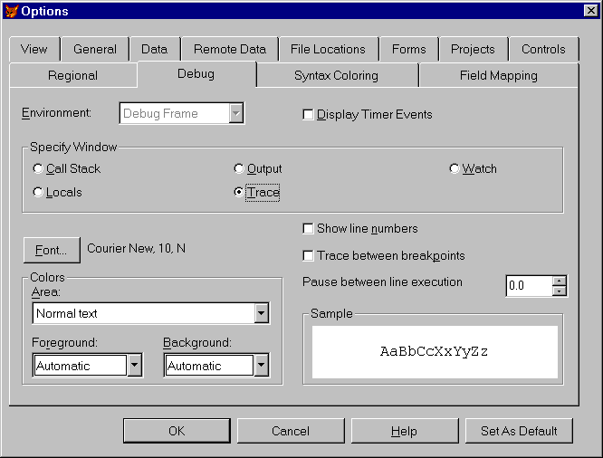
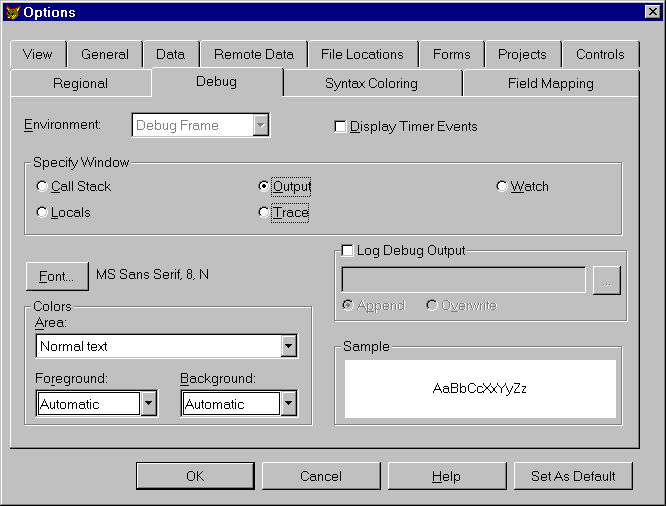

## Productive Debugging

>Error is a hardy plant: it flourisheth in every soil.  
>&mdash;Martin Farquhar Tupper, *Proverbial Philosophy*

Our programs run correctly the first time, every time. Yeah,
right&mdash;if you believe that one, we have a bridge in Brooklyn we'd like to sell
you. We figure we spend at least as much time debugging our programs as we do
writing them in the first place.

If your programs do run correctly the first time, every
time, you can skip this part of the book. In fact, you should write a book and
tell us how to do it. For the rest of you, we'll take a look at the kinds of
errors that occur in programs, give you some ideas on how to root them out, and
show how VFP can aid your efforts.

### "Whatever Can Go Wrong, Will"

>I will not steep my speech in lies; the test of any man lies in action.  
>&mdash;Pindar, *Olympian Odes IV*

Errors in programs fall into three broad categories. One of
them is pretty easy to find, the second usually isn't too bad, and the third is
the one responsible for most of our gray hairs (at least a few of those have to
be credited to our respective children).

The first group of errors, the easy ones, is the syntax
errors. These are the ones that come up because you typed "REPORT FROM
...", forgot the closing quote on a character string, and so on. These are
easy because FoxPro will find them for you if you ask. (In fact, VFP 5
increased the strictness of syntax checking so even more of them than before
can be found just for the asking.) In addition, the new VFP 7 enhancements to
the editor, such as IntelliSense and parenthesis matching, help you avoid quite
a few of these bugs. Here's a tip just for that forgotten closing quotation
mark: Set the syntax coloring for strings to something different (say,
magenta), and your strings magically turn magenta when you type the matching
quotation mark.

If you just start running a program, it crashes as soon as
an error is found. Not bad, but you can do better. Use the `COMPILE` command or
choose Compile from the Program menu, and FoxPro checks the whole program for
syntax errors and gives you an ERR file (with the same name as your program).
One shot and you can get all of these. The Build option in the Project Manager
gives you the same errors for all of the code within a project. We regularly
select Recompile All Files as an easy "smoke test" for the
project&mdash;just make sure to also check Display Errors to see the resulting ERR
file.

The next group is a little more subtle. We call these
"runtime errors" because they don't turn up until runtime. These
errors result from comparing variables of different types, dividing by 0,
passing parameters when none are expected, and so forth. They're things that
FoxPro can't find until it actually runs the code, but then they're obvious.
Again, your program crashes as soon as one of these turns up. 

Because you have to tackle them one at a time and you have
to actually execute a line of code to find an error in it, these are more
time-consuming to deal with than syntax errors. But they're manageable. In VFP
5 and later, they're even more manageable because you can use assertions to
test many of these things, so you can find them before VFP crashes. The task
gets easier again in VFP 6 because the Coverage Profiler can help you figure
out what's been tested, so you can test the rest.

The truly terrible, difficult errors are what we call
"correctness errors." Somehow, even though you knew what the program
was supposed to do and you carefully worked out the steps necessary to do it,
it doesn't do what it should. These are the errors that try programmers' souls.

Tracking down correctness errors requires a planned,
systematic, step-by-step attack. Many times, it also requires you to take a
fresh perspective on the symptoms you're seeing&mdash;take a break or ask someone
else to look at your code. (Tamar has solved countless correctness errors by
talking them out with her non-programmer husband. Ted's favorite method is to
try to explain the problem in a CompuServe message&mdash;invariably, two-thirds of
the way through explaining it, the problem explains itself.)

### Don't You Test Me, Young Man

>None but the well-bred man knows how to confess a fault, or acknowledge himself in an error.  
>&mdash;Benjamin Franklin, *Poor Richard's Almanac*, 1738

So now you can categorize your errors. So what? What you
really want to know is how to get rid of them.

Let's start with a basic fact. You are the worst possible
person to test your code. It's fine for you to track down syntax and runtime
errors, but when it's time to see if it works, anyone else will do it better
than you.

Why's that? Because you know how it's supposed to work.
You're going to test the system the way it's meant to be used. No doubt after a
little work, you'll get that part working just fine. But what about the way
your users are really going to use the system? What happens when they push the
wrong button? When they erase a critical file? When they enter the wrong data?

Understand we're not picking on you personally&mdash;we're just as
bad at testing our own applications. The psychologists call it
"confirmatory bias." Researchers find that a programmer is several
times more likely to try to show that a program works than that it doesn't.

So how can we avoid the problem? The answer's obvious: Get
someone else to test our code. That's what all the big companies do. They have
whole testing departments whose job it is to break code. If you're not a big
company, you could try what one of our friends used to do&mdash;he hired high school
students to come in and break his code. We've been known to sit our spouses or
kids down in front of an app and let them bang on it.

A second problem we've found is that clients are almost as
bad at testing as we are. Not only do they have an investment in the success of
the application, but very typically they hired you because they did not have
the resources to develop the application&mdash;they won't find the resources to test
it, either! The ideal situation is one in which the testing person's interest,
motivation and job description is to find flaws in the program.

No matter who's testing the code, you need a structured
approach to testing. Don't just sit down and start running the thing. Make a
plan. Figure out what the inputs and outputs should look like (or should never
look like!), then try it.

Here are some things you need to be sure to test (and it's
easy to forget):

* Every single path through the program. You need to figure out all the different branches and make sure every single one gets tested. Change your system date if you have to, to test the end-of-decade reporting features or what happens on February 29.

* Bad inputs. What if the user enters a character string where a number is called for? What if he enters a negative invoice amount? What if she tries to run end-of-month processing on the 15th?

* Extreme values. What happens if the patient was born on January 1, 1901? What if someone's last name is "Schmidgruber-Foofnick-Schwartz"?

* Hitting the wrong key at the wrong time. We've seen applications that crash dead when you press ESC.
In larger projects, you should generate a set of test data
right up front that handles all the various possibilities, and use it for
ongoing testing. It's easy to figure out the expected results once, then test
for them repeatedly.

With large projects, it's also much more likely for a change
in one place to cause problems in another. Plan for regression testing (making
sure your working system hasn't re-exposed old buggy behavior due to changes)
for these applications. Your test data really comes in handy here.

You need to test your error handler, too. The ERROR command
makes it easy to check that it handles every case that can occur, and then does
something sensible. When you design the error handler, keep in mind that every
new version of FoxPro that's come along has introduced new error codes&mdash;be sure
it's easy to add them.

### Harnessing your tests

>Thy horses shall be trapp'd,<br>
 Their harness studded all with gold and pearl.  
>&mdash;William Shakespeare, *The Taming of the Shrew*

Visual FoxPro 7 includes the Active Accessibility Test
Harness, so you can record and play back test scripts. This helps you
standardize your testing, especially the regression testing part. It relieves
the tedium of trying to remember exactly what you typed in last time so you can
test it again (and again and again).

The test harness is an application found in the Tools/Test
directory in the VFP 7 installation directory. It's called AATest.APP. Like
most tools in VFP, it is written in VFP, and the source code is included. Run
the Test Harness app with the following command:

```foxpro
DO (HOME() + "tools\test\aatest")
```
A tabbed dialog appears. The Scripts page shows the stored
scripts in a grid. You can access and modify all the script information here.
You'll likely want to start by recording your own test script. The Test Harness
toolbar has a set of VCR buttons; press the circle button to begin recording a
script.

A dialog box appears, asking you to choose the
VFP/Application window. It shows all (and we do mean "all") open
windows on the desktop. While it offers you any window, VFP or not, you must
select only a VFP window, or you get an error. Your application should be up
and running before you start recording the script.

Next it asks you for the name of your script. Type the name,
press Enter, and you're ready to record your script. If you've ever recorded a
macro in another language or in a Microsoft Office document, you know exactly
what to do. Just test your application by clicking on menu items or typing in
the information. The Test Harness records the location of mouse clicks as well
as recording every keystroke. When you're done, go back to the Test Harness app
and press the Stop button (the square).

To play back your script, check the check box in the Select
column on the Scripts tab, and then press the Play button. Be sure you've
started your application and know what window it's running in. Select this
window, and then watch as your script executes. When it finishes, you'll see a
modal dialog that indicates it's done. You can look at the Test Log tab to see
what passed or failed, a reason why it failed, how much memory was used, and
how long it took.

<table>
<tr>
  <td width="20%" valign="top">

  </td>
  <td width="80%">
  <p>Sometimes the mouse clicks aren't always accurate. While they always seem to fire, they don't always click in the same place. Lists and grids are particularly difficult; don't count on always selecting the same list member or grid cell as was selected while running the recorder.</p>
  </td>
 </tr>
</table>

Brand new in VFP 7, the Test Harness has a few bugs in it,
and the interface&mdash;well, it could be a little (or a lot) more intuitive. You do
have access to the source, if you care to dig into it. In spite of the bugs and
the unintuitive interface, this is a tool that can really help test your
programs much more thoroughly. Since you (the developer) are the worst person
to test your apps, you can have somebody test your application while recording
the test script, then run these scripts until your program works flawlessly.

#### Extreme Programming

One of the newest methodologies, extreme programming, makes
testing an integral part of the development process. In a nutshell, extreme
programming involves two developers working side-by-side, focusing on the
simplest solution to the design and coding tasks at hand. Developers integrate
and test their code often to ensure any defects are found early. It also
mandates that software be delivered early and often, so as to get feedback from
the client. With two developers cross-checking each other's design and code
(not to mention the peer pressure of not wanting to let one's peers down), far
fewer flaws are introduced. And by delivering early and often, if the team's
understanding of the problem is off-base, it can be corrected quickly with as
little impact on the project as possible. 

Sometimes it's hard enough to justify the one-programmer
approach; who's going to buy into two programmers working on the same code
simultaneously? Studies have shown that extreme programming can produce
applications in less time, with fewer defects (hence fewer maintenance hours),
and a minor increase in total programmer hours. This reduction in errors
generally more than offsets the increase in hours. It's a topic worth looking
into.

### Where the Bugs Are

>Truth lies within a little and certain compass, but error is immense.  
>&mdash;Henry St. John, Viscount Bolingbroke, *Reflections upon Exile*, 1716

Once you figure out that the program's broken, what next?
How do you track down those nasty, insidious bugs that haunt your code?

FoxPro has always had some decent tools for the job, but
starting in VFP 5 (that's getting to be a theme in this section, isn't it?),
the task is much easier. We'll talk only about the debugger introduced in that
version. If you're using VFP 3, check out the *Hacker's Guide to Visual FoxPro 3.0* for suggestions on debugging
using the older tools.

#### Assert Yourself

>Let me assert my firm belief that the only thing we have to fear is fear itself.  
>&mdash;Franklin D. Roosevelt 

The way to start debugging is by keeping certain kinds of
errors from happening in the first place. The `ASSERT` command lets you test, any
time you want, whether any condition you want is met. Use assertions for any
conditions that can be tested ahead of time and that don't depend on user input
or system conditions. If it can break at runtime even though it worked in
testing, don't use an assertion. We use `ASSERT` the most to test parameters to
ensure that they're the right type and contain appropriate data.

Give your assertions useful messages that help you hone
right in on the problem. One trick is to begin the message with the name of the
routine containing the assertion. A message like:

```foxpro
MyRoutine: Parameter "cInput" should be character.
```
is a lot more helpful than the default message:

```foxpro
Assertion failed on line 7 of procedure MyRoutine.
```
or, the worst, a custom message like:

```foxpro
Wrong parameter type.
```
Liberal use of assertions should let you get your code
running faster and help to track down those nasty regression errors before they
get to your clients.

#### Debugger De Better

>Error is the contradiction of Truth. Error is a belief without understanding. Error is unreal because untrue. It is that which seemeth to be and is not. If error were true, its truth would be error, and we should have a self-evident absurdity&mdash;namely, erroneous truth. Thus we should continue to lose the standard of Truth.  
>&mdash;Mary Baker Eddy, *Science and Health*, 1875

Before VFP 5, FoxPro could just barely be said to have a
debugger. The Watch and Trace windows worked as advertised and gave you tools
for seeing what was going on, but they were pretty limited. Fortunately, as so
often happens with FoxPro, the development team heard our pleas and VFP 5
introduced "the new debugger," so called because it doesn't really
have any other name.

The debugger is composed of five windows and several other
tools. It can run inside the VFP frame (meaning that the windows are contained
in the main VFP window and are listed individually on the Tools menu) or in its
own frame, with its own menu and its own entry on the taskbar. On the whole, we
much prefer putting the debugger in its own frame. Then we can size and
position both VFP and the debugger as we wish (someday we hope to have a
monitor big enough to make them fit together nicely without compromises&mdash;perhaps
our best hope is using two monitors side by side), minimize the debugger when
we're not using it, and so forth. In addition, when the debugger has its own
frame, tools like Event Tracking and Coverage Logging appear in the debugger's
Tools menu. When the debugger lives in the FoxPro frame, those tools appear
only on the debugging toolbar that opens when any of the debugger's windows are
opened. We should point out that, even when in its own frame, the debugger is
still not totally independent of VFP. It closes when VFP closes, and you can't
get to it when you're in a dialog in VFP. (Well, actually, you can get to it by
bringing it up from the taskbar, but you can't do anything there.)

The five main debugger windows are Trace, Watch, Locals,
Output and Call Stack. Whichever frame you use, each of them is controlled
individually. 

You can open or close whichever windows are useful at the
moment. If you open the debugger in its own frame, you can move the windows
around within the frame, and dock them along the edges of the frame. In the
FoxPro frame, the debugger windows are also dockable. You can dock them along
each of the edges, and you can even dock them to each other, using either tab
docking or link docking. So what do these windows let you do? Trace lets you
view code, and Watch lets you keep an eye on values of expressions. The Locals
window saves on putting things into the Watch window&mdash;it lets you see all the
variables that are in scope at the moment. Call Stack shows you the (nested)
series of calls that got you to the current routine. Output, also known as
Debug Output, holds the results of any `DebugOut` commands, as well as things you
consciously send there, like events you're tracking. We'll take a look at each
one, and point out some of the cooler things you can do. 

Before that, though, a quick look at the Debug page of the
Tools, Options dialog. This is one of the strangest dialog pages we've ever
encountered. Near the middle, it has a set of option buttons representing the
different debugger windows. Choosing a different button changes the dialog,
showing options appropriate only to that window. Figure 2-1 shows the dialog
when the Trace window is chosen. Figure 2-2 shows the dialog when the Output
window is chosen. Each window also has its own font and color settings.



#### Figure 2-1: Tracing Paper&mdash;When the Trace window is chosen, you can specify whether to trace between breaks and how long to wait between each line executed.



#### Figure 2-2: Putt-Putt Output&mdash;With the Output window chosen, you can indicate whether to store any output sent to that window to a file, and if so, where.

One last general point: Since you're likely to be working on
a number of programs and each probably has different debugging needs, you can
save the debugger's current configuration and reload it later to pick up where
you left off.

#### The Trace of My Tears

>Well had the boding tremblers learned to trace<br>
 The day's disasters in his morning face.  
>&mdash;Oliver Goldsmith, *The Deserted Village*

The Trace window shows you code and lets you go through it
at whatever pace you want. You can open programs ahead of time or wait until a
Suspend in the code or a breakpoint stops execution. Once a program is open in
the Trace window, you can set a breakpoint on any executable line. When you run
the program, execution stops just before running that line.

In an application, the Trace window (together with the Call
Stack window) gives you quick access to any program or object in the execution
chain. You can also open up others and set breakpoints by choosing Open from
the Debugger menu or using the Trace window's context menu.

Several commands let you execute a little bit of the program
while still retaining control. Step Into executes the next command, even if it
calls another routine. Step Out executes the rest of the current routine,
stopping when it returns to the calling routine. Step Over executes an entire
routine without stepping through the individual lines within; if you use it
when you're on a line that's not a call to a subroutine, it's the same as
choosing Step Into. Run to Cursor lets you position the cursor in the code,
then execute all the code up to the cursor position. All of these options have
menu shortcuts, so you can use a single keystroke (or a keystroke combination)
to move on. (If some of the keystrokes don't work for you, check your
development environment. Even if the debugger is running in its own frame, On
Key Labels you've defined intervene and prevent keystrokes from executing
debugger commands.)

<table>
<tr>
  <td width="20%" valign="top">

  </td>
  <td width="80%">
  <p>When you run the debugger in the FoxPro frame, the F7 (Run to Cursor) and Shift+F7 (Step Out) keystrokes don't work. They're fine when the debugger lives in its own frame.</p>
  </td>
 </tr>
</table>

<table>
<tr>
  <td width="20%" valign="top">

  </td>
  <td width="80%">
  <p>The Set Next Statement choice on the Debug menu is a little gem. While stepping through code, you can position the cursor, and then choose this one to skip over some code or go back and execute some again. This is probably one of the most overlooked options in all of VFP. Thanks to our friend Christof Lange for pointing it out to us.</p>
  </td>
 </tr>
</table>

The "Pause between line execution"  option on the Trace portion of the debugger
options (see Figure 2-1) is pretty cool. Sometimes you want to step through a
program, but the simple act of doing so changes the results. This setting to
the rescue&mdash;it lets you slow the program down (not one of our usual goals, but
handy for debugging). Set it to a speed where you can see each line execute
without growing a beard in between. Note that the dialog simply changes the
system variable `_THROTTLE`.

"Trace between breakpoints" is also controlled
from the Tools, Options dialog, as well as from the Trace window's context
menu. It can make a big speed difference when you're trying to get to a
particular trouble spot. It determines whether all code is echoed in the Trace
window on the way to a breakpoint. If you turn it off, Trace stays the same
until you reach a breakpoint, then the code there is updated&mdash;this can be a lot
faster.

Opening a form or class in the Trace window is a pain. You
can't just use File, Open as you can with a PRG. However, the Breakpoints
dialog makes it easy to set a breakpoint in a form, so you can stop execution
quickly when you get there. See "Break It Up Out There" later in this
section.

Once a form is open, though, the Object and Procedure
drop-downs let you get to the various methods in the form and set breakpoints
as needed (or you can do it with the Breakpoints dialog).

#### Just Watch Me!

>Oh! death will find me long before I tire<br>
 Of watching you.  
>&mdash;Rupert Brooke

The Watch window is the successor to the old Debug window of
FoxPro 2.x and VFP 3 fame. You put expressions in and you can see their values.
But it does much more than that, too. You can set breakpoints (as you could in
the old Debug window) and you can change the values of variables, fields and
properties on the fly.

Unlike the old Debug window, the Watch window lets you look
at objects and arrays. Just put the object or array name in and it shows up
with a "+" next to it to let you expand it and drill down. Very
handy. 

Over the years, we've run into some problems using ActiveX
objects. Some of them didn't interact so well with the Watch window and can
hang VFP or make it play dead until you destroy the object. (Doug also reports
that he can crash VFP 5 under Windows 95 by putting a reference to a Word
object in the Watch window.) The debugger seems to be much more stable in VFP 7. 

You can also drag and drop into the Watch window. If you
want an expression that's almost the same as one that's already there, drag the
one you have into the text box, edit it and hit Enter. You can drag from other
windows as well, so you could drill down in the Locals window to find the
property you want to watch, then drag it into the Watch window. When you do it
that way, you don't even have to drop it in the text box first; just drop it
right into the main part of the Watch window. You can do the same thing from
the Trace window or even from VFP itself. No more typing long expressions and
hoping you can get them right.

The Watch window lets you know what's changed recently. When
the last command executed changed one of the items you're watching, the color
in the Value column for that item changes. (Actually, it seems to stay changed
for more than just the next command. We haven't figured out exactly when it
changes back.)

To set a breakpoint in this window (as in the Trace window),
click in the gray bar on the left. (As in the Trace window, a red dot appears
next to the item with the breakpoint.) As soon as the value of that expression
changes, program execution is suspended and you can get a look at the current
state of affairs. (Note the difference between breakpoints in Trace, which
happen before the marked line, and breakpoints in Watch, which happen after the
value has changed.) With objects, you don't always know the name of the thing
you want to look at. Say you want to see what's going on with a check box on a
form. But the same form might be running several times. Instead of trying to
figure out the name of the form, just refer to it via `_Screen.ActiveForm`&mdash;this
expression always references the form that has the focus (unless it's a
toolbar). Use `_Screen.ActiveForm` as a way of getting to the controls on the
form. The nicest thing is that the Watch window is very forgiving&mdash;if the
property or object you reference doesn't exist, no error is generated; you just
have the message "(Expression could not be evaluated)" in the Value
column for that expression. `SYS(1270)` is also a handy way to get a reference to
an object so you can watch it. See that topic in the Reference section for
details.

Protected and Hidden properties are a special problem in the
Watch window (they don't show up at all in the Locals window)&mdash;you can only see
their values when you're in a method of the object. When you're executing other
code (or even just sitting on a form), they show up as unable to be evaluated.

The columns in the Watch window can be resized. Just put the
mouse over the divider between the columns. Voila, a sizer. We haven't yet
found a good way to size things here so that we can always read everything
that's showing, short of maximizing the debugger (and maybe the Watch window,
too). But you can click into an item (click once on the line and again in the
section you're interested in) and use the arrow, Home and End keys to see the
hidden part. 

Clicking into the Value section that way also lets you
change the value, if it's possible. That is, you can change variable, field and
property values, but you can't change the value of computed expressions. Very
handy when you're 20 minutes into a complex test and you find you failed to
initialize a counter to 0.

#### Local Hero

>The evil which assails us is not in the localities we inhabit but in ourselves.  
>&mdash;Seneca, *Moral Essays, "De Tranquillitate Animi" (On Tranquility of Mind)*

Just when you're convinced that the Watch window is the
greatest thing since sliced bread, along comes the Locals window. This one cuts
down dramatically on what you need to put into the Watch window. It shows you
every variable that's in scope and, in fact, lets you choose the scope whose
variables you want to see. Unlike the Watch window, you can't set breakpoints
in Locals, but you can drill down in arrays and objects. 

The context menu for this window gives you some control over
which variables show up. The choices are a little strange, since they're not
mutually exclusive. The Local and Public options do what they say&mdash;indicate
whether variables declared as local and public, respectively, are shown. The
Standard choice appears to really mean "private" and indicates
whether private variables currently in scope are displayed, whether or not they
were created by the current program. The Objects choice is independent of the
other three and indicates whether variables holding object references are
displayed, regardless of scope. 

#### Call Me Anytime

>She was not quite what you would call refined. She was not quite what you would call unrefined. She was the kind of person that keeps a parrot.  
>&mdash;Mark Twain, *Pudd'nhead Wilson's New Calendar*, 1897

The Call Stack window lets you see where you are and where
you've been. It shows the sequence of calls that got you to the current
situation. However, it only shows call nesting&mdash;that is, if routine A calls
routine B, which finishes, and then A calls C, which contains a breakpoint, the
Call Stack window at the breakpoint shows only A and C. It doesn't show you
that you visited B along the way. 

Call Stack interacts with Locals and Trace. When you're
stopped, you can click on any routine in the Call Stack window, and the Locals
window switches to show variables for that routine, while Trace shows the code
for that routine.

At first glance, Call Stack isn't as useful as it should be,
because it works only when "Trace between breakpoints" is on.
Fortunately, though, as soon as you turn on Trace between breakpoints, the
complete call stack does appear. Breakpoints also make the call stack appear.
You can change the Trace between breakpoints setting with the context menu in
the Trace window or the `SET TRBETWEEN` command, as well as in the Tools, Options dialog.

#### Here Comes Debug

We use the last of the debugger windows a lot&mdash;it's the Debug
Output window, and you can send all kinds of information there. By default,
anything in a DebugOut command goes there, of course. The Event Tracker likes
to send its output there. And finally, the output of `_VFP.LanguageOptions = 1`
goes there, too.

Use the DebugOut command and the Debug Output window for the
kinds of testing you've always done with `WAIT WINDOW`s or output sent to the
screen. `DebugOut` interferes with your running program much less.

If you want to examine the output at your leisure, you can
also redirect it to a file (either from Tools, Options or the `SET DEBUGOUT`
command). If you forget to do so, the context menu for the window contains a
Save As command. (You might want to think of it as a "save my bacon"
command.)

#### Break It Up Out There

>A prince never lacks legitimate reasons to break his promise.  
>&mdash;Niccolò Machiavelli, *The Prince*, 1514

Breakpoints are one of the key weapons in the fight to make
code work right. They let you stop where you want to see what's going on. As
with so much else about debugging, breakpoints got much better in VFP 5. 

In the old debugger, you could set breakpoints at a
particular line of code or when a specified expression changed. With some
creativity, you could stop pretty much anywhere, but it wasn't easy.

The new debugger makes it much simpler. First of all, you
can set breakpoints while you're looking at the code in the development
environment. The context menu for all the code editing windows includes a
Toggle Breakpoint option ("Set Breakpoint" in VFP 6 and earlier).

Once you're working with the debugger, the Breakpoint dialog
is available from the Tools menu and has its own button on the Debugger
toolbar. In VFP 7, it's also on the Tools menu all the time. In addition to the
same old choices, it has options to stop at a specified line when a particular
expression is true or after you've executed it a certain number of times. You
can stop not only when an expression has changed, but also when an expression
is true. Each breakpoint you specify can be turned on and off independently.
Finally, breakpoints are among the things saved when you save the debugger
configuration.

In an OOP world, it can be difficult to specify just where
you want to put a breakpoint. What a pain to type in
`_Screen.ActiveForm.grdMain.Columns[3].Text1.Valid`. Fortunately, you
don't have to. If you don't mind stopping at every Valid routine that contains
code, just specify Valid. If you do mind stopping at all of them, maybe you
don't mind stopping at each Valid in that form&mdash;specify Valid for the Location,
and specify the form's name (including the SCX extension) for the File. And so
forth. And so on. Be creative and you'll get just what you want.

Some things are obvious candidates for breakpoints. If a
variable is coming out with a value you don't understand, set a "Break
when expression has changed" breakpoint on it. Similarly, if a setting is being
changed and you can't figure out where, set the same kind of breakpoint on
`SET("whatever")`.

You can get even more clever than that. Wanna find out when
a table is being closed? Set a breakpoint on `USED("the alias")`. When
a window is being defined? Set a breakpoint on `WEXIST("the window
name")`. 

You get the idea&mdash;you can set breakpoints on any change at
all in program state as long as there's some way to express it in the language.

In fact, you can take advantage of this flexibility to set
breakpoints in the Watch window as well. Put an expression like
`"CLICK"$PROGRAM()` in the Watch window and set a breakpoint (by
clicking in the left margin next to the item) to make VFP stop as soon as it
reaches any Click method. You can use the same approach to set breakpoints on
things like the line number executing. While the Breakpoint dialog gives you
tremendous flexibility in describing your breakpoints, turning them on and off
is much easier in the Watch window.

VFP 7 offers still more ways of setting breakpoints right
from the code editor. At the left side of the editor window is a selection bar
(provided it's turned on). Double-clicking in this bar sets a breakpoint,
denoted by a red circle. Double-clicking again removes the breakpoint. The
shortcut menu displayed by right-clicking on any line includes the Toggle
Breakpoint option, just in case you need yet another way to set breakpoints.

<table>
<tr>
  <td width="20%" valign="top">

  </td>
  <td width="80%">
  <p>The Toggle Breakpoint option (as well as several others) is displayed only if the code editing window you're working in has already been saved at least once. Specifically, the program, form or class must have a name. That's because the name is used in specifying the breakpoint.</p>
  <p>We don't have any problem with this, except that we don't understand why those options simply disappear rather than being dimmed.</p>
  </td>
 </tr>
</table>

#### Boy, What an Event That Was

>Men nearly always follow the tracks made by others and proceed in their affairs by imitation, even though they cannot entirely keep to the tracks of others or emulate the prowess of their models.  
>&mdash;Niccolò Machiavelli, *The Prince*, 1514

One of the trickier aspects of working in an OOP language is
that events just happen. For programmers used to controlling every aspect of an
application's behavior, this can be disconcerting to say the least. Event
Tracking is one way to calm your rapid breathing and get your blood pressure
under control.

Like the Breakpoint dialog, event tracking lives in the
debugger's Tools menu and on the Debugger toolbar. It lets you choose whichever
events you're interested in and have a message appear whenever that event fires
(for any object at all). The messages go into the Debug Output window by
default, but can also be sent to a file. 

Be careful. Tracking an event such as MouseMove can generate
a tremendous amount of output. Choose only the events you're really interested
in, so the output is manageable. `SYS(2801)`, added in VFP 7, can make the log
even larger and more unmanageable, because now you can track not only VFP
events, but also Windows events. However, you can control whether the tool
tracks VFP events, Windows events, or both, depending on what you're looking
for. The nice thing about this `SYS()` function is that sometimes you really want
to see what Windows events are lurking about behind or interspersed within the
VFP events. Though it tracks only mouse- and keyboard-related events, this
function lets you see a lot more about what events are firing when.

One thing about event tracking is one of our least favorite
aspects of the debugger. The button for it on the Debugger toolbar is a toggle.
In fact, it's not really a button at all; it's a graphical check box. So, when
you have event tracking in place, clicking the "button" doesn't bring
up the dialog for you to change it&mdash;it turns it off. Then, when you click again
to make changes, the check box in the dialog that actually controls tracking is
unchecked. Yuck. This wouldn't be such an annoying problem except that there's
no menu shortcut for event tracking, either. So you can't just hit a key combo
to bring up the dialog. We sure hope someone at Microsoft notices how
aggravating all this is soon. (We've told them.)

You can also use `SET EVENTTRACKING` and `SET EVENTLIST` in code
or the Command Window to control how event tracking works.

#### Cover Me, Will You?

>We gaze up at the same stars, the sky covers us all, the same universe compasses us. What does it matter what practical systems we adopt in our search for the truth. Not by one avenue only can we arrive at so tremendous a secret.  
>&mdash;Quintus Aurelius Symmachus, *Letter to the Christian Emperor Valentinian II*, 384

The last of the debugger's tools is Coverage Logging. This gadget creates a file (generally, voluminous) containing one line for each line of code that executes. It includes the file name, the routine name, the line number, the object containing the code, how long it took, and the nesting depth of the routine. 

The file is comma-delimited, so it's easy to pull into a
table. However, by itself, the file isn't terribly informative. Unfortunately,
in VFP 5, that's all we had.

VFP 6 and later include the Coverage Profiler, an
application that analyzes coverage logs and gives you information such as how
many times a given line was executed. If you point it to the right project,
it'll tell you which files in that project were called and which ones weren't.

The Coverage Profiler that's provided is actually just a
front end on an incredibly extensible coverage engine. You can enhance it in
two different ways. The first is by specifying Add-Ins, similar to those you
can specify for the Class Browser. The second alternative is to subclass the
coverage class and define your own front end for it. Check the Microsoft Visual
FoxPro Web site for some solid information on extending the Coverage Profiler.

The Coverage button on the Debugger toolbar has the same
annoying behavior as the Event Tracking button, but we find it bothers us a lot
less because we're far less likely to need to make changes and keep going.
Also, all it takes to turn on Coverage Logging is a valid file name&mdash;there's no
check box you have to remember to check. 

The Coverage Profiler can generate a lot&mdash;a whole lot&mdash;of
output. If you want to run the Coverage Profiler for only a portion of your
code, you can set it programmatically. See `SET COVERAGE` in the Reference
section for more information.

#### Doing it the Old-Fashioned Way

You've set breakpoints, you've put everything you can think
of in the Watch window, you tracked events until they're coming out of your
ears, and you still can't figure out where it's going wrong. Time to step back
and try another approach.

Grab a sheet of paper and a copy of the code (could be
online or on paper). Now pretend you're the computer, and execute your program
step by step. Use the paper to keep track of the current values of variables.

These days, we don't use this technique a lot, but when we
do, it's invaluable. This systematic attack, or any method of logically
proceeding through the possibilities, whether splitting the problem in half or
bracketing it from input to output, is vastly superior to the panicked
"change this, change that, change the other thing, try it again"
mentality typical of amateurs. If you can't explain why it works, you haven't
found the problem yet.

### Staying Out of Trouble

>Nobody knows the trouble I've seen.  
>&mdash;*Anonymous Spiritual*

These are techniques we use to minimize our troubles.
They're mostly pretty straightforward, once you know about them.

#### Get Me Outta Here

Always have an escape valve. Sometimes programs crash really
badly and leave you with lots of redefined keys and all kinds of other trouble.
Keep a cleanup program around, which at a minimum should include:

```foxpro
ON ERROR
ON KEY
SET SYSMENU TO DEFAULT
CLOSE ALL
CLEAR ALL
```
Give it a simple name like Kill.PRG and set some obscure key
combination (like CTRL+Shift+F12) to `DO` this program. If your applications use
an application object of some sort, put all the cleanup code in the application
object's `Destroy` method and you'll cut way down on the number of times you need
the escape hatch, since `Destroy` should run even if the application crashes.

#### Step By Step

Testing a whole application all at once is guaranteed to
fail. Build it piece by piece and test each piece as you go. It's much easier
to get a 20-line function working than a 20,000-line application. But if the
20,000-line app is made up of 20-line functions that work, it's a whole lot
easier.

When you're testing, take it one thing at a time, too. For
that 20-line function, see what happens if you forget the parameters, if you
pass the wrong parameters, or if you pass them in the wrong order. Once all
that stuff is working, get to the heart of the thing and see if it works when
you do hand it the right data. Try each endpoint; try typical data; try
bizarre, but legal, data.

When building a complicated routine (especially parsing
sorts of things), we've even been known to test one line at a time from the
Command Window until we get it right, then plunk it into the routine. The
ability to highlight several lines of code in the Command Window or a `MODI COMM`
window and execute them (added in VFP 5) makes this technique more valuable
than ever.

#### You Deserve a Break

When your hair is all gone and you're pounding your bald
head against the wall and you still can't see what's wrong, take a break. Go
for a walk, talk to a friend, anything&mdash;just get away from your desk and let the
other part of your brain kick in. The folk wisdom of "sleeping on it"
really works for many difficult troubleshooting problems. 

#### That's What Friends Are For

If a break doesn't work, ask somebody else. We've all worked
in project teams, where it's easy to wander down the hall and ask someone. And
we've all worked alone, but we're not afraid to pick up the phone and call a
friend to say, "What am I doing wrong here?" If we don't need an
instant answer, we'll post a message in the FoxPro forum on CompuServe, on the
Universal Thread, or the other wonderful online Fox communities&mdash;we've never
failed to get some ideas there, even if no one knows the exact answer. (See
"Back 'o Da Book" for some other places to get VFP help online.)

#### So What's Left?

>When you have eliminated the impossible, whatever remains, <br>
 however improbable, must be the truth.  
>&mdash;Sir Arthur Conan Doyle, *The Sign of Four*, 1890

So, you're sure the file exists or that the variable is
getting properly initialized. If you've tried everything else and you can't
find the problem, question your assumptions. Go up a level and make sure things
are as you expect when you get to the problem point. Sherlock Holmes knew what
he was talking about.

#### Do It Right in the First Place

A lot of the things we mention elsewhere in this book will
help to keep you from reaching the hair-pulling stage. It's a lot easier to
realize you've initialized a variable incorrectly when you see something like:

```foxpro
cItem = 7
```
than when it's:

```foxpro
MyChosenItem = 7
```
Good documentation makes a difference, too. If you've
declared cItem as `LOCAL` and commented that it contains "the name of the
chosen item," you're not likely to make the mistake in the first place.

Watch out for undeclared and `PRIVATE` variables. They can
often cause hard-to-find errors. VFP 7 adds a new feature to help find problems
in poorly written code you've inherited. (You wouldn't write it this way in the
first place, would you?) The `_VFP.LanguageOptions` property checks for
undeclared and `PRIVATE` variables when set to 1. It won't produce an error, but
it does send information about the errant variable to the Debug window.

### These are a Few of our Favorite Bugs

>Nothing is more damaging to a new truth than an old error.  
>&mdash;Johann Wolfgang von Goethe, *Sprüche in Prosa*

There are certain bugs we find ourselves fixing over and
over and over again. Since we make these mistakes a lot, we figure other people
do, too. (Check out ["It's a Feature, Not a Bug"](..\section3\s3c2.html) for more items along
these lines.)

#### Is That "a AND NOT b" or "b AND NOT a"?

It's easy to mess up complicated logical expressions. Back
to paper and pencil to get this one right. Make what logicians call a
"truth table"&mdash;one column for each variable and one for the final
result. Try all the possible combinations of .T. and .F. and see if you've got
the right expression.

If the expression's really complex, break it into several
pieces and check each one separately.

#### But I Changed That Already

>Change begets change. Nothing propagates so fast.  
>&mdash;Charles Dickens, *Martin Chuzzlewit*, 1844

You find a bug. You figure it out and fix the code. You run
it again and nothing's different&mdash;the exact same problem you will swear you just
fixed replays again and again. What gives? There are a couple of possibilities
here.

One is that you're running an APP, and though you changed an
individual routine, you didn't rebuild the APP file. Do.

Another is that you're not running the copy of the program
you think you are. Check around for other copies in other directories and
figure out which one you're actually running. Try deleting the FXP file, if
you're dealing with a PRG. If you don't get a new FXP, you'll know you're not
pointing at the program you think you are.

There's one more subtle case that can happen. FoxPro keeps
stuff in memory to speed things up. In some situations, it doesn't do a good
job of cleaning up when you need it to. If all else fails, try issuing `CLEAR
PROGRAM` before you run again. Really desperate? `QUIT` and restart.

#### What is This?

In moving to object-oriented programming, we often forget to
include the full reference needed to talk to an object. Writing `FOR nCnt = 1 TO
ControlCount` doesn't do a bit of good&mdash;it needs to be `This.ControlCount` or
`ThisForm.ControlCount` or `This.Parent.ControlCount` or something like that. We've
found we're most likely to forget when dealing with array properties.

There are no easy solutions for this one&mdash;we all just have to
learn to do it right.

#### I Really Do Value Your Input

Here's another one that you just have to learn, but it's
pretty common for VFP newcomers and we still do it ourselves occasionally,
especially when working with unfamiliar objects. The problem is referring to
the object when you want one of its properties. Probably, this happens most
with the Value property. Somehow, it seems appropriate that `ThisForm.txtCity`
should contain the city that the user just typed in, but of course, it doesn't.
You need `ThisForm.txtCity.Value` in this case.