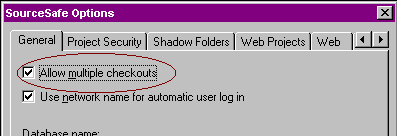
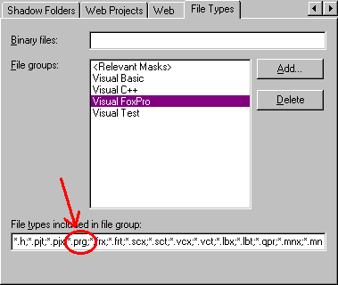
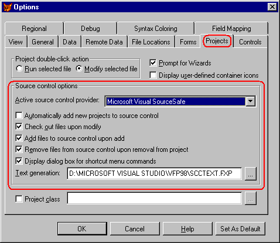
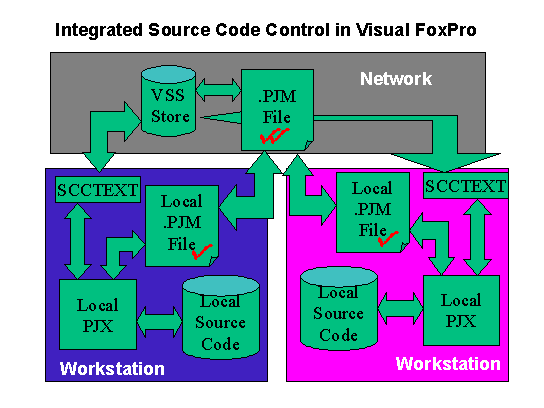
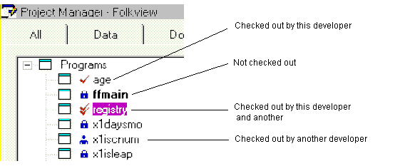
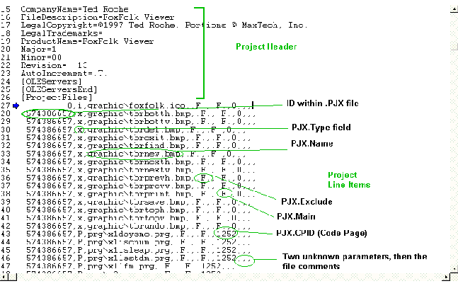
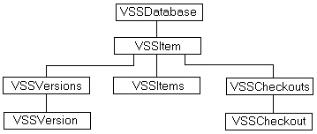

## A Source is a Source, Of Course, Of Course

>Private information is practically the source of every large modern fortune.  
>&mdash;Oscar Wilde

Wait! Don't flip that page! Source code integration in
Visual FoxPro is not just for team development! If you're a solo developer, or
work in a group where each of you has your own project, source code control is
for you, too.

The additions that came in Visual Studio 6 offered greater
possibilities for tight integration of Visual FoxPro projects with the other
tools supplied in the Visual Studio package. Now that Visual FoxPro 7 is no
longer in Visual Studio, we see no need to panic; it still works with the other
tools, especially Visual SourceSafe. However, the integration with Visual
SourceSafe started with Visual FoxPro 5.0, and SourceSafe has been a tool
useful in coordination with FoxPro since before Microsoft bought either tool.

### "Why Should I Bother with Source Control?"

>Integrity without knowledge is weak and useless, and knowledge without integrity is dangerous and dreadful.  
>&mdash;Samuel Johnson

Source code control can be a very useful tool to the solo
developer as well as a key tool for multi-developer teams. For the solo
developer, source code control provides backup facilities and the ability to
perform a "grand undo" as well as retrieve early builds or versions.
With a multiple-developer team, source code control can ensure that all members
of the team work with the latest revision of source code, protect the members
of the team from inadvertently overwriting each others' work, and can provide a
simple method to keep track of multiple releases of the software to the same or
different clients.

Source code control programs have been around for quite some
time but, like difficult backup programs, programs that prove too hard to use
are too easy to avoid. With the increasing complexity of projects and the
improved accessibility of these products, they are tools worth the effort to
learn. Integration of source code control directly into the development
environment is a relatively recent feature that makes these programs easier to
use.

Bear in mind that Visual SourceSafe, or any other source
code control program, is a separate product and you must learn its terminology
and operations to get the greatest benefit from it. While many operations can
easily be performed from within the FoxPro interface, you should become
familiar with the less frequently needed maintenance functions that may only be
available within the program itself.

With SourceSafe, we'll caution you that many of the "features"
are well hidden. SourceSafe, like FoxPro (and many other Microsoft products)
was not created by the boys and girls of Redmond, but rather was purchased. The
original product was developed primarily as a command line utility and
supported clients on DOS, Macintosh, UNIX and Windows platforms. Many of the
utility programs are available only from the command line. When you install
SourceSafe as described below, make sure you check out the Administration tool
and read through both the user's and administrator's sections of the help file.
The help file recommends that tools like Analyze, used to check the integrity
of the SourceSafe data store, should be run on a *weekly* basis. We've
worked with clients with gigabyte-sized data stores who weren't aware that the
Analyze tool exists!

<table>
<tr>
  <td width="20%" valign="top">

  </td>
  <td width="80%">
  <p>Visual Studio 97 Service Pack 2 causes &quot;Invalid Page Faults&quot; in VFP if you're using integrated SourceSafe projects! Avoid Service Pack 2. You can find Service Pack 3 for Visual Studio 97 on the Microsoft Web site.</p>
  <p>This is a killer bug, because VSS crashes the machine about 10 minutes <i>after</I> you close a project that's under source code control. Uck.</p>
  <p>(One of Ted's sessions on benchmarking at the 1997 DevCon included a close-up and personal demonstration of this bug. Ouch.)</p>
  </td>
 </tr>
</table>

### Getting SourceSafe Ready

>But their determination to banish fools foundered<br>
 ultimately in the installation of absolute idiots.  
>&mdash;Basil Bunting

Follow the prompts of the Visual Studio install (or the
Visual SourceSafe install, if you purchased it separately) to install the full
"server" installation of VSS to a section of your network where it
can be accessed by all workstations. Each workstation needs to be able to
access the shared SourceSafe install to run the NetSetup.EXE, which in turn
installs client software on the local machine. If you're installing on a
stand-alone machine, you still need to go through these steps. The server
install creates the data structures needed to store the SourceSafe information;
the client install sets the Registry settings so VFP and other source-code
control-enabled applications can recognize that the service is available.

A couple of additional settings need to be tweaked before
the product is ready for use. In the Administrators tool, under Tools |
Options, you should enable the multiple checkouts option (Figure 2-9) to allow
all developers to jointly check out the PJM file that serves as the ASCII
equivalent of the Project Manager. Some developers have reported success with
leaving multiple checkouts disabled, and requiring each developer to
individually and manually check out the PJM file (via the native VSS interface)
in order to synchronize their project changes to the shared project. We haven't
tried this, but suspect that a process that cumbersome is done less often than
one that can just be picked from the VFP menu.



#### Figure 2-9: Administrator option for multiple checkouts must be turned on.

If you're working with VSS 5.0, you also need to add .PRG to
SourceSafe's list of file extensions for Visual FoxPro (Figure 2-10). Each
workstation needs to turn on Visual SourceSafe from the Tools | Options dialog,
using the Active source control provider drop-down (Figure 2-11). For the other
options on the Projects tab, we've found that different developers are happier
with them in different configurations. You'll need to experiment to determine
which settings best fit your work style. Finally, note that the last SourceSafe
option on the page is one for the text generation program. As we explain below,
binary files are stored both in their native format and a text equivalent, to
make comparisons easier. The source for the program that generates the text,
SccText.PRG, is included with Visual FoxPro; you should consider modifying it
to meet your needs if necessary.



#### Figure 2-10: For VSS 5.0, you'll need to add the *.PRG to VFP's File Types. They got it right in VSS 6.0.



#### Figure 2-11: The Tools | Options | Project dialog provides SourceSafe options.

### The Intricate Dance of the Source and the Fox

>I do not know what the spirit of a philosopher could more wish to be than a good dancer. For the dance is his ideal, also his fine art, finally also the only kind of piety he knows, his "divine service."  
>&mdash;Friedrich Nietzsche, *The Gay Science*

Once VSS is installed, the developer who creates a project
can select "Add Project to Source Control" (if he hasn't set things
up to do this automatically via the Options dialog). All other developers can
now access the project by selecting "Join Source Control Project"
from their File menu.

Each developer maintains her own copy of the shared project,
and each has a complete copy of all of the source code. By default, all of the
source code is flagged read-only to prevent inadvertent code changes. After
checking out an individual file, additions and modifications to the source code
are made by each developer on his local machine. When the changes have been
tested and are ready to be shared with the rest of the development team, the
developer chooses "Update Project List" from the Source Control
submenu of the Project menu. This option updates a text version of the project,
a PJM file, with the changes this developer has made to her local project file.
When other developers choose to update the shared project list, they see the
changes made by this developer. Figure 2-12 shows the dance of files from place
to place.

Source code control works best on text files, because
differing versions of text files can be visually compared. Since FoxPro keeps a
lot of its designs in table format (SCX, VCX, MNX), these files cannot be
compared directly. Instead, the integrated source control creates an ASCII
version of each of these files (with corresponding SCA, VCA and MNA extensions)
so that changes can be "diffed" (checked for differences). The
SccText.PRG program creates and interprets these ASCII files; this program can
be modified (or replaced) to suit your needs.



#### Figure 2-12: Source code control using VFP's Project Manager makes developers play nicely together.

### Visual SourceSafe at Work

>You have a new source of doubt and apprehension.  
>&mdash;Charles Horton Cooley, *Human Nature and the Social Order*

When source control is in use, the Project Manager displays
icons to show the status of each file (Figure 2-13).



#### Figure 2-13: Icons within Project Manager tell us the status of each file. Even though a file might be available, there are no icons for "married," "single," or "just wants to be friends."

The PJ* Project files and database and table files should
not be checked in. The project file is generated for each developer by the
FoxPro-to-SourceSafe interface by reading the PJM file, which is checked out by
each developer who joins the project. The PJM file contains the
"header" information for the project&mdash;name, address, icon, generator
options, and a line for each file within the project. Figure 2-14 shows a
typical PJM file.



#### Figure 2-14: The PJM file is the text file equivalent of the Project Manager's PJX table. Not something we'd want to have to read regularly.

### The Sourcerer's Apprentice

>In the world of knowledge, the essential Form of Good is the limit of our inquiries, and can barely be perceived; but, when perceived, we cannot help concluding that it is in every case the source of all that is bright and beautiful.  
>&mdash;Plato

Once you have succeeded in using Visual SourceSafe with the
Visual FoxPro Project Manager, there are a number of ways in which the
collaboration between the two products can be enhanced and your life, thus,
made easier.

#### Automate It!

Rather than using the internal source code control mechanism,
it is possible to control Visual SourceSafe using Automation directly from
FoxPro. You can scan the contents of a project (PJX files are just data
tables), or you can iterate through the files in a Project object and process
the contents directly against the SourceSafe back end.

An extract of Visual SourceSafe's object model is shown in
Figure 2-15.



#### Figure 2-15: The Visual SourceSafe Object Model&mdash;Cindy Crawford is a lot more interesting to look at, but this one is informative.

The object model is pretty much like other OLE objects and
collections (including the VFP Project, Server and Files objects), only this
time, the objects are files, *versions*
of those files, and records of checkouts. The objects are:

<b>VSSDatabase</b>: A
SourceSafe database.

<b>VSSItem</b>: A
project or file. Note there is also a VSSItems object that's a collection of
all the children in one project.

<b>VSSVersion</b>: One
way of representing a specific version of a file or project. VSSVersions is a
collection of all the versions of a particular file or project.

<b>VSSCheckout</b>: A
checkout record for a file. Note once again there's a collection, since one
file may have many simultaneous checkouts.

Here's a routine that lists the files available along the
path specified in a tree format:

```foxpro
********************************************************************
* Program....: LISTTREE.PRG
* Abstract...: Recursively displays VSS tree
********************************************************************
LPARAMETERS lcPath, lcPrefix, lcINIFile, lcUser, lcPassword
IF TYPE("lcPath") <> "C"
  lcPath = "$/"
ENDIF
IF VARTYPE(lcPrefix) <> "C"
  lcPrefix = SPACE(0)
ENDIF
IF VARTYPE(lcINIFile) <> "C" or EMPTY(lcINIFile)
  lcINIFile = "D:\VS98\Common\VSS\SrcSafe.INI"
ENDIF
IF VARTYPE(lcUser) <> "C" or EMPTY(lcUser)
  lcUser = "troche"  && substitute your own VSS login here
ENDIF
IF VARTYPE(lcPassword) <> "C"
  lcPassword = SPACE(0)
ENDIF
LOCAL loSSafe, loVSSItems, loRoot, loNode
loSSafe = CREATEOBJECT("SourceSafe")
loSSafe.Open(lcINIFile, lcUser, lcPassword) 
loRoot = loSSafe.VSSItem(lcPath)
loVSSItems = loRoot.Items()
FOR EACH loNode IN loVSSItems
  ? lcPrefix + loNode.Name
  IF loNode.Type = 0  && project
    * Use recursion to drill down VSS tree
    do listtree with lcPath + loNode.Name + "/", ;
                     lcPrefix + "+", ;
                     lcINIFile, ;
                     lcUser, ;
                     lcPassword
  ENDIF
 
NEXT
RELEASE loNode, loVSSItems, loRoot, loSSafe
```
This second sample opens a database, displays a few
properties, and then checks out a specific file. Properties of the file are
then displayed. Note this sample has the file paths, login information and
filenames hard-coded for demonstration purposes; a general-purpose routine
would accept these as parameters. 

```foxpro
********************************************************************
* Program....: TESTVSS1.PRG
* Abstract...: Demonstrate VSS Automation
* Changes....:
********************************************************************
 
oSSafe = CREATEOBJECT("SourceSafe")
 
* Syntax is object.open(path to srcsafe.ini, username, password)
oSSafe.Open("D:\VS98\Common\VSS\SrcSafe.INI","troche","")
 
* The following lines show some of the object's properties
? oSSafe.UserName        && Troche, no surprise there
? oSSafe.CurrentProject  && $/simpserv, the last project opened
? oSSafe.SrcSafeINI      && the file and path above
 
* The next line assumes Sys2335 is a Visual SourceSafe project and
* Sys2335.PRG is a program of that 
oFile = oSSafe.VSSItem("$/sys2335/Sys2335.PRG")
oFile.Checkout()
? oFile.IsCheckedOut = 2  && returns .T.
? oFile.Binary            && returns .F.
? oFile.IsDifferent       && returns .F.
? oFile.VersionNumber     && returns 1, 2, etc for your file
oFile.Checkin()
```
#### That Annoying SCC Window

Under Visual FoxPro 5.0, whenever a SourceSafe check-in,
check-out, or "get latest" operation is attempted from within FoxPro,
a top-level window appears to report any messages from SourceSafe, but more
likely just blocks your access to the FoxPro application and occasionally
intercepts keystrokes. Thanks to Christof Wollenhaupt for pointing out that you can
get rid of this annoying window with `HIDE WINDOW "SOURCE"` or `HIDE
WINDOW "Ergebnisse der Quellcode-Kontrolle"`, if you're using the
German version of these tools.

This annoying behavior was replaced in VFP 6.0 by the less
annoying feature of echoing actions to the Command Window. It didn't change in
VFP 7.0. We still wish we could just have the ability to turn this stuff off!

#### Files Outside of the Project Tree

SourceSafe doesn't allow you to include files outside the
project directory tree; attempting to do so generates an error. There are
several workarounds, depending on the situation. If the file is used in this
application only, the simplest thing to do is just to move it into the
directory structure. If the file is used in multiple projects, one alternative
is to add it to a separate project within the SourceSafe native interface. Use
sharing in VSS to add the file to the current project, and use "Get Latest
Version" to copy a version to the appropriate project directory. Within
FoxPro, add the shared file to the project, and when FoxPro protests that the
file already exists under source code control, select "Overwrite" to
update the file to the most recent version.

#### Pinned to the Wall

While it's way beyond the basic introduction this section is
meant to give you, SourceSafe can do some cool things. Look at sharing between
projects to maintain control of common files (FoxTools, framework source code).
Consider "pinning" to lock in versions for shared branches. A
"pinned" file is a branch of the file versions that's locked at a
particular revision until "unpinned." The idea is that common files
can get updated, but the code you've shipped to a particular client doesn't
reflect those changes until you open the safety pin. 

#### Label Maker

Look at the labeling options within Visual SourceSafe to
control and document versions sent to testing or released to clients. This is a
big help when the client calls and reports some problem in their Outer Mongolia
office with code three revs back. With labeling on each released version, you
can use the native SourceSafe interface to produce a snapshot of the code at
that label point.

#### SccText.PRG&mdash;Sort of Right

The October '97 issue of *FoxPro
Advisor* has an excellent article by Mark Wilden with several suggestions
for changes to SccText.PRG, the text generation program. One issue he
identifies is that SCX and VCX files jumble the order of methods each time
they're saved. When SccText generates the method code to go in the
corresponding SCA or VCA file, the methods are put in their order in the SCX or
VCX and are not sorted. Since each version can have the methods in a different
order, viewing differences in the files is difficult. Mark proposed a simple
change to the SccText program to sort the methods before writing out the text
file. Amazingly, Microsoft did not integrate these changes into the 6.0 version
of SccText&mdash;it is byte-for-byte identical with the version that shipped with
5.0! And a few minor changes were made in VFP 7, but not changes we were
looking for. If you ever find the need to compare versions of SCXs or VCXs
(we'd be surprised if you didn't), this change is well worth making.

Mark Wilden, Advisor Publications and Microsoft did give Ted
permission to reproduce and distribute the SccText.PRG with his book, *Essential
SourceSafe,* also published by Hentzenwerke Publishing. If you're serious
about source code control, this is one book you ought to, er, check out.

### Sharing Ought to Be Easier Than This

The Project | Source Control | Share option on the VFP
Project menu allows you to add controlled files from any other project directly
into your project. Unfortunately, there's no option to specify where these
files are stored&mdash;all are dumped into the project root directory. You can move
the file using the SourceSafe interface. In version 5.0 and earlier, you do
this by dragging and dropping into the correct folder, and then deleting the
file from the root. (Yes, this is how you have to do a "move"&mdash;copy
and delete&mdash;there's no native move functionality in versions of SourceSafe
before version 6.0.) In version 6.0 or later, drag using the right mouse button
and select "Move" from the menu. Finally, modify the PJM file
directly to point to the new location of the file.

### Source Control&mdash;It's Not Just for Code Anymore!

By default, the VFP-VSS interface doesn't put data files
under source code control, nor does it include the database container. Consider
adding data files that are more control files than end-user data. Take a look
at the GenDBC program, included with Visual FoxPro in the Tools\GenDBC
directory, to generate a program containing all of your database container
properties and methods; once you create the program, put it under source
control. Consider a tool like xCase or Stonefield Database Toolkit to generate
the design metadata for preservation within SourceSafe.

Microsoft Office Developer editions, beginning with 2000,
ship with Visual SourceSafe 6.0 to add a SourceSafe menu to those products.
Consider maintaining all project documentation under source code control as
well.

### Troubleshooting Speed Problems

Under some circumstances, the Project Manager takes *forever* to do anything with projects
under source code control. Make sure you're using the latest versions of FoxPro
and SourceSafe&mdash;each version and Service Pack has improved on the previous one.
Ensure your network is performing correctly by checking the configuration of
your clients and server, monitoring performance at the server, or using a
packet sniffer to watch network traffic. Use the SourceSafe admin tools like
Analyze.EXE to test and correct problems with the SourceSafe data store. You'll
also want to check the Microsoft Knowledge Base (see the appendix for details
on the Knowledge Base) for updated information on this&mdash;we've heard of anecdotal
cases, but haven't managed to chase down a cause yet.

### Mother Said We Should Share

There's no concept in the SourceSafe model of
"synching" between two SourceSafe repositories, nor is there significant
support for remote sites or developers who want a separate SourceSafe
installation for their laptop. The solutions at this point are manual: Check
the files out from the "master" database and check them in to the
"slaves." The process is arduous and requires close attention by the
operators.

When duplicating SourceSafe-controlled projects between
machines, a number of errors can be generated if the project's status, as
stored in the PJX, doesn't match that of SourceSafe. For example, if you
attempt to open a SourceSafe-controlled project on a machine connected to a
different SourceSafe database, you can receive the error 'SCC API error
"Project created" occurred. The project will be opened without source
control.' This is proof positive that two wrongs don't make a right.

Two fields in the PJX table appear to determine how files
are controlled within the project: the LOCAL field is a logical to determine
whether the file is only used locally (.T.) or if it's controlled via source
code control (.F.). In the project header record (the first record in the
table), SCCDATA stores path names and SourceSafe control information. In the
records for the individual files, the SCCDATA memo field appears to contain
flags for the status of the associated file. Thanks to fellow MVP Christof
Lange for hacking his way through this one: Bytes 260 and 261 (or 0x104 and
0x105) determine whether the file is checked in or out, by this developer or
another, within this project or another project. These flags seem to be updated
automatically by the Project Manager, but only if the LOCAL switch is set.

### Give Me That Remote Control

There's no native support for remote access, and Visual
SourceSafe over RAS is significantly slower than LAN speed. However, the VSS
team worked hard at improving the performance of VSS over dial-up lines in the
6.0 product and its Service Packs. Look for significant performance
improvements, especially in SP5. You should also consider alternatives such as
using a shadow directory structure to allow developers to "get" all
current source code without invoking VSS, using a store-and-forward process,
like e-mail, to transfer files to and from remote users, or setting up an
Automation server locally with a better remote interface.

One third-party product, SourceOffSite, by SourceGear
Corporation (<a href="http://www.sourcegear.com/" target="_blank">http://www.sourcegear.com</a>),
has gotten rave reviews by many of our fellow developers. If you are working on
a project with remote or home-based teams, check this one out.

### Control That Source!

>There is no such source of error as the pursuit of absolute truth.  
>&mdash;Samuel Butler

Microsoft has provided us with hooks into the Project
Manager and source code control to allow us to reliably maintain source code
shared among multiple developers. A little time spent understanding how the
mechanism works and how it can be used to your best advantage can pay off for
the multi-developer team.

This chapter presents an overview of Visual SourceSafe. For
an in-depth look, we suggest you obtain Ted's book, *Essential SourceSafe*,
published by Hentzenwerke Publishing (<a href="http://www.hentzenwerke.com/" target="_blank">www.hentzenwerke.com</a>).
It covers just about anything you'd want to know about Visual SourceSafe.