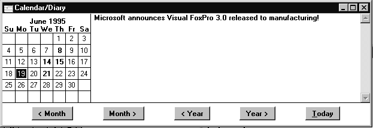
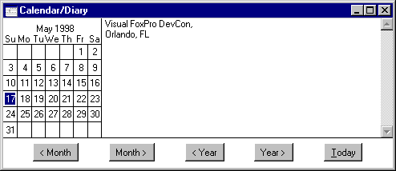

## Calendar/Diary, _DiaryDate

A Mac-like desktop accessory kept in Visual FoxPro for "backward compatibility," but hidden within the product, ignored.

### Usage

```foxpro
ACTIVATE WINDOW CALENDAR
DEFINE BAR _MST_DIARY OF _MSYSTEM
               PROMPT "CALENDAR/D\<IARY"
```

Having only one application with the ability to do a slew of stuff was handy in the 640K, 20MB hard drive days. Now, with the ability to have many programs running at once in the Windows environment and multi-gigabyte drives considered standard equipment, the idea of a built-in calendar applet seems a little dated. Outlook, Microsoft's personal information manager in the Office package, far exceeds the capabilities of this "mini-app."

But this application has some neat features, and we are disappointed that Microsoft has chosen to ignore Calendar. The Calendar/Diary option has disappeared from the menu, and you need to dredge through the help file for the example code for the _DiaryDate variable to see how it can be called up programmatically. The fact that a system menu bar is defined for this function appears to be completely undocumented.



#### Figure 1: The Calendar / Diary interface in Visual FoxPro 3.0 and...



#### Figure 2: The same interface in Visual FoxPro 7: Bolding of characters is gone.

The interface for using the Calendar / Diary is pretty straightforward. The calendar is displayed on the left-hand side, and buttons across the bottom can be used to change the display to a specific month and year. Note also that there is a "Diary" menu that appears when the Calendar is activated, displaying keyboard shortcuts for many of these functions. In versions before VFP 6, a date with a diary entry associated with it is shown in a bolder font (see figure 1); the month and year are displayed in bold when the calendar is active, and in plain text when the diary is active. In VFP 6 and later, all bolding effects are gone (see figure 2). Diary entries are stored in the currently active resource file. If no resource file is available, a dialog box appears when the calendar is activated for the first time, informing the user he/she will be unable to save diary entries. The entry is stored with a TYPE of "Data," an ID of "DIARYDATA," a NAME of the date in DTOS() format ("YYYYMMDD"), the actual entry in the memo field DATA, and a SYS(2007)-generated checksum in the CHKVAL field.

Since Microsoft hasn't updated the really ugly interface of this item, we can predict it will probably continue to receive minimal support, perhaps even disappearing in a future release. Using the calendar can be problematic in an application. Storage of diary data in the resource file can cause problems. Because the calendar is a built-in system window, it does not have all of the characteristics or programmability that we may want to integrate into our own application windows, causing difficulties including it within our event handlers. While it may be a handy utility for developers to use, we suggest you consider other sources for supplying a calendar to your users. Several intrepid users have developed all-FoxPro-coded versions of the calendars, available through many of the FoxPro magazines and online services. In addition, there are a several fairly sophisticated ActiveX calendar controls available.

### Usage

```foxpro
dDiaryDate = _DIARYDATE
_DIARYDATE = dDateToBeSet
```

_DIARYDATE is a system memory variable that stores the last date selected in the Calendar/Diary, or the present date if the Calendar has not been used.

### Example

```foxpro
STORE {04/11/2000} to _DIARYDATE
? _DIARYDATE
```
### See Also

[Calculator](s4g263.md), [Desk Accessories](s4g566.md), [DToS()](s4g007.md), [Filer](s4g361.md), [Puzzle](s4g568.md), [Set Resource](s4g276.md), [Sys(2007)](s4g024.md)