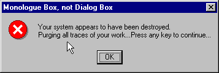
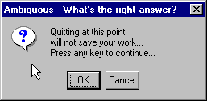

## MessageBox(), FoxTool's MsgBox(), InputBox()

Haven't you wondered how all those cool Windows programs display the same type of dialogs&mdash;with the same icons, text faces, and screen positioning? Perhaps it's a conspiracy. Nah. Maybe they all agreed on a convention and are actually sticking with it? Get real. The only reason those boxes all look the same is because they are all produced from the same function, and FoxPro programmers have access to that function as well.

MessageBox() is a function introduced to the language in Visual FoxPro 3.0 that duplicates much of the functionality already available to FoxPro 2.x programmers in the FoxTools.FLL function MsgBox. (See FoxTools and SET LIBRARY TO for more information on FoxTools and libraries in general.) The big difference between using the two is that MessageBox() is built in and doesn't require the use of any external libraries. The little difference is that the order of parameters differs between the two. Both functions return the same values to indicate the user's choice.

InputBox() was introduced in VFP 7 to give developers access to the single input dialog used for collecting View Parameters. 

### Usage

```foxpro
nReturnValue = MESSAGEBOX( uMessage [, nIconButtons [, cTitle
                           [, nTimeOut ] ] ] )
nReturnValue = MSGBOX( cMessage, cTitle,
                       nIconButtons )    && FoxTools version
```

 <table border cellspacing=0 cellpadding=0 width=100%> <tr> <td width=32% valign=top> <p><b>Parameter</b></p>
  </td>
  <td width=23% valign=top>
  <p><b>Value</b></p>
  </td>
  <td width=45% valign=top>
  <p><b>Meaning</b></p>
  </td>
 </tr>
<tr>
  <td width=32% valign=top>
  <p>uMessage</p>
  </td>
  <td width=23% valign=top>
  <p>Any</p>
  </td>
  <td width=45% valign=top>
  <p>The message to display in the body of the dialog box. In VFP 6 and earlier, this parameter must be character. Beginning in VFP 7, any type may be used and it's converted to character. If uMessage is character, you can use CHR(13) to separate lines of text, and the text is automatically word-wrapped. VFP cuts off the message after 1024 characters.</p>
  </td>
 </tr>
<tr>
  <td width=32% valign=top>
  <p>cMessage</p>
  </td>
  <td width=23% valign=top>
  <p>Character</p>
  </td>
  <td width=45% valign=top>
  <p>A character string or expression to display in the body of the dialog box. Use CHR(13) to separate lines of text. Automatically word-wrapped.</p>
  </td>
 </tr>
<tr>
  <td width=32% rowspan=5 valign=top>
  <p>nIconButtons:</p>
  <p>Choose one icon:</p>
  </td>
  <td width=23% valign=top>
  <p>0</p>
  </td>
  <td width=45% valign=top>
  <p>No icon. </p>
  </td>
 </tr>
<tr>
  <td width=33% valign=top>
  <p>16 (MB_ICONSTOP)</p>
  </td>
  <td width=67% valign=top>
  <p>Stop icon.</p>
  </td>
 </tr>
<tr>
  <td width=33% valign=top>
  <p>32 (MB_ICONQUESTION)</p>
  </td>
  <td width=67% valign=top>
  <p>Question mark.</p>
  </td>
 </tr>
<tr>
  <td width=33% valign=top>
  <p>48 (MB_ICONEXCLAMATION)</p>
  </td>
  <td width=67% valign=top>
  <p>Exclamation point.</p>
  </td>
 </tr>
<tr>
  <td width=33% valign=top>
  <p>64 (MB_ICONINFORMATION)</p>
  </td>
  <td width=67% valign=top>
  <p>Information (i).</p>
  </td>
 </tr>
<tr>
  <td width=32% rowspan=6 valign=top>
  <p>Add to that value</p>
  <p>which button set</p>
  <p>to display:</p>
  </td>
  <td width=23% valign=top>
  <p>0 (MB_OK)</p>
  </td>
  <td width=45% valign=top>
  <p>OK.</p>
  </td>
 </tr>
<tr>
  <td width=33% valign=top>
  <p>1 (MB_OKCANCEL)</p>
  </td>
  <td width=67% valign=top>
  <p>OK, Cancel.</p>
  </td>
 </tr>
<tr>
  <td width=33% valign=top>
  <p>2 (MB_ABORTRETRYIGNORE)</p>
  </td>
  <td width=67% valign=top>
  <p>Abort, Retry, Ignore.</p>
  </td>
 </tr>
<tr>
  <td width=33% valign=top>
  <p>3 (MB_YESNOCANCEL)</p>
  </td>
  <td width=67% valign=top>
  <p>Yes, No, Cancel.</p>
  </td>
 </tr>
<tr>
  <td width=33% valign=top>
  <p>4 (MB_YESNO)</p>
  </td>
  <td width=67% valign=top>
  <p>Yes, No.</p>
  </td>
 </tr>
<tr>
  <td width=33% valign=top>
  <p>5 (MB_RETRYCANCEL)</p>
  </td>
  <td width=67% valign=top>
  <p>Retry, Cancel.</p>
  </td>
 </tr>
<tr>
  <td width=32% rowspan=3 valign=top>
  <p>and add to<br> that the default button:</p>
  <p>  &nbsp;</td> <td width=23% valign=top> <p>0 (MB_DEFBUTTON1)</p>
  </td>
  <td width=45% valign=top>
  <p>First button has the focus.</p>
  </td>
 </tr>
<tr>
  <td width=33% valign=top>
  <p>256 (MB_DEFBUTTON2)</p>
  </td>
  <td width=67% valign=top>
  <p>Second button has the focus.</p>
  </td>
 </tr>
<tr>
  <td width=33% valign=top>
  <p>512 (MB_DEFBUTTON3)</p>
  </td>
  <td width=67% valign=top>
  <p>Third button has the focus.</p>
  </td>
 </tr>
<tr>
  <td width=32% valign=top>
  <p>And if desperate:</p>
  </td>
  <td width=23% valign=top>
  <p>4096 (MB_SYSTEMMODAL)</p>
  </td>
  <td width=45% valign=top>
  <p>System modality: forces the message box to always be on top.</p>
  </td>
 </tr>
<tr>
  <td width=32% valign=top>
  <p>cTitle</p>
  </td>
  <td width=23% valign=top>
  <p>Character</p>
  </td>
  <td width=45% valign=top>
  <p>A character string or expression to display in the title bar of the box.</p>
  </td>
 </tr>
<tr>
  <td width=32% rowspan=2 valign=top>
  <p>nTimeOut (added in VFP 7)</p>
  </td>
  <td width=23% valign=top>
  <p>Numeric</p>
  </td>
  <td width=45% valign=top>
  <p>The number of milliseconds after which the dialog should be closed, even if the user hasn't made a choice.</p>
  </td>
 </tr>
<tr>
  <td width=33% valign=top>
  <p>Omitted</p>
  </td>
  <td width=67% valign=top>
  <p>The dialog stays open until the user makes a choice.</p>
  </td>
 </tr>
<tr>
  <td width=32% rowspan=7 valign=top>
  <p>nReturnValue</p>
  &nbsp;</td>
  <td width=23% valign=top>
  <p>1 (IDOK)</p>
  </td>
  <td width=45% valign=top>
  <p>OK</p>
  </td>
 </tr>
<tr>
  <td width=33% valign=top>
  <p>2 (IDCANCEL)</p>
  </td>
  <td width=67% valign=top>
  <p>Cancel</p>
  </td>
 </tr>
<tr>
  <td width=33% valign=top>
  <p>3 (IDABORT)</p>
  </td>
  <td width=67% valign=top>
  <p>Abort</p>
  </td>
 </tr>
<tr>
  <td width=33% valign=top>
  <p>4 (IDRETRY)</p>
  </td>
  <td width=67% valign=top>
  <p>Retry</p>
  </td>
 </tr>
<tr>
  <td width=33% valign=top>
  <p>5 (IDIGNORE)</p>
  </td>
  <td width=67% valign=top>
  <p>Ignore</p>
  </td>
 </tr>
<tr>
  <td width=33% valign=top>
  <p>6 (IDYES)</p>
  </td>
  <td width=67% valign=top>
  <p>Yes</p>
  </td>
 </tr>
<tr>
  <td width=33% valign=top>
  <p>7 (IDNO)</p>
  </td>
  <td width=67% valign=top>
  <p>No</p>
  </td>
 </tr>
<tr>
  <td width=32% valign=top>
  &nbsp;</td>
  <td width=23% valign=top>
  <p>-1</p>
  </td>
  <td width=45% valign=top>
  <p>The dialog timed out</p>
  </td>
 </tr>
</table>

The second numeric parameter is calculated by adding the three numeric values for the icon, types of buttons and default button, and passing that value as a single numeric parameter.

### Example

```foxpro
* This example displays the dialog box shown in Figure 1
MessageBox("Your system appears to have been destroyed."+;
        chr(13)+"Purging all traces of your work..."+ ;
        "Press any key to continue...", 16,;
        "Monologue Box, not Dialog Box")
```

 

#### Figure 1: Sample dialog box.

This is a pretty sample, but a terrible user interface example. Remember, dialog boxes should allow you to have a *dialogue* with your users, your clients, the people who sign your paycheck. These are not opportunities to show how much smarter you are than they (you never know what you may prove!). Give the people who pay your salary intelligent, understandable options, not one-way, no-way-out warnings that Armageddon is around the corner. While we're on a tear, Figure 2 shows our second-least-favorite dialog.



#### Figure 2: A really bad dialog box.

Don't ever leave a dialog as confusing as this for your end users to mess with. You risk invoking the 50-50-90 law: If there's a 50-50 chance of your end users choosing a particular option, 90 percent of the time they'll choose the one that causes the most destruction.

You might be wondering how you can keep track of, and decode in the future, the obscure settings of the message functions' numeric parameter. Fortunately, Microsoft has taken care of this by letting you #INCLUDE any of the MessageBox parameter settings stored within the FoxPro.H file, an ASCII text file. (The table above shows the defined constants for the various values.) By including this file, provided with FoxPro, code can be changed from this:

```foxpro
IF MessageBox("This is the message body", 21, ;
             "This is the title") = 2
```
to this:

```foxpro
#INCLUDE "FOXPRO.H"
 
IF MessageBox("This is the message body", ;
             MB_RETRYCANCEL + ;
             MB_ICONSTOP + ;
             MB_DEFBUTTON1, ;
             "This is the title") = IDCANCEL
```
Add 4096 to the numeric parameter passed to the message function to invoke system modality. In Windows 3.1, this was a "last resort" style dialog, without all the features (nor did it consume all the resources) of its fancier siblings. The title was displayed as the first line of text within the box. Body text did not word-wrap. Icon settings were ignored and no icon was displayed. In VFP 5.0 and later, now that FoxPro runs on Win32 platforms only, the System Modal setting is not that severe. In Windows 95 and 98, there seems to be no difference from an ordinary message box. In NT, the message box always stays on top, even if you switch applications underneath it. But it is not the potential system-locking-up monster it was under Windows 3.1. Good riddance!

The folks at Hacker Labs went to town on this function in VFP 3, and we documented several weird behaviors in that product in the *Hacker's Guide for Visual FoxPro 3.0*. In VFP 5 and later, these loopholes seem to have been plugged.

### Usage

```foxpro
cResult = INPUTBOX( cMessage [, cCaption [, cDefault
                    [, nTimeOut [, cTimeoutValue ] ] ] ] )
```
<table border cellspacing=0 cellpadding=0 width=100%>
<tr>
  <td width=32% valign=top>
  <p><b>Parameter</b></p>
  </td>
  <td width=23% valign=top>
  <p><b>Value</b></p>
  </td>
  <td width=45% valign=top>
  <p><b>Meaning</b></p>
  </td>
 </tr>
<tr>
  <td width=32% valign=top>
  <p>cMessage</p>
  </td>
  <td width=23% valign=top>
  <p>Character</p>
  </td>
  <td width=45% valign=top>
  <p>The prompt to appear in the dialog. Unlike MessageBox(), the prompt is limited to a single line. Any message too long for the dialog (94 characters with default settings) gets cut off.</p>
  </td>
 </tr>
<tr>
  <td width=32% rowspan=2 valign=top>
  <p>cCaption</p>
  </td>
  <td width=23% valign=top>
  <p>Character</p>
  </td>
  <td width=45% valign=top>
  <p>The caption to appear on the title bar of the dialog. Like the message, captions that are too long get cut off.</p>
  </td>
 </tr>
<tr>
  <td width=33% valign=top>
  <p>Omitted or empty</p>
  </td>
  <td width=67% valign=top>
  <p>The dialog caption is the caption of the main Visual FoxPro window.</p>
  </td>
 </tr>
<tr>
  <td width=32% rowspan=2 valign=top>
  <p>cDefault</p>
  </td>
  <td width=23% valign=top>
  <p>Character</p>
  </td>
  <td width=45% valign=top>
  <p>An initial string to offer the user. The string appears, highlighted, in the text box portion of the dialog.</p>
  </td>
 </tr>
<tr>
  <td width=33% valign=top>
  <p>Omitted</p>
  </td>
  <td width=67% valign=top>
  <p>Nothing appears initially in the text box portion of the dialog.</p>
  </td>
 </tr>
<tr>
  <td width=32% rowspan=2 valign=top>
  <p>nTimeOut</p>
  </td>
  <td width=23% valign=top>
  <p>Numeric</p>
  </td>
  <td width=45% valign=top>
  <p>The number of milliseconds after which the dialog closes, even if the user hasn't pressed a button.</p>
  </td>
 </tr>
<tr>
  <td width=33% valign=top>
  <p>Omitted</p>
  </td>
  <td width=67% valign=top>
  <p>The dialog stays open until the user chooses either OK or Cancel, or uses the keyboard equivalents.</p>
  </td>
 </tr>
<tr>
  <td width=32% rowspan=2 valign=top>
  <p>cTimeoutValue</p>
  </td>
  <td width=23% valign=top>
  <p>Character</p>
  </td>
  <td width=45% valign=top>
  <p>The string to return if the dialog times out.</p>
  </td>
 </tr>
<tr>
  <td width=33% valign=top>
  <p>Omitted</p>
  </td>
  <td width=67% valign=top>
  <p>The empty string is returned if the dialog times out.</p>
  </td>
 </tr>
<tr>
  <td width=32% valign=top>
  <p>cResult</p>
  </td>
  <td width=23% valign=top>
  <p>Character</p>
  </td>
  <td width=45% valign=top>
  <p>The user's input (or cDefault if the user didn't change it) if he chooses OK; the empty string if the user chooses Cancel or presses ESC; cTimeoutValue if the dialog times out.</p>
  </td>
 </tr>
</table>

Have you ever needed just one little input value from a user? Creating a form for that situation seems like so much work (though, of course, you could have a form class for collecting a single input). The InputBox() function is designed for just that situation. This is another case where the FoxPro team took functionality that was already in the product (this dialog is used to get the value of a parameter when a parameterized view is opened) and exposed it so that we could use it, too.

Note that the function returns a character string, even when the input looks like a number or date. Similarly, the default value and timeout value must be character strings.

### Example

```foxpro
cUser = InputBox( "Who are you?", oApp.cAppName )

cMainCompany = "The most important one"
cCompany = InputBox( "What company do you want to work on?", ;
                     "Accounting App", cMainCompany )

cSignIn = InputBox( "You have 10 seconds to identify yourself",;
                    "", "", 10000, "Intruder" )
```
### See Also

[#Include](s4g229.md), [FoxTools](s4g450.md), [Set Library](s4g232.md), [Wait](s4g293.md)