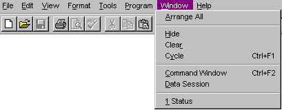

## Menus

FoxPro has four&mdash;count 'em, four&mdash;different kinds of menus, not including those you might hand-build with a form (like putting up a series of buttons with choices). Why this embarrassment of riches? Historical reasons, of course. Each time a new type of menu became common, the next version of FoxBase/FoxPro included it. The number of menu commands in the language is staggering.

However, other than for testing purposes, we haven't actually written a menu command in years. We build our menus using the Menu Designer and let it generate all the code we need. With the addition of Andrew Ross MacNeill's GenMenuX, there's not much we can't do with generated menus. So, our first piece of advice is: Don't write menu code.

So what kinds of menus can you build, anyway? The antique varieties come in three flavors: Lotus-style lightbar menus, individual (somewhat ugly) menu popups, and an array-based precursor to Windows-type menus. They're all quirky and tedious to create and, most important, none of them fully conforms to the Windows interface standard. Don't use them.

### The Real McCoy

So what's left? Component-style, Windows-type menus. Coincidentally, exactly the kind the Menu Designer lets you create.

Windows menus are built out of four types of components: menu bars, pads, popups and bars. That's right&mdash;the term "bar" has two different meanings in this context. (So what else is new?) The "menu bar" refers to the one line across the top of a window that contains the main options for that window or application. The term "bar" is used for individual items in a menu popup&mdash;things like "New" or "Open" or "Print." In between those two levels, we have pads&mdash;the items that appear on the menu bar&mdash;like "File," "Edit," and "Help"; and we have popups, which appear when you choose a menu pad. The popups contain the actual menu items (or bars) that you can choose to do something. Figure 1 shows the Visual FoxPro menu bar. It has eight pads at this point. The Window pad has been chosen, opening the window popup. The popup has 12 bars, including the three horizontal divider bars.



#### Figure 1: A Windows menu is composed of four types of components: a menu bar, pads, popups and bars. You shouldn't hang out in bars.

Component menus actually break down into two pairs of containers and contents. A menu bar without pads or a popup without bars is like an Oreo cookie without the cream.

A menu may have many, many levels, but there's always one menu bar with a collection of pads. Those pads have popups, each of which contains bars. The bars, however, may point to more popups, which in turn have more bars, and so forth and so on and scooby-dooby-dooby. Generally, it's not a good idea to have more than two levels of popups and bars. Users don't appreciate having to navigate down, down, down. It's very easy to get lost, and be unable to find a particular bar again without trolling through the entire menu structure. In addition, users with motor challenges will have a much harder time trying to keep all the menus open. If there are that many choices, call a dialog and let them make all the choices in parallel.

### Are Shortcuts and Hot Keys Anything like Cold Cuts and Hotcakes?

Menu pads and bars (the contained objects) have a number of characteristics in common. Each has a prompt (the text that appears for it). The prompt can include a "hot key," a single letter that's underlined, which the user can press to choose that item when focus is on the container (the menu bar or popup). In addition, a keyboard shortcut, which chooses the item at any time, can be included. Each item may also have a message that appears in the status bar when the item is highlighted. A "skip for" condition may be specified, indicating that the item is disabled under certain conditions. Beginning in VFP 7, menu bars may also include an icon.

The difference between menu hot keys and menu shortcuts is a little subtle. Hot keys are available only when focus is already on the menu. You press just the underlined key. In Figure 1, hot keys are active only for the bars of the Window menu. "C" is the hot key for the Command Window.

Shortcuts are available when the menu doesn't have focus. They usually are either Alt or Ctrl plus a key or a function key. Typically, Alt plus a key is used for menu pad shortcuts, while Ctrl plus a key is used for menu bar shortcuts. In Figure 1, Ctrl+F2 is the shortcut for the Window-Command Window bar. Alt+F is the shortcut for the File pad.

When you specify a menu, either in code or in the Menu Designer, you have to specify hot keys and shortcuts separately. Hot keys are specified by preceding the letter with "\&lt;" in the prompt. Shortcuts are specified with the KEY clause of the appropriate command or through the Options dialog in the Menu Designer.

In most applications, some menu options shouldn't be available some of the time. When an item isn't available, the user should be aware of it; usually, unavailable options are dimmed. FoxPro handles some of this automatically. When a modal form is active, almost all menu items are dimmed. (Only things like Edit-Copy are available.) Most of what needs to be done, though, is under your control. The SKIP FOR clause of the various menu commands or the SKIP FOR check box in the Options dialog of the Menu Designer lets you specify a condition for dimming the item. Pay attention to the name of this clause&mdash;it's SKIP FOR, not ALLOW FOR. That is, the condition you specify should be .T. when the item is to be dimmed. This is one of those counter-intuitive things, like `SET DELETED`, that makes FoxPro so, er, idiosyncratically lovable, and just has to be accepted because "it's always been that way."

Recent versions of Windows permit icons next to the text on menu bars. VFP has adopted this practice, beginning in version 7, using the PICTURE and PICTRES clauses of `DEFINE BAR`. In the Menu Designer, you specify these in the Options dialog for the bar.

VFP 7 also introduced the ability to create so-called MRU ("most recently used") bars and to invert bars as desired. For details, check out the `DEFINE BAR` section.

### The Font of Knowledge

Since Windows-style menus entered the language, they've had mostly incremental change. There are a couple of newer features worth looking at. First, we have control over the font used for each menu component. Now we can make menus that look like ransom notes. Alternate fonts, however, are not available in menus that replace the system menu. Because this is the kind the Menu Designer is meant to build, you have no font choices there. (Besides, as with so many other items, the only person who should change the font for system menus is the user.)

Also, to accommodate various ActiveX issues, each menu pad can specify how it behaves when a different application takes over. Any pad can disappear or stick around in any of three specified locations. Similarly, each menu pad can indicate what happens to it when it's used in an ActiveDocument.

### Handmade Isn't Always Better

Building a menu in code is a tremendous undertaking. (If you don't believe us, open the Menu Designer, specify a Quick Menu, then Generate it. Take a look at the code.) You have to DEFINE each component with the appropriate command. Then, for each pad and bar, you have to specify the appropriate ON command to indicate what happens when the user chooses that item.

Menu DEFINE commands, though long-winded, are pretty straightforward. You indicate what item you're specifying, then provide each piece of information about it, such as the prompt, the message, the skip for condition, the shortcut, and so on.

The commands that indicate what happens when the user does something are more complex. They come in two flavors: ON and ON SELECTION. The ON commands are simpler&mdash;you use them to nest menus. Use `ON PAD`, for example, to indicate which popup to activate when the user chooses a particular menu pad.

The ON SELECTION version specifies a command to execute when the user chooses that item. These are cool because they propagate downward. That is, if you specify an ON SELECTION for a popup, it applies to any of that popup's bars that don't have actions of their own. This is particularly handy when you're first building an application. Specify something like WAIT WINDOW "Not implemented yet" at a high level, then fill in the individual items as you go.

### Designer Menus

Almost everything you can do in code, you can do in the Menu Designer much more easily. Definitions go into the Prompt text box, plus a few of the Options items. For pads and bars, the ON vs. ON SELECTION choice is incorporated into the Result type drop-down list. A result type of "Submenu" corresponds to ON, while a result type of "Command or Procedure" is really ON SELECTION. (The final result type, "Pad Name" or "Bar #", lets you build components of Visual FoxPro's own menu right into your application menus.)

For the menu bar itself and menu popups, you can specify a routine to run ON SELECTION in the Menu Options dialog on the View menu.

Menus built in the Menu Designer are stored in tables with extensions of MNX/MNT. To turn a menu into something you can use, you have to generate the menu (either from Menu-Generate or through the Project Manager). This runs a program whose name is stored in _GENMENU, typically GENMENU.PRG (written in FoxPro), which reads the MNX table and uses textmerge to create the program, with an MPR extension, that implements your design. (The aforementioned GENMENUX uses the _GENMENU variable to hook itself into the process. You change _GENMENU to point to GENMENUX, then it calls GENMENU when it's ready to.)

### Who's In Charge Here?

Once you have a menu defined, then what? You have to tell FoxPro to use your menu. There are a couple of ways to do this. 

The Windows way (and the approach normally used by the Menu Designer) is to define your menu pads as belonging to _MSYSMENU, the system menu. Combined with `SET SYSMENU` AUTOMATIC, that's all it takes to let your menu replace FoxPro's.

Occasionally, you might have a reason to do it a different way (though we haven't in a long time). In that case, you use `ACTIVATE MENU` to start things rolling. 

### Shortcuts Again?

In the wonderful, but sometimes confusing, world of FoxPro, it's normal to have two (or more) meanings for the same or similar phrases. Menus include yet another example. As we said above, a menu shortcut is a key combination that executes a menu bar without navigating to it (like Ctrl+C for Copy). In the last few years, shortcut menus have come into vogue. No, these aren't menu items that substitute for a key combination, as the phrase might make you think. Shortcut menus are also known as context menus or right-click menus. They're the popups that appear when you right-click somewhere.

In VFP 5 and later, you can create shortcut menus in the Menu Designer. Simply choose Shortcut from the dialog that appears when you `CREATE MENU` and you're on your way. The generated menu starts at the popup level and goes down from there. To hook it to right-clicks, put code like: 

```foxpro
DO MyShortCut.MPR
```
in the RightClick event of the relevant object. If you want a context menu that appears on all right-clicks, not just on a particular object, use something like:

```foxpro
ON KEY LABEL RightMouse DO MyShortCut.MPR
```
(In either case, don't forget to trigger your context menu when the user presses Shift+F10 or the special context menu key on the keyboard, as well.) 

Just like standard menus, the shortcut menus you create in the Menu Designer can use the system menu bars. So, for example, to put a copy item in a shortcut menu, you specify the result as "Bar #" and the action (ever noticed that column in the Menu Designer is unlabeled?) as "_MED_COPY". (Lose the quotes in both places.)

In VFP 3, you have to write your own `DEFINE POPUP` and `DEFINE BAR` code for shortcut menus. Then, in the RightClick event for whatever triggers the popup (or with `ON KEY` LABEL RightMouse), use `ACTIVATE POPUP`.

### See Also

[@...Prompt](s4g197.md), [Activate Popup](s4g642.md), [Activate Menu](s4g642.md), [Create Menu](s4g198.md), [Define Bar](s4g098.md), [Define Menu](s4g098.md), [Define Pad](s4g098.md), [Define Popup](s4g098.md), [Menu](s4g199.md), [Menu To](s4g197.md), [_GenMenu](s4g160.md), [On Bar](s4g307.md), [On Exit Bar](s4g522.md), [On Exit Menu](s4g522.md), [On Exit Pad](s4g522.md), [On Exit Popup](s4g522.md), [On Pad](s4g307.md), [On Selection Bar](s4g307.md), [On Selection Menu](s4g307.md), [On Selection](s4g307.md), [Pad()](s4g305.md), [On Selection Popup](s4g307.md), [Read Menu](s4g196.md), [Set SysMenu](s4g233.md), [Set TextMerge](s4g161.md)