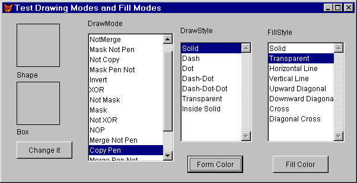

## DrawMode, DrawStyle, DrawWidth

These three properties affect the way drawing occurs on a form (including the main FoxPro window, _SCREEN). DrawMode also affects the drawing of Shape and Line controls.

### Usage

```foxpro
oObject.DrawMode = nDrawMode
nDrawMode = oObject.DrawMode
```

DrawMode determines the way colors are mixed. For shape controls, BorderColor and FillColor specify colors for the outside edge and interior, respectively. The BorderColor of a line control determines its color (and it has no interior, of course). For shapes drawn with the Box, Circle and Line methods, the outside edge is based on the form's ForeColor, while the form's FillColor specifies the interior.

Normally, the appropriate colors are used directly, regardless of the BackColor of the form or any other considerations. It turns out, though, that this "normal" behavior is actually something called "copy mode," which means "copy the color of the object onto the form." That's DrawMode 13. Visual FoxPro supports 15 other drawing modes as well. The other modes perform various kinds of mixing of the object's specified drawing color with the form's BackColor. For example, DrawMode 15 ("Merge") combines the object's specified color with the form's BackColor (kind of like painting one color over another while the bottom color is still wet).  Here's an interface design tip: If you want to highlight an area of a form with a lighter shade of the same color as the form, draw a rectangle (or other shape), set its BackColor to a light or medium gray (such as the default RGB(212,208,200)), and set the DrawMode to 15. Now, whatever color the form is, you'll have a lighter shade without changing code. If you want it to always be a "grayer" version of the color, use the gray box, but set the DrawMode to 9 ("Mask").

The names given for the values of DrawMode are totally mystifying, with a few exceptions. Blackness (DrawMode 1) and Whiteness (DrawMode 16) are pretty clear (or opaque). Regardless of the specified color, they draw black and white, respectively. Mode 11 (NOP, meaning "no operation") is pretty simple, too. It doesn't actually draw anything, thus making your object invisible.

Many of the other modes are based on the idea that colors have inverses (remember the color wheel you learned in elementary school?). You get the inverse of a color by subtracting each of its red, green and blue values (that's the "R", "G" and "B" in `RGB()`) from 255, so the inverse color of RGB(128,0,0)&mdash;a deep red&mdash;is RGB(127,255,255)&mdash;light blue-green.

DrawMode 6 (Invert) draws using the inverse of the form's BackColor. DrawMode 4 (Not Copy) uses the inverse of the specified color for the object.

Another interesting pair is modes 7 and 10 (XOR&mdash;"exclusive OR"&mdash;and Not XOR). These two modes look at the foreground and background colors bitwise and are interested only in bits turned on in one of the two colors, but not both. Mode 7 uses the color this produces. Mode 10 uses the inverse of mode 7.

The remainder of the draw modes use combinations and variations of these techniques.

Something else to note: With any setting of DrawMode other than the default 13 (Copy), 3-D effects (SpecialEffect = 0) don't show up. Depending on the combination of colors of the object and the setting of DrawMode, there may be a single border, or there may be no border.

### Usage

```foxpro
frmForm.DrawStyle = nDrawStyle
nDrawStyle = frmForm.DrawStyle
```

DrawStyle applies only to forms, and determines the type of line used for the outside border of things drawn with the Box, Circle and Line methods. The default (0) is a solid line&mdash;there are six other choices. 

Styles 1 through 4 are all variations of dots and dashes, and apply only when DrawWidth for the form is 1. As soon as you use a wider line, the dots and dashes blend together and you get solid lines again.

Style 5 is transparent, meaning that though the item is drawn, you can't see it. This appears to be the way to get borderless objects from the drawing methods. 

<table>
<tr>
  <td width="17%" valign="top">

  </td>
  <td width="83%">
  <p>Finally, Style 6 is labeled as &quot;inside solid,&quot; but we can't get it to do anything at all. No matter what settings we specify for related properties, nothing happens. If there's already something there, it stays there. If there's nothing there, nothing appears. We're not sure what this one is supposed to do, but this can't be it.</p>
  </td>
 </tr>
</table>

### Usage

```foxpro
frmForm.DrawWidth = nDrawWidth
nDrawWidth = frmForm.DrawWidth
```

DrawWidth determines how wide (in pixels) the border lines are for the Box, Circle and Line methods. The default is 1. You can go all the way up to 32,767, but we can't imagine why you'd want to. Actually, you can specify any number at all, but anything less than 1 is treated like 1. We suppose anything over 32767 is treated as 32767 (we haven't figured out how to test that, even in 1280x1048 video).

DrawWidth interacts with DrawStyle, as noted above. 

Figure 1 shows a form that lets you play with the settings of DrawMode, DrawStyle, FillStyle, FillColor and BackColor. When you click the "Change it" button, the current values from the lists and the colors chosen by pressing the Form Color and Fill Color buttons are applied to the Shape (top) and box (lower) on the left of the form. You'll find this form as TestDraw.SCX in the Developer Downloads available at <a href="http://www.hentzenwerke.com/" target="_blank">www.hentzenwerke.com</a>.



#### Figure 1: Testing drawing parameters.

### Example

```foxpro
* The "Change it" button in the form shown has all
* the interesting code in its Click method.
* nFormColor and nFillColor are custom properties
* of the form that get set by the appropriate buttons.
ThisForm.BackColor = ThisForm.nFormColor
ThisForm.Shape1.DrawMode = ThisForm.lstMode.ListItemId
ThisForm.Shape1.FillColor = ThisForm.nFillColor
ThisForm.Shape1.BorderColor = ThisForm.nFillColor
ThisForm.Shape1.FillStyle = ThisForm.lstFillStyle.ListItemId-1
ThisForm.DrawMode = ThisForm.lstMode.ListItemId
ThisForm.DrawStyle = ThisForm.lstDrawStyle.ListItemId-1
ThisForm.FillColor = ThisForm.nFillColor
ThisForm.FillStyle = ThisForm.lstFillStyle.ListItemId-1

* Redraw the box to see the new effects.
ThisForm.Box(ThisForm.Shape1.Left, ;
             ThisForm.Shape1.Top + ThisForm.Shape1.Height + 10,;
             ThisForm.Shape1.Left + ThisForm.Shape1.Width, ;
             ThisForm.Shape1.Top + ;
             (2 * ThisForm.Shape1.Height) + 10)
```
### See Also

[BackColor](s4g335.md), [Box](s4g443.md), [Circle](s4g443.md), [FillColor](s4g362.md), [FillStyle](s4g363.md), [ForeColor](s4g335.md), [Line Method](s4g443.md)