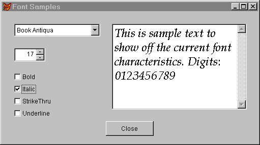

## FontBold, FontItalic, FontName, FontSize,  FontStrikeThru, FontUnderline, FontOutline, FontShadow

These properties control the font characteristics of forms and controls. FontBold, FontItalic, FontStrikeThru and FontUnderline are all logical&mdash;.T. means the control's text should use that font characteristic. FontOutline and FontShadow don't do anything in VFP/Windows, though they control the specified font characteristics in VFP/Mac.

### Usage

```foxpro
oObject.FontBold = lBoldValue
lBoldValue = oObject.FontBold
oObject.FontItalic = lItalicValue
lItalicValue = oObject.FontItalic
oObject.FontName = cNameValue
cNameValue = oObject.FontName
oObject.FontSize = nSizeValue
nSizeValue = oObject.FontSize
oObject.FontStrikeThru = lStrikeThruValue
lStrikeThruValue = oObject.FontStrikeThru
oObject.FontUnderline = lUnderlineValue
lUnderlineValue = oObject.FontUnderline
```

The docs say FontSize can go up to 2048 points, but we haven't been able to get past 127 without an error message. This isn't terribly limiting&mdash;at 127 points, you can get about five characters across a 640x480 screen. We can't imagine wanting anything much bigger than that.

The controls on a form do not inherit their font characteristics from the form. The form's Font properties affect only text written directly on the form&mdash;for example, with the form's Print method or sent directly to the form by various output commands when the form is active.

The downloads (<a href="http://www.hentzenwerke.com/" target="_blank">www.hentzenwerke.com</a>) contains a form that lets you play with font characteristics. The form is shown in Figure 1. The ControlSource for each of the controls other than the edit box is set to the appropriate font characteristic of the edit box. For example, the ControlSource for the Bold check box is:

```foxpro
ThisForm.edtSample.FontBold
```
There's only one complication on this form. Spinners don't update their ControlSource until you leave, so instead the InteractiveChange method of the spinner contains the following line:

```foxpro
ThisForm.edtSample.FontSize=this.Value
```
which updates the sample right away.



#### Figure 1: Font Characteristics Form.

### Example

```foxpro
* Set an object to use 12-point Courier New Italic
This.FontName="Courier New"
This.FontSize=12
This.FontBold=.F.
This.FontItalic=.T.
This.FontStrikeThru=.F.
This.FontUnderline=.F.
```
### See Also

[AFont()](s4g103.md), [DynamicFontBold](s4g359.md), [DynamicFontItalic](s4g359.md), [DynamicFontName](s4g359.md), [DynamicFontOutline](s4g359.md), [DynamicFontShadow](s4g359.md), [DynamicFontSize](s4g359.md), [DynamicFontStrikeThru](s4g359.md), [DynamicFontUnderline](s4g359.md), [GetFont()](s4g294.md)