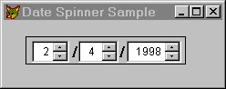

## KeyboardHighValue, KeyboardLowValue, SpinnerHighValue, SpinnerLowValue

These properties determine what values you can enter in a spinner using either the keyboard or the arrow buttons.

### Usage

```foxpro
spnSpinner.KeyboardHighValue = nValue
nValue = spnSpinner.KeyboardHighValue

spnSpinner.KeyboardLowValue = nValue
nValue = spnSpinner.KeyboardLowValue

spnSpinner.SpinnerHighValue = nValue
nValue = spnSpinner.SpinnerHighValue

spnSpinner.SpinnerLowValue = nValue
nValue = spnSpinner.SpinnerLowValue
```

KeyboardHighValue and KeyboardLowValue correspond to the Range clause of FoxPro 2.x's spinners. The spinner cannot lose focus unless its value is between KeyboardLowValue and KeyboardHighValue, which leads to a gotcha&mdash;if you assign these in the wrong order (put the higher value in KeyboardLowValue and vice versa), you can't leave the spinner at all. There is a way out, but it's a pain&mdash;don't do it! (The only way we could find involved using the mouse to create a new program that changes one of the bounds, then using the mouse to run that program.)

SpinnerHighValue and SpinnerLowValue, on the other hand, control only how high and low you can go using the spinner's arrows. Messing up these values just means that the arrows behave strangely. You can still use the spinner from the keyboard.

Note also that using up and down arrow keys to change the spinner isn't keyboarding&mdash;it's just like clicking on the arrows themselves.

<table>
<tr>
  <td width="17%" valign="top">

  </td>
  <td width="83%">
  <p>Although they ultimately control the same thing (the maximum value the user can enter in the spinner), KeyboardHighValue has a lower maximum value than SpinnerHighValue: 2,147,483,647 versus who knows how high (we gave up after entering values up to 1.0 E+100). Assigning a value greater than 2,147,483,647 to KeyboardHighValue results in it being set to a negative number. Assigning an enormously high value to SpinnerHighValue doesn't mean you'll be able to spin up to a value that high. First, who'd have the patience? Second, because of the inherent limits in numeric precision, you'll lose the values in the rightmost digits (they'll appear to be there but when you access the spinner's Value, you'll end up with something like a number in scientific notation).</p>
  </td>
 </tr>
</table>

Spinners in Visual FoxPro are much better than those in FoxPro 2.x. You can change any of these properties (as well as Increment) on the fly, so a spinner's range can change during a program. The only thing you can't do, to our regret, is set up what we guess should be called DynamicSpinnerHighValue, and so forth. That is, you can't assign a variable to one of these properties and have it changed dynamically&mdash;when the variable changes, you need to reassign the spinner property.

Figure 1 shows a form containing a date spinner class, DateSpin, based on the Container class. The range for the day spinner (the one in the middle&mdash;this uses American dates) changes based on the month and year chosen with the other spinners.



#### Figure 1: Date Spinner&mdash;One spinner controls another.

The LostFocus methods for the month and year spinners each call a custom method of the container, FixDays, to update the day spinner's properties, as follows:

### Example

```foxpro
* FixDays
DO CASE
CASE INLIST(This.nMonth, 1, 3, 5, 7, 8, 10, 12)
   This.spnDays.SpinnerHighValue = 31
   This.spnDays.KeyboardHighValue = 31
CASE INLIST(This.nMonth, 4, 6, 9, 11)
   This.spnDays.SpinnerHighValue = 30
   This.spnDays.KeyboardHighValue = 30
CASE This.nMonth = 2
   IF This.LeapYear(This.nYear)
      This.spnDays.SpinnerHighValue = 29
      This.spnDays.KeyboardHighValue = 29
   ELSE
      This.spnDays.SpinnerHighValue = 28
      This.spnDays.KeyboardHighValue = 28
   ENDIF
ENDCASE

IF This.nDay > This.spnDays.SpinnerHighValue
   This.nDay = This.spnDays.SpinnerHighValue
ENDIF
```

LeapYear is also a custom method of the DateSpin class. It returns .T. when the year passed to it is a leap year, and .F. otherwise. 

DateSpin is in the CoolStuf class library in the download files.

### See Also

[Increment](s4g426.md), [RangeHigh](s4g382.md), [RangeLow](s4g382.md)