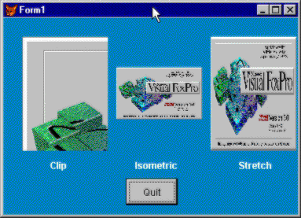

## Stretch

This property determines how an Image or OLE control is displayed. The image can be displayed in three different ways: at its full resolution where it might be cropped to fit within the space allowed; stretched or shrunk to fit the space but maintain its proportions; or distorted so that all of the image is squashed into the space allowed

### Usage

```foxpro
oObject.Stretch = nStretchValue
nStretchValue = oObject.Stretch
```
<table>
<tr>
  <td width="32%" valign="top">
  <p><b>Parameter</b></p>
  </td>
  <td width=23% valign=top>
  <p><b>Value</b></p>
  </td>
  <td width=45% valign=top>
  <p><b>Meaning</b></p>
  </td>
 </tr>
<tr>
  <td width=32% rowspan=3 valign=top>
  <p>nStretchValue</p>
  </td>
  <td width=23% valign=top>
  <p>0</p>
  </td>
  <td width=45% valign=top>
  <p>Clip. No change to the original pixels of the original image. If the image is larger than the space allowed, the upper-left corner of the image is displayed.</p>
  </td>
 </tr>
<tr>
  <td width=33% valign=top>
  <p>1</p>
  </td>
  <td width=67% valign=top>
  <p>Isometric. The image is stretched or shrunk to show the best proportional image possible within the space allowed.</p>
  </td>
 </tr>
<tr>
  <td width=33% valign=top>
  <p>2</p>
  </td>
  <td width=67% valign=top>
  <p>Stretch. The image is stretched or shrunk to fit the space.</p>
  </td>
 </tr>
</table>

Figure 1 illustrates the results of the three different settings. We hardly ever use anything other than the Isometric setting, but Microsoft chose the Clip option as the default. We suspect they did this because that setting requires the least processing.



#### Figure 1: Different settings of Stretch result in markedly different results!

### Example

```foxpro
imgImage.Stretch = 1
```
### See Also

[Image](s4g507.md), [OLEBoundControl](s4g518.md), [OLEControl](s4g518.md)