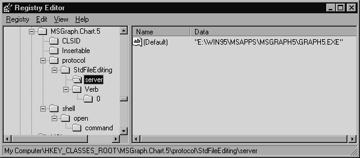
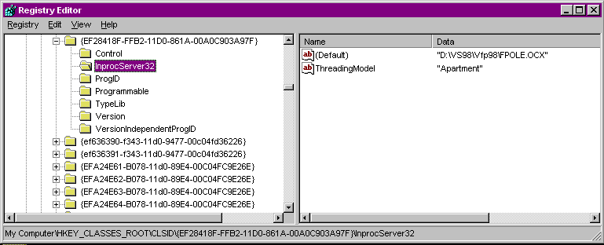
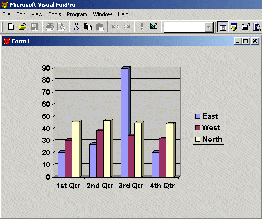
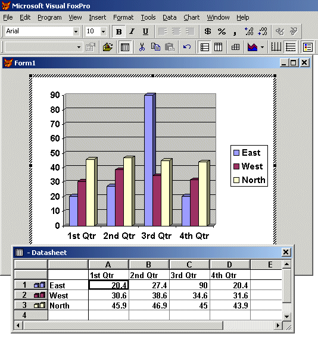

## Active Something

>True contentment is a thing as active as agriculture.  
>&mdash;G. K. Chesterton, *A Miscellany of Men*, 1912

In the original *Hacker's
Guide to Visual FoxPro 3.0,* we included a chapter "OLE, OLE, Oxen
Free!" that talked about the brave new world of OLE. Even at that time,
OLE was not that new, but it was just catching on in the developer community.
FoxPro 2.x provided support only for OLE 1.0 in its implementation, and that
was pretty weak. Visual FoxPro supported OLE 2.0 but, like many "point zero"
releases, there were a lot of incompatible products released under the 2.0
banner.

We've made a somewhat arbitrary decision to divide the
ever-expanding subject of OLE, er, COM, into several pieces. "It was
Automation, You Know" covers those technologies formerly known as OLE
Automation, now simply Automation, as well as the brave new world of Automation
servers created with Visual FoxPro. In this section, we take on a few of the
other aspects of the technology, and look at the Registry, linking and embedding,
and ActiveX controls.

### OLE History

>"In the beginning, there was DOS. And it was good ..."

Well, maybe not that good. People wanted computers to be
able to do more and more, and DOS just didn't cut it. So then GUIs (Graphical
User Interfaces) were invented, to allow users to create better-looking
documents in an easier-to-use environment. And it was good. Well, maybe not
that good. Users now wanted to be able to copy a portion of one document and
place it in another. Cut-and-paste was invented to fill this need. And it was
... okay, but not enough. Now that users could create an item in one
application and paste it into another, they wanted to go back to the first
document, update the data, and have the second document reflect the changes
made in the first. So DDE, with its hot-links, cold-links, warm-links and
lukewarm-links, was invented to fill this gap. And DDE was ... well, it was ...
anyway, we learned to work with it. 

OLE was next in this genesis&mdash;Object Linking and Embedding&mdash;a
method used to actually embed the data and a link to the originating document
in a final document in a visual manner. OLE 1.0 was a clumsy and error-prone
architecture. OLE 2.0 introduced far more stability into the structure. And
with OLE 2.0, sounding like Monty Python's Knight Who Says "Ni,"
Microsoft declared that OLE was no longer "Object Linking and
Embedding" but should henceforth be referred to only as "OLE."
Not long after that, "OLE Automation" became simply "Automation"
and OCXs (which started as OLE Controls) were declared to be "ActiveX
Controls." More recently, the term "OLE" was considered too
passé, and "COM" became the new rage. 

In the last edition, we asked, "Who knows what
Microsoft will be calling this technology by the time you read this book?"
Well, it's still COM. It's been extended to support distributed applications,
cleverly called Distributed COM, or DCOM (sounds like something to rid your
house of mice, doesn't it?). And now we have COM+ (if Microsoft doesn't call it
Active something, they'll put a plus or two at the end of it). COM+ came about
when Windows 2000 combined COM technologies with Microsoft Transaction Server
(both of which were previously add-ons), and integrated them into the operating
system.

There really and truly is something to COM and its
successive technologies that's different from ActiveX or OLE. COM, the
Component Object Model, has been at the very base of all of Microsoft's designs
for object interaction. OLE and all of the Active technologies are built on the
base of COM object design. 

We've all heard the hype for .NET as the next solution, so
does that mean COM is dead? Hardly. Microsoft has hyped COM for around seven
years, so there must be six bazillion COM apps out there by now. (Actually, a
Web page at Microsoft's site touts that COM is in use on "well over 150
million systems worldwide." And that page was last updated in August 1999,
so six bazillion apps isn't too far off the mark.) All the developers in the
world working 24/7 couldn't convert these COM apps to .NET anytime soon after
.NET is released, especially given the less-than-blazing speed with which many
firms upgrade (remember that call last week to support FoxPro 2.6 code? That
Windows 95 app? That Office 95 installation?). COM's going to be around for
quite a while. Fortunately, COM objects can play in the .NET world, so
developers don't have to instantly rewrite bazillions of COM objects when .NET
1.0 is finally released&mdash;furthering the life of COM.

### Windows Registry

>I know not anything more pleasant, or more instructive, than to compare experience with expectation, or to register from time to time the difference between idea and reality. It is by this kind of observation that we grow daily less liable to be disappointed.  
>&mdash;Samuel Johnson

The Windows Registry is
the source of all information linking applications together. The Registry is a
structured collection of "key" values, each of which may have one or
more settings. Understanding how to read and work with Registry entries is
crucial for understanding the nuances of COM.

The Registry can be
viewed with a Microsoft-supplied viewer program, RegEdit.EXE (on Win9x platforms) or
RegEdt32.EXE (for Windows NT/2000/XP)&mdash;see Figures 5-1 and 5-2. Tracing your way
through the networked set of keys can tell you the verbs appropriate to use
with a server, the paths to the server, and how to match extensions to their
executables. A set of registration keys can be exported from the registration file to an editable text format (usually with a
.REG extension) and imported into the same or a different Registry.



#### Figure 5-1: A view of the Windows 95 Registration Editor, showing entries for the MSGraph 5.0 applet.



#### Figure 5-2: The Windows NT 4.0 Registration Editor, showing the settings for VFP's FPOLE interface.

Two words of caution
(based on painful experience!) for working with the Registry: Make backups! A
badly planned entry in the Registry can cause your applications or even Windows
itself to fail. Some backup programs fail to back up the Registry, because the
file is always open while Windows is running. Make sure your backup program knows how to back up
the Registry. In addition, look for utilities specifically designed to restore
the Registry when the operating system is no longer bootable. Rdisk.EXE comes
with Windows NT. Emergency startup disks can be made for Windows 98, 2000, ME
or XP. In addition, the Resource Kits for each operating system come with
additional Registry tools. Check 'em out.

### Linking and Embedding

>There is no object so soft but it makes a hub for the wheel'd universe.  
>&mdash;Walt Whitman

The simplest form of OLE is the ability to place data and
images from one application into another. This ability to embed or link objects
within FoxPro is cleverly called "Object Linking and Embedding." Bet
someone stayed up all night thinking that one up! Linking and embedding objects
is a feature that was available in FoxPro 2.5 and 2.6 for Windows, but there
have been significant enhancements in Visual FoxPro.

FoxPro stores the object, or the links to the object, in a
General field. General fields are nothing more than enhanced memo fields, and
they share many characteristics with them. Among other things, for a given
table, they're both stored in a single FPT file. A General field is made of
several components. First, there's the binary data needed to tell FoxPro what
this data is. This key refers FoxPro to the Registry, which stores the name of
the server (originating) application and the capabilities of the server. Also
stored within the General field is the "display data," a bitmap or
metafile that gives FoxPro an image to display when the General field is shown
in a `MODIFY GENERAL` window or an OLEBoundControl. Finally, if the data is linked
from a file on disk, the path and file name of the original file are stored in
the General field. If the data is embedded rather than linked, the actual data
is also included within the General field.

When should data be embedded and when should it be linked?
The answer, as with most things in the design of a FoxPro application, is
"it depends." Some OLE servers, like MSGraph, don't have the ability
to store freestanding files, but can operate only within another application.
For these servers, the decision has been made for you. On the other hand, if
you're working with data that needs to be accessed and manipulated from another
application, such as a Paintbrush file that will change over time, the data
should be linked so the other applications will be able to find it on disk. The
flip side of the same coin is that embedding data within a General field
protects it from unauthorized changes, so it's editable only within your
application or another application with appropriate access to your data. 

Disk space is another consideration. Since OLE generates
display data as well as storing embedded data within a file, large, high-color,
detailed graphic images can consume enormous amounts of disk space. Display
data is typically stored in a bitmap-type format: several bytes of color
information for each pixel. So, even if the original image is deeply
compressed, like a JPG or PNG image, the resulting display data can take
megabytes of space. We know of some applications where the decision was made to
bypass General fields for storing the image altogether. The path to the actual
data is stored in a character or memo field, and the data is brought into the
General field of a temporary cursor when it needs to be manipulated. So the
decision to link or embed, either permanently or temporarily, or none of the
above, is one that needs to be made based on the best compromise of your
application's need for access, security and disk space issues.

Data is attached to a General field with the `APPEND GENERAL`
command. It can be displayed with the legacy `MODIFY GENERAL` or `@...SAY`
commands, or preferably with the more capable and controllable OLEControl and
OLEBoundControl. See the Reference section for more on these commands.

Like memo fields, General fields suffer from "memo
bloat." When changes are made to information stored within the memo file,
new blocks of information are written at the end of the file, and then the
original blocks are marked as no longer in use. These blocks are never reused.
It is necessary to `PACK MEMO` (we dislike PACK&mdash;see "Commands Never to
Use" earlier in the book for some good workarounds) or `COPY` the table to
eliminate the wasted space.

### In-Place, er, In-Situ Activation, er, Visual Editing

>To a philosopher all *news*, as it is called, is gossip, and they who edit it and read it are old women over their tea.  
>&mdash;Henry David Thoreau, *Walden*, 1854

The confused topic title is typical of this confused topic.
Microsoft fumbled the ball in a major way when rolling out this feature,
changing its name three times in the process. "In-situ" is wonderful
for those Ivy League Latin scholars among us, but we can't see this catching on
with the MTV crowd&mdash;it sounds more like a sneeze than a feature.
"In-Place" says what it does and will probably be popular with
programmers for years to come, because it tells us what it is. Visual Editing,
however, is what Microsoft decided to call it, a phrase that flows off the
tongue of the sales reps easily enough, and one that looks good in print. But
what does it mean to do "visual editing"&mdash;that you look at the screen
while you type? 

What it does is far easier to explain than trying to come up
with a name for it. Visual Editing is a better user interface to allow users to
manipulate data from one application while running another. Microsoft has
discovered through usability studies that users are uncomfortable and
disconcerted when they're working in an application and a second application's
interface&mdash;a new window, menu and toolbars&mdash;leaps to the front when the second
application's data is called up. For example, a user might want to place a
graph of quarterly sales on a page in the annual report. In earlier versions of
OLE, placing a graph in a document and calling it up for editing brought up the
entire MS Graph interface, with its own menus, toolbars and separate graph and
datasheet windows. The document the hapless user was working on was shoved far
to the back, out of the way and inaccessible.

With Visual Editing, the graph doesn't come up with its own
window, but rather is activated in place (get it?), maintaining its position
and relative size within the document. The toolbars of the host application are
replaced with the toolbars of MS Graph, in a manner similar to the way that
Visual FoxPro brings up and removes its own toolbars as the various power tools
are called into play. The menus also change. Those menus that are more the
concern of the containing application remain the same. That includes the File
menu, with its options to Open, Close and Exit, and the Window menu, with its choices
for arranging the various windows on the screen. The remaining menu pads are up
for negotiation between the contained application and its container. The Edit
menu is a good candidate for replacement, so that it can offer features unique
to the application. The Help menu is taken over by the embedded application,
allowing it to offer context-sensitive help. Any menus you create that should
participate in this negotiation process should include the `NEGOTIATE` keyword (see the Reference section on `DEFINE PAD` for
details). Figures 5-3 and 5-4 illustrate the menu negotiation with
before-activation and after-activation pictures of an MS Graph application.



#### Figure 5-3: The native FoxPro menu before OLE activation.



#### Figure 5-4: After In-Place Editing. Note new toolbar and menu pads and bars.

One significant limitation of this method is that Visual
Editing is available only for embedded objects. Microsoft claims this is to
avoid having multiple users attempting to make changes to a file
simultaneously. We find it astounding that no one considered implementing a
locking scheme as part of the logic of Visual Editing. So, you need to either
embed data you want to allow your clients to edit, or run the linked
application directly, rather than use Visual Editing.

Last words of warning before you leap into implementing this
feature: Visual Editing, like most of OLE, is resource-intensive. Ensure that
you test and evaluate the features on a minimally acceptable system before
committing to a large project dependent on this feature. OLE is very cool, but
that coolness comes at a cost. While it may be theoretically possible to
implement a Visual FoxPro system with Visual Editing on a 64 MB, low-end
Pentium III system, it would not be a pretty thing. Data-entry clerks would get
into the habit of calling up a Visual Editing situation just before going to
lunch, so it might be ready for them upon their return. Something along the lines
of 128 MB is probably a good minimum system for OLE work, and more is better.
For more of our hardware recommendations, check out "Hardware and Software
Recommendations" in the earlier part of the book. 

### ActiveX Controls, aka OLE Custom Controls, aka OCXs

>Any technology sufficiently advanced is indistinguishable from magic.  
>&mdash;Sir Arthur C. Clarke, *Clarke's Law*

Sometimes it's hard to
believe things accomplished by our computers are not simply magic. ActiveX
Controls often seem to take on that aura. An ActiveX Control is an add-on for
Windows32 applications that gives our applications capabilities not imagined by
the authors of Visual FoxPro (or sometimes just better versions of the ones
they did imagine). ActiveX Controls, or, more familiarly, OCXs (named for their
usual extension), can be added to a development environment like Visual FoxPro
in such a way that they seem like just another control. They have properties,
events and methods. They can be selected from the Form Controls toolbar and
placed on forms. They can be manipulated in code through the usual
`Formset.Form.Object.Property` addressing scheme. Events and methods can be
initiated as with any native control. But the ActiveX Control can be written by
a third party. This is a tremendous avenue of possible add-on tools for Visual
FoxPro.

Not only that, but
ActiveX Controls are designed to be available to any tool that supports the OLE
Custom Control interface. ActiveX Controls developed for other tools, such as
Visual Basic, Access, or Visual C++, should be compatible ("should
be" is the key here&mdash;see below) with the FoxPro environment. This larger
market for selling tools can only help to bring more and better developers into
this field. ActiveX Controls from a variety of manufacturers are already available
for graphing, displaying calendars and acquiring analog data. We continue to
see new and interesting controls.

ActiveX Controls
originated with the VBX, or Visual Basic eXtension, feature added in Visual
Basic 3.0. These add-ons were specifically designed to take advantage of the VB
environment, and had a number of limitations that made them difficult to use in
other development environments or to add to other platforms. Access 2.0
featured the ability to use the second generation of VBXs, 16-bit OCXs.
However, this still wasn't enough, and 32-bit ActiveX Controls were developed
to address those needs. 32-bit ActiveX Controls are the only format supported
by Visual FoxPro, and VFP was the first released application to use them. Since
the release of Visual FoxPro, additional platforms for 32-bit ActiveX Controls
have appeared&mdash;most notably, Visual Basic 4.0 and later.

With the proliferation
of ActiveX Controls for the much larger developer market, the reality behind
the promise came to light. ActiveX Controls *should*
be the same, the interfaces *should* all
work the same, and everybody *should*
just get along fine. Uh-huh. Well, the ugly truth is that VFP, first out of the
gate with OCX support, was developed with a preliminary specification.
Last-minute changes defeated some of the compatibility the VFP team tried so
hard to achieve. Developers of VB, in an effort to make OCXs most useful on
their platform, interpreted the specification to let them introduce some custom
interfaces, rendering controls that used those interfaces inoperable in other
platforms. Finally, OCXs shipping to support the interface in VB lacked key
elements needed to support the faster VTable binding, forcing the VFP
development team to create the `SYS(2333)` function to turn off that feature.

Like many other features
of OLE 2.0, ActiveX Controls are a mish-mash of feature sets and optional APIs.
Visual Basic, Access and other development platforms supporting ActiveX
Controls reveal incompatibility problems, with controls running with one and
not other platforms of this "standard." We really hope that Microsoft
gets their act together on this one and finds a way to deliver the same
support, using the same APIs across their entire product line of development
systems. If Microsoft can't even do this internally, third-party vendors stand
no chance of supporting the OCX specification. 

The number of OCXs
bundled with Visual FoxPro is pretty dazzling, and really beyond the scope of
what we want to cover here. In the following sections, we'll talk a little bit
about how ActiveX Controls are used in VFP, and some important controls VFP
provides. 

#### How to Use ActiveX Controls in Visual FoxPro

Just as with FoxPro's
base class controls, the first thing you want to do with these controls is to
subclass them, and use your subclasses in forms. The reason for this is that
it's not possible to add custom properties and methods to the base classes.
There will come a time when you have designed the coolest form and realize that
you need to add some feature to the control. With subclassed controls, this is
easy.

The properties of these
controls are accessible in curious ways. Right-clicking on most ActiveX
Controls will bring up a context-sensitive menu with two "Properties"
options: one labeled just "Properties" that brings up the native VFP
property sheet, and a second one, usually labeled "*Control* Properties" that brings up the control's property
sheet. The control's own property sheet is often the only way to see some of
the properties of the control. If they appear at all, many of the control's
properties show up only on the All tab and not on the Other tab of VFP's
property sheet. However, the VFP team has made it easier to find the control's
PEMs by showing them in color in the VFP property sheet. The actual color used
is configurable from the property sheet's context menu. In addition, the method
editor puts the string "*** ActiveX Control Method ***" at the
beginning of each method that belongs to the control.

You'll also note that
few ActiveX Controls have data binding features. If you need to add, say, a
table of data, you'll have to use AddItem to do it one record, or even one
field, at a time. This can seriously limit the capacity of the controls to work
with large data sets. We have seen a few controls with data binding features,
using ODBC or ADO to link to the underlying data sources. These can be
problematic, because their implementation really makes them stand-alone data
applications plunked in the middle of our apps&mdash;they're not sharing data with
the host VFP application. That means these controls are usually pretty heavy
consumers of resources, and aren't going to recognize changing data within the
application until it's committed to the data source and the control's data is
requeried. If you need to data-bind an OCX, you might have to write the code
yourself, perhaps in a data-binding wrapper class definition.

Almost all of the
controls we discuss below have an AboutBox method, which displays a dialog
crediting the authors. They also have Help files, stored in the Help directory
under the Windows installation directory.

#### MSComCtl.OCX

The MSComCtl.OCX library contains a number of very useful
controls, including the ProgressBar, Slider, StatusBar, Toolbar, and TreeView
controls. There's also an ImageCombo control that's similar to the VFP ComboBox
control, except that pictures can be attached to each item in the list.
(Actually, you can do that with VFP's combo box, too. See the `Picture` property
in the Reference section.) Ever want to change the look of the tabs on a
PageFrame control? The TabStrip control has a number of different looks to try;
implement it by having it activate the pages of your PageFrame control on which
you've turned off the tabs. Also available is the ListView control, used to
give an Explorer-like interface to your apps. And finally, the ImageList
control is a collection of images, used by other controls to set their image
properties. You can find help for all of these controls in CmCtl198.CHM.

Don't forget that when you use any one of these controls,
you must ship MSComCtl.OCX with your application.

Note that in previous releases, this library shipped as
ComCtl32.OCX (the version 5 controls), so don't forget to take this into
account with your older apps.

#### MSComCtl2.OCX

This library contains some cool controls. The Animation
control lets you run .AVI files (without sound) on your buttons when the button
is clicked. There's a DateTimePicker and a MonthView control that make entering
dates and times much easier. The UpDown control works just like the arrows on a
spinner, but updates an associated control (ever want to use a spinner with
character data?). And the FlatScrollBar control looks like the scrollbar in
Internet Explorer. You can find the help for this library in CmCtl298.CHM.

#### MCI32.OCX, a Multimedia Control

This is the Multimedia MCI control, which manages the
recording and playback of multimedia files. It's a set of VCR buttons that can
be programmed to do whatever you need. Its Help file is MMedia98.CHM.

#### MSChrt20.OCX, the MsChart Control

MSChart is a control that creates graphs (aka charts). Its
Help file is MSChrt98.CHM.

#### MSComm32.OCX, the MSComm Control

This
control provides communications over the serial port. You can manipulate the
settings of the port, and then send and receive data. Its Help file is
Comm98.CHM.

#### MSINet.OCX, Microsoft Internet Transfer Control

This
control implements HTTP and FTP protocols in your application. There are
Username and Password properties to let you connect to private sites, as well
as an Execute method to perform common FTP commands. The Help file is
INet98.CHM.

#### MSMAPI32.OCX, MAPI Controls

You can provide e-mail support with the Messaging
Application Program Interface (MAPI) controls. There are two controls: the
Session control opens (and closes) the MAPI session, while the Message control
works with individual messages within a MAPI session. MAPI services must be
installed on the computer running your application in addition to providing
this OCX. The Help file is MAPI98.CHM.

#### MSMask32.OCX: Masked Edit Control

The
OCXs mentioned in this section are also shipped with the other Visual Studio
tools, which explains this control's inclusion. It's like a text box with an
InputMask property. Unless you're matching interfaces with another language
that uses this control, we think you'll stick with InputMask. Its Help file is
MASKED98.CHM.

#### MSWinSck.OCX, WinSock Control

The
WinSock control lets you connect to another computer to exchange data using TCP
and UDP protocols. See MSWNSK98.CHM for more details on how to use this
control.

#### PicClp32.OCX, PictureClip Control

The
PictureClip control takes a single bitmap and divides it into rows and columns,
making each clipped region available for use by a button or other control
requiring a picture or icon. You can put all of your icons in one bitmap and
reference the location in this control, instead of using a multitude of files
shipped with your application. Its Help file is PicClp98.CHM.

#### RichTx32.OCX, Rich Textbox Control

Here's
the tool to format text with all the various font properties. You'll need to
create an interface that sets these properties (an Italic button, a Bold
button, a font selector, etc.), but all the tools are here to let the user see
or choose text formatting in your application. See RTFBox98.CHM for much more
information.

#### SysInfo.OCX, SysInfo Control

The SysInfo control responds to system events, like changes
to the system time or date, power status, and plug-and-play events, and it
monitors system properties like OSVersion and WorkAreaHeight. Its Help file is
SysInf98.CHM.

#### Filer

Filer used to be a handy "desktop accessory" tool
built into FoxPro, great for finding all those times you misspelled
"license" and opening all the programs in the native FoxPro editor.
Alas, time and politics killed poor Filer, eliminated from the feature list for
VFP 5. Rumors abound as to the real cause of its demise. We can't say for sure,
but we suspect it wasn't really long file names that killed it.

Filer returned, not too long after the shipping of VFP 5.0a,
but in a new guise: as a FoxPro form and a COM object containing the core
file-searching capabilities. The source code for the Filer form is provided,
and we've seen several variations of the Filer form in *FoxPro Advisor* magazine as well as out on the Web. In VFP 6 and
later, you'll find the form and DLL in `HOME() + "\Tools\Filer"`. 

Did we say DLL? Yes, the Filer functionality comes to us as
a DLL. But, you might ask, is a DLL an ActiveX Control? Well, no, strictly
speaking. By Microsoft's definitions this month, ActiveX Controls are COM
components with a design-time user interface: an OCX. But this chapter is
"Active Something" and, like many of the other Active technologies
Microsoft is shipping these days, Filer is a COM component accessible from many
languages but lacking a design-time user interface. We feel the control needs
to be featured, and this was the best place for it.

Here's a quick idea of what Filer can do for you:

```foxpro
oFiler = CREATEOBJECT("filer.fileutil")
oFiler.SearchPath = "C:\Temp"   && path can be separated with commas
oFiler.FileExpression = "*.*"   && wildcards and multiple file 
                                && expressions, separated with semicolons
oFiler.SubFolder = .T.          && search subfolders
oFiler.SearchText1 = ""         && the text to search for
oFiler.SearchText2 = ""
oFiler.SearchText3 = ""
oFiler.IgnoreCase = .T.         && ignore the case 
oFiler.WholeWords = .T.         && find only whole words
oFiler.Find(0)                  && 0: new search, 1: add to results
oFiler.Files.Count              && returns count of files found
oFiler.Files[2].Name            && returns name of file
oFiler.Editor = "notepad"       && specify an external editor
oFiler.IsHostedByFox = 0        && use the specified editor, not internal
```
Now, you could probably write all of the code to perform the
searching functions in VFP&mdash;`ADIR()` and a little recursion get you most of the
way there. Processing the text searching is easy with `FileToSTR()`; ANDing and
ORing results would be tiresome but manageable&mdash;but why bother? You've already
got the functionality you need, in a compact little utility, listed as being
freely distributable.

#### FoxTLib

The FoxTLib OCX is a handy utility for reading and parsing
ActiveX Type Libraries. A Type Library describes the functionality of its
associated component, going into detail on the interface. It can be important
to browse type libraries, as we discuss in ["It Was Automation, You
Know,"](..\section1\s1c9.md) to determine the method names, parameters and constants required by
a function. FoxTLib supplies all of the information in an easy-to-use format.
Check out the VFP Help for the details on FoxTLib, and check out the sample
class Typelib.VCX (original, huh?) included in the `_SAMPLES +
"Classes\"` directory.

#### FPOLE

Some people are still out there programming in a language
not capable of working with all of Microsoft's technologies (actually, come to
think about it, we suspect we all are). For them, the VFP team included a DLL
in VFP 5, and a DLL-OCX pair in VFP 6 and later, that allows them to access
FoxPro's internal functionality even if their language is not capable of using
Automation directly. It is called FPOLE, and it presents several methods.
FoxDoCmd allows you to pass a single command to FoxPro and have it execute it.
Other methods include FoxEval to evaluate an expression, SetOLEObject to
specify the class used in the methods above, and several other methods for
error handling. 

### Wrap it Up

>There is not a fiercer hell than the failure in a great object.  
>&mdash;John Keats

ActiveX offers some
great challenges. Integrating the functionality available only through OLE can
allow you to create easier-to-use, easier-to-maintain, richer interfaces with
less coding and maintenance. Embedded and linked data can maintain the
inter-application links from one session to the next. Visual Editing allows the
presentation of data from foreign sources within the comfortable context of
your own application.

But the reality of the situation is that many of these new capabilities are still being worked out. The perfect OCX for the job might work well under Visual Basic but may not have been tested under Visual FoxPro. Your clients might be surprised to hear that some functionality is available only under specific variations of the operating systems, or that 128 MB of RAM is good for a "starter" system. Each and every application you work with will require a different command set, different syntax, perhaps a different sequence of steps. Be prepared to face these challenges, and you will create some very cool COM/OLE/ActiveX-based systems.

One final tip: In many cases the OCX is just a wrapper for underlying technology available through COM or DECLARE-DLLs, and by using the lower-level access, you can often avoid problems with OCX hell. A case in point is the CommonDialogs control, contained in ComDlg32.OCX, which provides a number of Windows dialogs, such as Open and Save As. Starting in VFP 7, one of the classes (_ComDlg in `HOME() + "FFC\_System.VCX"`) included in the FoxPro Foundation Classes (FFC) provides Open and Save dialogs by calling the same Windows DLL functions the ActiveX control does. You can use this class rather than having to worry about distributing and registering ComDlg32.OCX.