## Hacking the Class Browser and Component Gallery

Visual FoxPro's Class Browser and Component Gallery (or just
"Browser" and "Gallery") are valuable development tools;
most self-respecting VFP hacks will want to know them well.

Most of Visual FoxPro's ancillary tools, like Browser and
Gallery, are actually written in Visual FoxPro. (Surprised?) Starting with VFP
6, the source code for all the VFP-coded tools is included. This is great news
for VFP developers because the source for these tools provides some great (and
occasionally not so great) examples. If you search carefully, you may even find
an astonishing feat of software prowess: a comment in the source code. 

Lack of comments aside, if you've ever wondered just how a
particular wizard or service works, you can now easily and legally
reverse-engineer it. 

The source for VFP's tools is kept in a ZIP file in the
`HOME()+"Tools\XSource"` directory. If this directory doesn't exist on
your system, it's possible that you chose to omit some tools during installation.
The Browser and Gallery source can be found in the `HOME() +
"Tools\XSource\vfpsource\Browser"` directory. The most interesting
file in this directory is the form Browser.SCX. The Browser and the Gallery
share the same SCX file, and many of the methods therein serve both the Browser
and the Gallery. 

Let's look first at the Browser, and then we'll explore the
Gallery. 

### The Class Browser

The Browser is useful for a variety of development purposes.
These include, among others:

* Managing classes and class libraries, including adding, deleting, renaming and redefining classes.

* Generating equivalent code for visual classes.

* Creating running instances at design-time.

* Browsing all the classes and libraries used by a project.

* Browsing the interfaces of ActiveX and COM components.

#### Starting the Class Browser 

There are three ways to start the Browser. From the Tools
menu, select Class Browser. Another way is to use the `_BROWSER` system variable.
`_BROWSER` defaults to "Browser.APP", which is located in the Visual
FoxPro home directory. Issuing the command: 

```foxpro
DO (_BROWSER)
```
is equivalent to using the menu. In addition, you can pass a
parameter containing the name of the class library to load. For example, this
code: 

```foxpro
DO (_BROWSER) WITH HOME(2)+"tastrade\libs\about"
```
loads About.VCX from the TASTRADE sample application. Add a
second parameter to the command to select a particular class in the list. For
example, this code: 

```foxpro
DO (_BROWSER) WITH HOME(2)+"tastrade\libs\about", "aboutbox"
```
loads the About library and selects the class called
AboutBox. Specifying a form file name directly works, too: 

```foxpro
DO (_BROWSER) WITH HOME(2)+"tastrade\forms\customer.scx"
```
starts the Browser with the form Customer.SCX loaded. 

Finally, if the Gallery is running, you can just click the
Browser button to show the Browser.

#### The Browser Interface


#### Figure 5-5: Just browsing, thanks. The Class Browser interface.

Figure 5-5 shows the Browser. Here are a few things you
should know about the Browser to increase your productivity with this tool.

<table>
<tr>
  <td width="11%" valign="top">
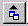
  </td>
  <td width="89%" valign="top">
  <p>Click this button to see the class code. Note that in some cases, the code shown can't be executed correctly. (This happens if the class is a container of other classes.) Right-click this button and see the class code in HTML format. This isn't obvious, but the window that appears is actually an instance of your HTML browser. You can right-click in the window and choose View Source to display the HTML source for the display.</p>
  </td>
 </tr>
<tr>
  <td width="11%" valign="top">
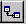
  </td>
  <td width="89%" valign="top">
  <p>Use this button to create a new class. This new class can be a subclass of the currently selected class, a subclass of any other class, or a subclass of a VFP base class.</p>
  </td>
 </tr>
<tr>
  <td width="11%" valign="top">
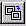
  </td>
  <td width="89%" valign="top">
  <p>You can redefine classes (that is, change the parent class) in the Browser with this icon. Starting in VFP 6, you can even redefine a class to use a different base class, after being warned that some intrinsic methods and properties will understandably be lost in the process.</p>
  </td>
 </tr>
<tr>
  <td width="11%" valign="top">
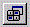
  </td>
  <td width="89%" valign="top">
  <p>When you have a method code window open, this button (which floats or docks independently of the Browser on a one-button toolbar) allows you to view the code up the class hierarchy in parent class methods. This button is available even after you close the Class Browser. </p>
  </td>
 </tr>
</table>

#### View More Than Class Libraries

In the Browser's Open dialog, note the different types of
files that are supported. Figure 5-6 shows the Browser's Open dialog with the
drop-down expanded to show the sorts of things you can display in the Browser.

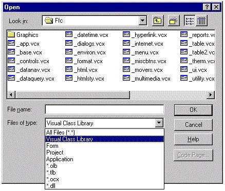

#### Figure 5-6: Open sesame! The Class Browser's Open dialog shows that you can view more than just class libraries in the "Class" Browser.

You can open VFP forms in the Browser; many of the features,
such as showing code, work as you might expect. This is very handy for
communicating your code examples with other users via e-mail. 

If you open a VFP project file, all the class libraries in
that project are visible in a single view. This is great if your project
contains hundreds of classes and you have no idea which library a particular
class belongs to. This view is a lifesaver when you inherit (or join) a new
project.

You can open all manner of EXE and OLE files, and the
Browser displays their public interfaces. If help is available, double-clicking
an item or pressing the spacebar invokes it.

#### Clever Tricks

To add controls to a form or class, in
the Browser open the VCX (class library) containing the class of the object
you want to add to the form, select the class, and then drag and drop the class
icon to the design surface. You can also drop a control on the desktop, and
you'll get a running instance of that class.

To quickly get to a class you're using, in the Form or Class
Designer select an object. Open the Browser. It opens with the class library of
the selected class loaded, and with the selected class highlighted.

#### Class Management

Table 5-1 shows what you can do with classes using either
VFP commands or the Browser.

#### Table 5-1: The class-management functions of the Class Browser.

<table>
<tr>
  <td width="32%" valign="top">
  <p><b>Action</b></p>
  </td>
  <td width="29%" valign="top">
  <p><b>VFP Command</b></p>
  </td>
  <td width="39%" valign="top">
  <p><b>Class Browser Action</b></p>
  </td>
 </tr>
<tr>
  <td width="32%" valign="top">
  <p>Clean up a class library</p>
  </td>
  <td width="29%" valign="top">
  <p>COMPILE CLASSLIB or open the VCX as a table and issue a PACK command.</p>
  </td>
  <td width="39%" valign="top">
  <p>Highlight a class or class library file in the Browser and click the Clean Up Class Library button.</p>
  </td>
 </tr>
<tr>
  <td width="32%" valign="top">
  <p>Copy a class from one class library to another</p>
  </td>
  <td width="29%" valign="top">
  <p>ADD CLASS</p>
  </td>
  <td width="39%" valign="top">
  <p>Open two copies of the Browser, with one pointing to the class to be copied and the other containing the destination class library. Ctrl+drag the class's icon from one Browser instance to another.</p>
  </td>
 </tr>
<tr>
  <td width="32%" valign="top">
  <p>Create a class library</p>
  </td>
  <td width="29%" valign="top">
  <p>CREATE CLASSLIB or CREATE CLASS using a new class library.</p>
  </td>
  <td width="39%" valign="top">
  <p>Click the New Class icon and specify the new class library name in the New Class dialog.</p>
  </td>
 </tr>
<tr>
  <td width="32%" valign="top">
  <p>Create a new class</p>
  </td>
  <td width="29%" valign="top">
  <p>CREATE CLASS</p>
  </td>
  <td width="39%" valign="top">
  <p>Select the parent class in the Browser and click the New Class button.</p>
  </td>
 </tr>
<tr>
  <td width="32%" valign="top">
  <p>Move a class between class libraries</p>
  </td>
  <td width="29%" valign="top">
  <p>No single command exists to move a class. Instead, copy the class to a second library (ADD CLASS), and then remove it from the first.</p>
  </td>
  <td width="39%" valign="top">
  <p>Drag the class's icon from one Browser instance to another. If subclasses of the moved class are open in any open Browser instances, the subclasses are automatically remapped to the parent class's new class library. If subclasses of the moved classes aren't open in another Class Browser instance, you've just corrupted your class hierarchy. Watch out!</p>
  </td>
 </tr>
<tr>
  <td width="32%" valign="top">
  <p>Open a class in the Class Designer</p>
  </td>
  <td width="29%" valign="top">
  <p>MODIFY CLASS</p>
  </td>
  <td width="39%" valign="top">
  <p>Select the class in the class library. Then double-click it, select Modify from the shortcut menu, or press the spacebar.</p>
  </td>
 </tr>
<tr>
  <td width="32%" valign="top">
  <p>Remove a class from a class library</p>
  </td>
  <td width="29%" valign="top">
  <p>REMOVE CLASS</p>
  </td>
  <td width="39%" valign="top">
  <p>Select the class, and then select Remove from the shortcut menu.</p>
  </td>
 </tr>
<tr>
  <td width="32%" valign="top">
  <p>Rename a class</p>
  </td>
  <td width="29%" valign="top">
  <p>RENAME CLASS</p>
  <p>VFP does not adjust classes below the renamed class in the class hierarchy.</p>
  </td>
  <td width="39%" valign="top">
  <p>Select the class, and then select Rename from the shortcut menu.</p>
  <p>The Browser adjusts classes below the renamed class in the class hierarchy if they're displayed in any open Browser window (not just the current one).</p>
  </td>
 </tr>
<tr>
  <td width="32%" valign="top">
  <p>View class code</p>
  </td>
  <td width="29%" valign="top">
  <p>There's no command or series of commands to do this, short of a complex program.</p>
  </td>
  <td width="39%" valign="top">
  <p>Select the class and click the View Class Code button.</p>
  </td>
 </tr>
<tr>
  <td width="32%" valign="top">
  <p>Add an instance of a class to a container (such as a form or _SCREEN)</p>
  </td>
  <td width="29%" valign="top">
  <p>Container.AddObject() or Container.NewObject()</p>
  </td>
  <td width="39%" valign="top">
  <p>Click on the Move icon (the top-left icon in the Browser form, which changes based on the highlighted item) and drag it to the container.</p>
  </td>
 </tr>
<tr>
  <td width="32%" valign="top">
  <p>Change the icon for a class</p>
  </td>
  <td width="29%" valign="top">
  <p>There's no command for this. Instead, open the class in the Class Designer, choose Class Info from the Class menu, and change the Container Icon setting.</p>
  </td>
  <td width="39%" valign="top">
  <p>Right-click on the Move icon and select an image file in the GETPICT() dialog that appears. There's a nice touch here: When you select Cancel in the dialog, you get the option to reset the icon to the default for that item.</p>
  </td>
 </tr>
</table>

#### Programming the Class Browser with Add-Ins

The VFP Browser is designed for extensibility. It has a rich
programming interface, and it exposes its complete object model. The usual way
to program the Browser is by hooking its events and methods with Browser
add-ins. 

An add-in is a program that you create (or download) and
then register with the Browser. Once registered, the add-in can be invoked
automatically by Browser events or methods. If the add-in is not assigned to a
particular event or method, the user can invoke it.

Here is an example Browser add-in that demonstrates some of
the most important qualities of add-ins.

```foxpro
* Program Add-InSample1.PRG
* This program echoes class information to
* the debug output window
 
#DEFINE DEBUGWINDOW  "Debug Output"
 
LPARAMETERS oBrowser
 
IF ! oBrowser.lFileMode AND !EMPTY(oBrowser.cClass)
 ACTIVATE WINDOW DEBUGWINDOW
  
  *-- Output the class name 
  DEBUGOUT "Class Name: "+ oBrowser.cClass
 
  *-- Output the class library name
  DEBUGOUT "Class Library: "+ oBrowser.cFileName
 
  *-- Output the class's timestamp
  DEBUGOUT "Timestamp: "+ PADR(oBrowser.nTimeStamp,25)
  
  *-- Display the entire class pedigree
  DO WHILE oBrowser.SeekParentClass()
      *-- Output the parentclass name
      DEBUGOUT "Parent Class: "+ oBrowser.cClass
  ENDDO
ELSE
  WAIT WINDOW "Please select a class and try again"
ENDIF
```
Observe the following points about the sample add-in above:
The Browser passes a reference to itself as a parameter to the add-in. This
means that all of the Browser's members are available for reference. The
example demonstrates the Browser's cClass, cFileName, and nTimeStamp
properties, and its SeekParentClass method. 

Now, with the Browser running, register the add-in as
follows: 

```foxpro
_oBrowser.AddIn("Sample Add-In", "Add-InSample1.PRG")
```
<table>
<tr>
  <td width="20%" valign="top">

  </td>
  <td width="80%">
  <p>While the Browser form is running, you can refer to it with a memory variable named _oBrowser. </p>
  </td>
 </tr>
</table>

The Browser's AddIn method registers add-ins. The syntax
shown here specifies a name for the add-in and the program to run. An optional
third parameter specifies the event or method to which the add-in gets
assigned.

If a Browser event is assigned to the add-in, then the
add-in is invoked automatically near the beginning of that event's execution.
If a Browser method is assigned to the add-in, then the add-in is invoked near
the end of that method's execution.

In the example above, since no method or event is specified,
the add-in is listed in the Browser's add-in shortcut menu.

<table>
<tr>
  <td width="20%" valign="top">

  </td>
  <td width="80%">
  <p>The Add-In option doesn't always appear on the shortcut menu. When the mouse is over the Classes or Members panes, right-clicks don't show add-ins among the choices. You have to right-click on either of the description pages or the top of the Browser, where the buttons are, or over the Browser form itself, to see the add-in item.</p>
  </td>
 </tr>
</table>

Alternately, passing the name of an add-in to the Browser's
`DoAddIn()` method runs that add-in.

#### Tell me more! Tell me more! 

The Browser is extensively documented under "Class
Browser" in VFP Help. Also take a look at the following topics:
"Class Browser Buttons", "Class Browser Methods", and
"Class Browser Properties." For more information on add-ins, see also
the white papers section of the Visual FoxPro pages on the Microsoft Web site.

#### Having Trouble with the Class Browser's ActiveX Controls

Some people complain that earlier versions of the Class
Browser crashed a lot. Although that's not much of an issue in later versions,
if the Browser is prone to instability on your system, try invoking it with the
optional third parameter set to .T.:

```foxpro
DO (_BROWSER) WITH FileName, , .T.
```
This opens the Browser in "listbox" mode with the
TreeView control replaced by a VFP listbox. It's not as pretty looking, but it
may work better for you. (This is a legacy feature from VFP 3, which had a Mac
version; the listbox is a substitute for the outline OLE control, which doesn't
have a Mac counterpart.)

### The VFP Component Gallery

The Gallery is the Browser's companion. Both share the same
display surface, and you can toggle between them with a handy command button. 

The Gallery is a flexible and programmable shortcut manager.
Because it works with shortcuts, you can't hose a file using the Gallery; when
you delete a shortcut from the Gallery, the underlying file is not deleted. 

The Gallery can be used to categorize and display almost
anything, and its strength is in grouping the various resources used in
software development. With the Gallery, you can create and display your own
abstractions, organized as you wish, with event behavior&mdash;such as click,
right-click, double-click&mdash;that you can innovate and control. Moreover, the
Gallery also has *dynamic folders*,
which we'll discuss in a minute, which have the ability to hold all the
contents of VFP projects, class libraries and directories.

Now, you could use the Other Files section of the Other tab
in Project Manager to do some of this, but that's primitive, inflexible,
and&mdash;let's face it&mdash;low tech.

#### What's What in the Gallery

It's probably a good idea to explain a few things before
going further.

A <b>catalog </b>is both
a DBF table and the highest-level element of the Gallery. A catalog's records
define the shortcut items you see in the right-hand pane in the Gallery.

A <b>folder</b> is
simply a logical package of items and possibly other folders. (Folders look
just like subdirectories and that abstraction works for us.) Folders are either
*static* or *dynamic*. A static folder contains predefined shortcuts to items. A
dynamic folder determines its contents each time the Gallery is refreshed. A
dynamic folder could be defined as a directory ("C:\Projects\*.*"), a
VFP project, or a class library.

An <b>item</b> is a
shortcut to a particular file or URL.

An<b> item type </b>defines
the behavior of particular items in the catalog. Item types are stored in the
`HOME()+"Gallery\VfpGlry.VCX"` class library, and are configurable
through the Properties dialog for each catalog. The root catalog, named
"Catalogs", contains the default item types that apply to all
catalogs. See "Understanding Item Types" below for more on item
types.

#### Start Me Up!

VFP has a system memory variable named `_GALLERY` to identify
the Gallery application. By default, it's called "Gallery.App" in
your `HOME()` directory. You can replace or "wrap" the Gallery
application by changing the value of `_GALLERY`. 

You can use the `_GALLERY` memory variable to invoke the
Gallery, like this: 

```foxpro
DO (_GALLERY)
```
In addition, you can pass a parameter containing the name of
the catalog to load. For example, this code: 

```foxpro
DO (_GALLERY) WITH HOME()+"Gallery\Vfp Catalog"
```
loads Vfp Catalog.DBF. 

You can also start the Gallery from the Tools menu, or click
the Gallery button in the Browser.

#### The Component Gallery Interface

If you're comfortable with Explorer-type interfaces, the
basic features of the Gallery (shown in Figure 5-7) will work pretty much as
you'd expect. 

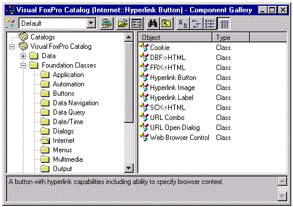

#### Figure 5-7: The Component Gallery interface&mdash;yet another Explorer-type interface

The Gallery is segmented into two panes. The Catalog pane,
on the left, lists the folder hierarchies within the currently open catalogs.
The Items pane, on the right, shows the items in the current catalog or folder.
Both panes are endowed with item-sensitive context menus to do the usual useful
things such as cut, copy, paste, rename, and so on. You can also invoke
item-sensitive property dialogs for selections in the left or right panes.
Moreover, the entire Gallery is enabled for both regular and OLE Drag and Drop.

As in the Browser, the Move icon&mdash;the top-left icon in the
Gallery form (which changes based on the highlighted item)&mdash;can be used to drag
the currently selected item to the desktop, a design surface, or a project.
Right-clicking the Move icon invokes a `GETPICT()` dialog to change the icon.
There's a nice touch here: When you select Cancel in the dialog, you get the
option to reset the icon to the default for that item.

The View Type drop-down lets you choose among different
views of the Gallery. For example, in the VFP Catalog, selecting
"Internet" filters the catalogs to display Internet items only. To
create your own custom views, use the Dynamic Views tab in the Gallery Options
dialog&mdash;we'll look at that in more detail a little farther along. The Browser
button toggles the view back to the standard Browser. Neat touch here:
Right-clicking the Browser button brings up a nice long list of the previously
opened folders.

The Open button is for opening new catalogs. The Open dialog
(Figure 5-8) is a little unconventional and merits explanation. In the process,
we'll take our first look at the Gallery internals.

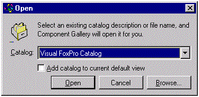

#### Figure 5-8: An Open dialog like no other. The Component Gallery's Open dialog is different because it offers catalog tables, and those references are kept in Browser.DBF.

This isn't your garden-variety Open dialog. The catalog
drop-down control displays the catalogs currently registered on your system.
The catalog names are kept in the Browser.DBF table. If you ever clean out or
lose Browser.DBF, you can click the Browse button to select an existing catalog
file that isn't listed in the Catalog drop-down. The "Add catalog"
check box control adds the contents of the catalog to the current view (the
default is to close the current catalog and open the one you specify).

The Options button brings you to a three-tabbed dialog
(Figure 5-9) where you can set certain Gallery properties.

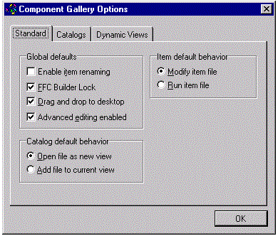

#### Figure 5-9: I need options. The Component Gallery comes with its own options; this figure shows the Standard tab.

The Standard tab displays the general defaults for the
Gallery itself. Like some of the Tools | Options dialog options, these brief
labels can be pretty obscure until you understand the product well:

* The "Enable item renaming" check box determines if clicking and then hovering over the item puts you in a name-edit mode, just as it works in Explorer.

* The "FFC Builder Lock" check box will, if checked, automatically invoke builders for new objects you create with the Gallery. If they have a builder, that is. Some do, some don't.

* The "Drag and drop to desktop" check box enables dragging and dropping to the desktop, just like it works in the Class Browser.

* Checking the "Advanced editing enabled" check box gives you access to advanced features of Gallery property dialogs. This is where the Gallery really starts to shine!
<table>
<tr>
  <td width="20%" valign="top">

  </td>
  <td width="80%">
  <p>The &quot;Advanced editing enabled&quot; check box is a killer. If this option isn't checked, that explains why you can't do half the stuff we're talking about in this chapter.</p>
  </td>
 </tr>
</table>

* The "Catalog default behavior" option determines whether new catalogs are appended to, or replace, the current visible collection of catalogs.

* The "Item default behavior" option determines whether double-clicking on an item opens or edits an item by default. This applies only to items that can be edited in VFP, of course. Otherwise, the selection will simply run regardless of what you've specified here.

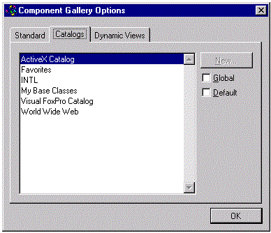

#### Figure 5-10: What, no underwear ads? A catalog page suitable for family viewing.

Use the Catalogs tab (Figure 5-10) to maintain the list of
catalogs that appear in the Catalog drop-down in the Catalog Open dialog.

<table>
<tr>
  <td width="20%" valign="top">

  </td>
  <td width="80%">
  <p>The New button is enabled only when at least one catalog is loaded in the Catalogs pane. We don't know why we need to load a catalog before we can create a new one, and frankly this behavior seems wrong. Nonetheless, that's the way it is.</p>
  </td>
 </tr>
</table>

The Global and Default check boxes let you set the
persistent visibility of each catalog. A Global catalog is always visible in
the Catalogs pane, regardless of which catalogs you open for display. You may
want to mark the Favorites catalog as a global catalog so you always have
access to your favorite things. A Default catalog is the one that's active and
current whenever the Gallery is invoked programmatically. You can have any
number of default catalogs.

<table>
<tr>
  <td width="20%" valign="top">

  </td>
  <td width="80%">
  <p>When you invoke the Gallery from the Browser, it always comes up empty. The only way the Gallery appears initially populated with the default catalogs is when it's originally opened with DO (_Gallery) or with Tools | Component Gallery.</p>
  </td>
 </tr>
</table>

The Dynamic Views tab lets you create your own custom, live
views of your catalogs. Figures 5-11 and 5-12 show how to create or edit a new
dynamic view called "Excel Spreadsheets" that displays all items of
type "file" that contain ".XLS" in their names.

<table>
<tr>
  <td width="20%" valign="top">

  </td>
  <td width="80%">
  <p>We think dynamic views are ultra cool. This adds a second powerful dimension to the Gallery. The first dimension is the obvious one: catalogs and folders that logically segment things as you choose. But dynamic views permit you to see all the items of a particular type (you define), regardless of their logical placement within a catalog.</p>
  </td>
 </tr>
</table>

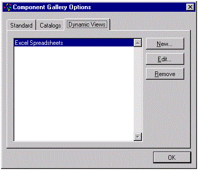

<b>Figure 5-11 Click the New button to create a new view,
or the Edit button to bring up the dialog below.</b>

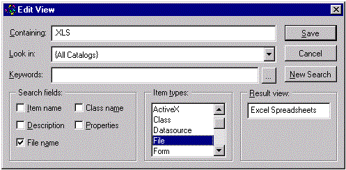

#### Figure 5-12: A different view of things. This is where you define and edit dynamic views.

Figure 5-13 shows the Keywords dialog, accessible from a
button in the Edit View dialog. This dialog lets us create dynamic views based
`ON KEY`words used to describe them. The keywords displayed in this list are
stored in a table called Keywords.DBF. You can use keywords to further expand
the power of the Gallery's dynamic views.


#### Figure 5-13: Views can be based `ON KEY`words you specify.

<table>
<tr>
  <td width="20%" valign="top">

  </td>
  <td width="80%">
  <p>In order to add a keyword, you must first have a catalog loaded in the Gallery. When we instructed the underpaid workers at Hacker Laboratories to take the screen shot shown in Figure 5-13, we forgot to mention that, so that's why the Add and Remove buttons look disabled.</p>
  </td>
 </tr>
</table>

<table>
<tr>
  <td width="20%" valign="top">

  </td>
  <td width="80%">
  <p>We think all the things you can do in the Options dialog are a good idea. But we cannot fathom why the Catalogs page is in that dialog. More specifically, we can't understand why the New button is in that dialog. This isn't an option, it's an action. Options are choices you make about how things look or operate. It's as if the New button in the Project Manager could only be accessed from the Project Info dialog. We'd feel the same way about the Dynamic Views page, except for one thing.</p>
  <p>Surprise! The Find button works just like choosing New on the Dynamic Views page! In effect, when you choose Find, you create a new persistent view. We're not really crazy about this; after all, cluttering our dynamic views every time we go searching is a bit much. However, it's easy enough to clean up the list of dynamic views using the Dynamic Views page.</p>
  </td>
 </tr>
</table>

#### Understanding Item Types

So, how does the Gallery work internally, you ask?

The behavior of a Gallery item, like what happens when you
click or drag it, is defined by its item type. The class library
Gallery\VfpGlry.VCX stores the item types supplied by Microsoft, and you can
modify, subclass, or simply copy these classes to create your own types. If you
develop your own custom item types, it's probably a good idea to store them in
some other VCX, such as *My_VfpGlry.VCX*.
This allows you to later update the Gallery's class libraries without fear of
clobbering your work.

Here's the hierarchy of the Gallery item types as supplied
by Microsoft. The _item and _folder classes live in _Gallery.VCX. All other
classes are defined in VfpGlry.VCX.

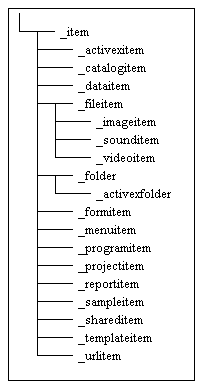

#### Figure 5-14: Type-o-rama! The Item Types hierarchy provided by Microsoft.

When creating your own item types, the most flexible base
type is the _fileitem. In fact, _fileitem should serve most of your needs
because its behavior is to simply invoke the Windows file associations.
Moreover, the _fileitem type has the ability to redirect popular file
extensions to other file types. We'll talk more about redirection in a minute.

Item types can be tied to particular catalogs. The root
catalog, which is always named "Catalog", serves as the basis for all
catalogs. If you select the Item Types tab of the properties of the root
catalog, you'll get something like the dialog in Figure 5-15 once you've turned
on the Advanced Editing option on the Class Browser's option dialog. Do it now!
C'mon, you're reading the *Hacker's Guide*!
That alone qualifies you as "Advanced!"

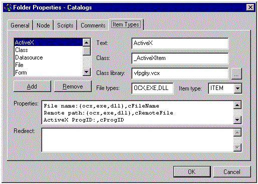

#### Figure 5-15: Catalog Properties, Item Types.

Note the following things about the Item Types page in this
dialog:

* The list of item types matches the item types you see in the New Item shortcut menu. To modify the New Item shortcut menu, simply edit this list.

* Each item type can be associated with display text, a class, and a class library. In this case the display text is "ActiveX", the class is _ActiveXItem, and the class library is VfpGlry.VCX.

* The lines in the Properties edit box specify what's displayed in the final page of the item's Properties dialog. For example, for the ActiveX item type pictured in Figure 5-15, when you examine the properties of an ActiveX item in the Component Gallery you'll see the following:

* File name: with an associated Open dialog initialized with OCX, EXE, and DLL files, and the file name specified will be stored in the item's cFileName property.

* Remote path: with an associated open dialog initialized with OCX, EXE, and DLL files, and the file name specified will be stored in the item's cRemoteFile property.

* Other lines in the edit box can't be seen in Figure 5-15. They include entries for Class, Class Library, Source project and Associated file; these all work the same as described above for the corresponding text box entries.

* If you create your own item types, you make them available by clicking the Add button and filling in the specifics of your new item type.
The properties for the _fileitem item type are worth a look
because, in addition to showing custom properties, they show an example of item
redirection. See the Redirect field in Figure 5-16.

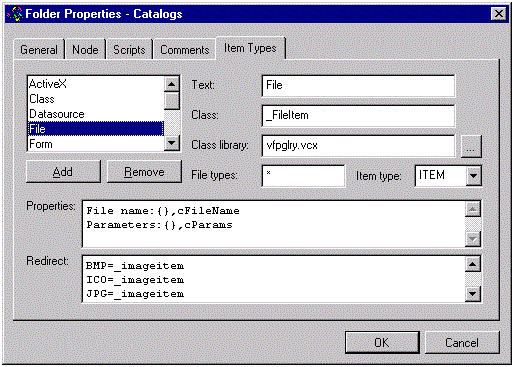

#### Figure 5-16: Item Types.

Here is the full list of redirections:

BMP=_imageitem, ICO=_imageitem, JPG=_imageitem,
GIF=_imageitem, WAV=_sounditem, RMI=_sounditem, AVI=_videoitem, DBF=_dataitem,
SCX=_formitem, MNX=_menuitem, FRX=_reportitem, LBX=_reportitem,
PRG=_programitem, APP=_sampleitem, OCX=_activexitem, HTM=_urlitem, HTML=_urlitem,
PJX=_projectitem, TXT=_programitem, LOG=_programitem, H=_programitem.

You can probably guess how redirections work: When an item
with any of those file extensions is created, the designated item type is
created instead. For example, if you try to add a PRG as a file item, the
Gallery notices the PRG redirection and creates a _programitem instead of a
_fileitem. This is why the _fileitem item type is so flexible; it has the
ability to properly redirect new items to the correct item type.

<table>
<tr>
  <td width="20%" valign="top">

  </td>
  <td width="80%">
  <p>Note that dragging VCX or PJX files from Windows Explorer just creates a regular file shortcut, and not a dynamic folder. We think VFP's Gallery should be able to recognize VFP's own components.</p>
  </td>
 </tr>
</table>

#### Programming the Component Gallery with Add-Ins

Since the Gallery and Browser are really the same
application, you can hook into the Gallery's events and methods with add-ins in
the same way you can with the Browser.

### I Never Metadata I Didn't Like

Here's a brief description of
the data structures used by the Browser and the Gallery.

#### Browser.DBF

The Browser stores all its metadata in a table named
Browser.DBF found in the VFP home directory. The Gallery also uses Browser.DBF
to store its catalog-related information. Table 5-2 shows a field-by-field
description of Browser.DBF.

#### Table 5-2: The structure of Browser.DBF.

<table>
<tr>
  <td width="23%" valign="top">
  <p><b>Field</b></p>
  </td>
  <td width="58%" valign="top">
  <p><b>Description</b></p>
  </td>
  <td width="20%" valign="top">
  <p align="center"><b >Used by (B)rowser (G)allery</b></p>
  </td>
 </tr>
<tr>
  <td width="23%" valign="top">
  <p>PLATFORM</p>
  </td>
  <td width="58%" valign="top">
  <p>&quot;WINDOWS&quot; or blank when Type=&quot;ADDIN&quot;. We suspect this is left over from the VFP 3 days when there was something other than Windows, and that it was retained for backward compatibility.</p>
  </td>
  <td width="20%" valign="top">
  <p align="center">BG</p>
  </td>
 </tr>
<tr>
  <td width="23%" valign="top">
  <p>TYPE</p>
  </td>
  <td width="58%" valign="top">
  <p>Records with type field value &quot;PREFW&quot; store Browser and Gallery preferences. Records with type field value &quot;ADDIN&quot; store add-in information.</p>
  </td>
  <td width="20%" valign="top">
  <p align="center">BG</p>
  </td>
 </tr>
<tr>
  <td width="23%" valign="top">
  <p>ID</p>
  </td>
  <td width="58%" valign="top">
  <p>&quot;FORMINFO&quot; records are used by the Browser to store form preferences and by the Gallery to store information about your catalogs. The only way to tell the difference is that Gallery records contain the string &quot;.dbf&quot; in the Name field.</p>
  <p>&quot;BROWSER&quot; records contain default settings for the Gallery (not the Browser!). See the Properties field for this record to see these default properties. These get set in the Gallery Options dialog.</p>
  <p>&quot;METHOD&quot; records store Browser add-ins that are tied to a particular Browser event or method.</p>
  <p>&quot;MENU&quot; records store Browser add-ins that are not tied to a particular Browser event or method, and are thus available on the Add-ins shortcut menu. </p>
  </td>
  <td width="20%" valign="top">
  <p align="center">BG</p>
  </td>
 </tr>
<tr>
  <td width="23%" valign="top">
  <p>DEFAULT</p>
  </td>
  <td width="58%" valign="top">
  <p>True for the default Gallery catalog.</p>
  </td>
  <td width="20%" valign="top">
  <p align="center">G</p>
  </td>
 </tr>
<tr>
  <td width="23%" valign="top">
  <p>GLOBAL</p>
  </td>
  <td width="58%" valign="top">
  <p>Applies to Gallery catalog records. True if the catalog is global. By default, new catalogs are not global. To make a catalog global, check the appropriate check box in the Catalogs tab in the Gallery's Options dialog.</p>
  </td>
  <td width="20%" valign="top">
  <p align="center">G</p>
  </td>
 </tr>
<tr>
  <td width="23%" valign="top">
  <p>BACKUP</p>
  </td>
  <td width="58%" valign="top">
  <p>When Gallery opens a catalog or a VCX, this field in the associated Browser.DBF record is queried. If the value is True, the Gallery checks to see if a file of the same name exists in the backup subfolder below that one. If the backup file doesn't exist, it is automatically created (as is a subfolder called Backup if needed). Then the Backup field is set to .F. This field can be set programmatically to force the Gallery to automatically back up a file the next time&mdash;and only the next time&mdash;that file is opened. You can set this field via add-in hooks, or with a program that opens and updates Browser.DBF. Note that Gallery doesn't automatically back up your work. You can force a backup at any time by selecting Backup on the catalog item shortcut menus.</p>
  <p>This feature is used internally in one special case. When Browser.DBF is first created after VFP is installed, it's set up with the default catalogs (around five or so). The Backup field is set to .T. so that each catalog gets backed up the very first time it is opened, since VFP doesn't install the associated backup catalog tables. Beyond that special function, it can be used at will by developers for their own purposes.</p>
  </td>
  <td width="20%" valign="top">
  <p align="center">G</p>
  </td>
 </tr>
<tr>
  <td width="23%" valign="top">
  <p>NAME</p>
  </td>
  <td width="58%" valign="top">
  <p>The file name that relates to this record. For a Browser record, the file type could be, among other things, VCX, PJX, SCX, OCX, DLL, EXE, or APP.</p>
  <p>For Gallery records, the file type is DBF.</p>
  <p>In the case of Browser and Gallery add-ins, the Name field stores the name of the add-in. This is what appears in the Add-ins shortcut menu if the add-in is not tied to an event or method.</p>
  </td>
  <td width="20%" valign="top">
  <p align="center">BG</p>
  </td>
 </tr>
<tr>
  <td width="23%" valign="top">
  <p>DESC</p>
  </td>
  <td width="58%" valign="top">
  <p>Used only by the Gallery, it stores the description of the catalog referred to in the Name field.</p>
  </td>
  <td width="20%" valign="top">
  <p align="center">G</p>
  </td>
 </tr>
<tr>
  <td width="23%" valign="top">
  <p>METHOD</p>
  </td>
  <td width="58%" valign="top">
  <p>Stores the name of the method to which an add-in is tied. If the Method field equals &quot;*&quot;, the add-in executes for all methods.</p>
  </td>
  <td width="20%" valign="top">
  <p align="center">BG</p>
  </td>
 </tr>
<tr>
  <td width="23%" valign="top">
  <p>PROPERTIES</p>
  </td>
  <td width="58%" valign="top">
  <p>Used by the Browser to store default settings.</p>
  </td>
  <td width="20%" valign="top">
  <p align="center">B</p>
  </td>
 </tr>
<tr>
  <td width="23%" valign="top">
  <p>SCRIPT</p>
  </td>
  <td width="58%" valign="top">
  <p>According to our sources at Microsoft, this field is used by code deep within the Gallery and is for internal use only.</p>
  </td>
  <td width="20%" valign="top">
  <p align="center">G</p>
  </td>
 </tr>
<tr>
  <td width="23%" valign="top">
  <p>PROGRAM</p>
  </td>
  <td width="58%" valign="top">
  <p>Stores the name of the program to executein the case of a PRG-based add-in.</p>
  </td>
  <td width="20%" valign="top">
  <p align="center">BG</p>
  </td>
 </tr>
<tr>
  <td width="23%" valign="top">
  <p>CLASSLIB</p>
  </td>
  <td width="58%" valign="top">
  <p>Stores the name of the class library in the case of a VCX-based add-in.</p>
  </td>
  <td width="20%" valign="top">
  <p align="center">BG</p>
  </td>
 </tr>
<tr>
  <td width="23%" valign="top">
  <p>CLASSNAME</p>
  </td>
  <td width="58%" valign="top">
  <p>Stores the name of the class to execute in the case of a VCX-based add-in.</p>
  </td>
  <td width="20%" valign="top">
  <p align="center">BG</p>
  </td>
 </tr>
<tr>
  <td width="23%" valign="top">
  <p>FILEFILTER</p>
  </td>
  <td width="58%" valign="top">
  <p>Used by add-in records to specify file masks for which the add-in applies. The FileFilter is specified in the fourth parameter of the AddIn method.</p>
  </td>
  <td width="20%" valign="top">
  <p align="center">B</p>
  </td>
 </tr>
<tr>
  <td width="23%" valign="top">
  <p>DISPMODE</p>
  </td>
  <td width="58%" valign="top">
  <p>Hierarchical/alphabetic listing display mode for the Browser (numeric).</p>
  </td>
  <td width="20%" valign="top">
  <p align="center">B</p>
  </td>
 </tr>
<tr>
  <td width="23%" valign="top">
  <p>TOP</p>
  </td>
  <td width="58%" valign="top">
  <p>The stored top coordinate for the Browser/Gallery form. All stored coordinates and sizes apply only if you include the file name when you open the Browser/Gallery. When you use the Open button, you get whatever settings are currently in effect.</p>
  </td>
  <td width="20%" valign="top">
  <p align="center">BG</p>
  </td>
 </tr>
<tr>
  <td width="23%" valign="top">
  <p>LEFT</p>
  </td>
  <td width="58%" valign="top">
  <p>The stored left coordinate for the Browser/Gallery form.</p>
  </td>
  <td width="20%" valign="top">
  <p align="center">BG</p>
  </td>
 </tr>
<tr>
  <td width="23%" valign="top">
  <p>HEIGHT</p>
  </td>
  <td width="58%" valign="top">
  <p>The stored height of the Browser/Gallery form.</p>
  </td>
  <td width="20%" valign="top">
  <p align="center">BG</p>
  </td>
 </tr>
<tr>
  <td width="23%" valign="top">
  <p>WIDTH</p>
  </td>
  <td width="58%" valign="top">
  <p>The stored width of the Browser/Gallery form.</p>
  </td>
  <td width="20%" valign="top">
  <p align="center">BG</p>
  </td>
 </tr>
<tr>
  <td width="23%" valign="top">
  <p>HEIGHT1</p>
  </td>
  <td width="58%" valign="top">
  <p>The stored height of the Class and Member description panes in the Browser.</p>
  </td>
  <td width="20%" valign="top">
  <p align="center">BG</p>
  </td>
 </tr>
<tr>
  <td width="23%" valign="top">
  <p>WIDTH1</p>
  </td>
  <td width="58%" valign="top">
  <p>The stored width of the Class and Member description panes in the Browser.</p>
  </td>
  <td width="20%" valign="top">
  <p align="center">BG</p>
  </td>
 </tr>
<tr>
  <td width="23%" valign="top">
  <p>HEIGHT2</p>
  </td>
  <td width="58%" valign="top">
  <p>The height of the Item Description pane in the Gallery.</p>
  </td>
  <td width="20%" valign="top">
  <p align="center">G</p>
  </td>
 </tr>
<tr>
  <td width="23%" valign="top">
  <p>WIDTH2</p>
  </td>
  <td width="58%" valign="top">
  <p>The width of the Item Description pane in the Gallery.</p>
  </td>
  <td width="20%" valign="top">
  <p align="center">G</p>
  </td>
 </tr>
<tr>
  <td width="23%" valign="top">
  <p>WINDOWSTAT</p>
  </td>
  <td width="58%" valign="top">
  <p>0&mdash;Window is zoomed normal; 1&mdash;Window is minimized; 2&mdash;Window is maximized.</p>
  </td>
  <td width="20%" valign="top">
  <p align="center">BG</p>
  </td>
 </tr>
<tr>
  <td width="23%" valign="top">
  <p>PROTECTED</p>
  </td>
  <td width="58%" valign="top">
  <p>True if protected members are to be displayed in the right-hand Browser pane.</p>
  </td>
  <td width="20%" valign="top">
  <p align="center">B</p>
  </td>
 </tr>
<tr>
  <td width="23%" valign="top">
  <p>EMPTY</p>
  </td>
  <td width="58%" valign="top">
  <p>True if empty methods are to be displayed in the right-hand Browser pane.</p>
  </td>
  <td width="20%" valign="top">
  <p align="center">B</p>
  </td>
 </tr>
<tr>
  <td width="23%" valign="top">
  <p>HIDDEN</p>
  </td>
  <td width="58%" valign="top">
  <p>True if hidden members are to be displayed in the right-hand Browser pane.</p>
  </td>
  <td width="20%" valign="top">
  <p align="center">B</p>
  </td>
 </tr>
<tr>
  <td width="23%" valign="top">
  <p>DESCBOXES</p>
  </td>
  <td width="58%" valign="top">
  <p>True if description panels are to be displayed.</p>
  </td>
  <td width="20%" valign="top">
  <p align="center">BG</p>
  </td>
 </tr>
<tr>
  <td width="23%" valign="top">
  <p>AUTOEXPAND </p>
  </td>
  <td width="58%" valign="top">
  <p>True if hierarchical items are to be displayed automatically expanded in the left-hand pane.</p>
  </td>
  <td width="20%" valign="top">
  <p align="center">BG</p>
  </td>
 </tr>
<tr>
  <td width="23%" valign="top">
  <p>PUSHPIN</p>
  </td>
  <td width="58%" valign="top">
  <p>True if the display is always on top.</p>
  </td>
  <td width="20%" valign="top">
  <p align="center">BG</p>
  </td>
 </tr>
<tr>
  <td width="23%" valign="top">
  <p>PCBROWSER</p>
  </td>
  <td width="58%" valign="top">
  <p>Parent class toolbar flag. If true for a file item, the toolbar is on for that file. If you close the parent class toolbar, this field is set to .F. for all open VCXs.</p>
  </td>
  <td width="20%" valign="top">
  <p align="center">B</p>
  </td>
 </tr>
<tr>
  <td width="23%" valign="top">
  <p>VIEWMODE</p>
  </td>
  <td width="58%" valign="top">
  <p>Indicates whether the Items pane of the Gallery displays large icons, small icons, or a list.</p>
  </td>
  <td width="20%" valign="top">
  <p align="center">G</p>
  </td>
 </tr>
<tr>
  <td width="23%" valign="top">
  <p>FONTINFO</p>
  </td>
  <td width="58%" valign="top">
  <p>Stores the display font preference.</p>
  </td>
  <td width="20%" valign="top">
  <p align="center">BG</p>
  </td>
 </tr>
<tr>
  <td width="23%" valign="top">
  <p>FORMCOUNT</p>
  </td>
  <td width="58%" valign="top">
  <p>Used internally by the Browser to track the number of Browser instances where this record's class library is being displayed.</p>
  </td>
  <td width="20%" valign="top">
  <p align="center">G</p>
  </td>
 </tr>
<tr>
  <td width="23%" valign="top">
  <p>UPDATED</p>
  </td>
  <td width="58%" valign="top">
  <p>The datetime this record was last updated.</p>
  </td>
  <td width="20%" valign="top">
  <p align="center">BG</p>
  </td>
 </tr>
<tr>
  <td width="23%" valign="top">
  <p>COMMENT</p>
  </td>
  <td width="58%" valign="top">
  <p>A comment field for your use.</p>
  </td>
  <td width="20%" valign="top">
  <p align="center">BG</p>
  </td>
 </tr>
<tr>
  <td width="23%" valign="top">
  <p>USER1,2,3,4</p>
  </td>
  <td width="58%" valign="top">
  <p>Not used; there for your use.</p>
  </td>
  <td width="20%" valign="top">
  <p align="center">BG</p>
  </td>
 </tr>
</table>

#### Additional Component Gallery Data Structures

Here's a brief overview of Gallery-specific structures. The
Gallery distributes its metadata in several locations.

Like the Browser, the Gallery keeps some of its metadata in
Browser.DBF (described above). That data stores references to the available
catalogs, as well as some properties such as whether the catalog is a global
one (auto-open and always in view) or default (in the default view). Delete a
Gallery catalog record from Browser.DBF and it won't appear in the Gallery Open
dialog. The Gallery catalog records in Browser.DBF contain ".dbf" in
their Name field. Since this field is of type memo, you can't easily identify
Gallery records in a simple browse of Browser.DBF&mdash;what a pain.

The rest of the Gallery metadata is stored in VfpGlry.DBF,
which lives in the Gallery subdirectory below the VFP root. VfpGlry.DBF defines
the default display and behavior of the Gallery. When you look at the Gallery,
you are looking at catalogs whose items are defined in the particular catalog
tables, but whose default behavior emanates from definitions in VfpGlry.DBF.

In fact, delete all Gallery records from Browser.DBF and the
Gallery will re-initialize the root catalog from data in VfpGlry.DBF.

Many of the records in VfpGlry.DBF point to behavior classes
stored in VfpGlry.VCX through fields named ClassLib and ClassName. Thus the
records in VfpGlry.DBF are pointers to the behavior classes that, in the case
of the native VFP-supplied behaviors, live in VfpGlry.VCX. Of course, any
custom gallery behavior you define or modify can live in any VCX you choose. In
fact, if you define custom Gallery behavior classes or modify existing ones, we
suggest that you keep these in a different class library so that future upgrades
of VFP don't clobber your work.

To illustrate some of the functionality of VfpGlry.DBF,
Table 5-3 examines some of the fields in a representative record&mdash;the one with
ID = "fileitem".

#### Table 5-3: Some of the fields in VfpGlry.DBF for the "fileitem" record.

<table>
<tr>
  <td width="21%" valign="top">
  <p><b>Field</b></p>
  </td>
  <td width="29%" valign="top">
  <p><b>Value</b></p>
  </td>
  <td width="50%" valign="top">
  <p><b>Meaning</b></p>
  </td>
 </tr>
<tr>
  <td width="21%" valign="top">
  <p>TYPE</p>
  </td>
  <td width="29%" valign="top">
  <p>&quot;CLASS&quot; </p>
  </td>
  <td width="50%" valign="top">
  <p>The Type field indicates what type of record this is. You'll surely be stunned to find out that &quot;FOLDER&quot; types are folders. The others aren't quite as obvious. &quot;CLASS&quot; items define the metadata for the various types of things the Gallery can display. &quot;ITEM&quot; types define the native catalogs that ship with VFP. &quot;OBJECT&quot; types are objects attached to the Gallery when it's instanced.</p>
  </td>
 </tr>
<tr>
  <td width="21%" valign="top">
  <p>ID</p>
  </td>
  <td width="29%" valign="top">
  <p>&quot;fileitem&quot;</p>
  </td>
  <td width="50%" valign="top">
  <p>The unique identifier for this type of item.</p>
  </td>
 </tr>
<tr>
  <td width="21%" valign="top">
  <p>TEXT</p>
  </td>
  <td width="29%" valign="top">
  <p>&quot;File&quot;</p>
  </td>
  <td width="50%" valign="top">
  <p>The item display text.</p>
  </td>
 </tr>
<tr>
  <td width="21%" valign="top">
  <p>TYPEDESC</p>
  </td>
  <td width="29%" valign="top">
  <p>&quot;ITEM&quot;</p>
  </td>
  <td width="50%" valign="top">
  <p>This field, used only for records with TYPE = &quot;CLASS&quot;, indicates whether record represents a folder object or an item object.</p>
  </td>
 </tr>
<tr>
  <td width="21%" valign="top">
  <p>DESC</p>
  </td>
  <td width="29%" valign="top">
  <p>Text</p>
  </td>
  <td width="50%" valign="top">
  <p>The text appearing in the Item Description pane.</p>
  </td>
 </tr>
<tr>
  <td width="21%" valign="top">
  <p>PROPERTIES</p>
  </td>
  <td width="29%" valign="top">
  <p>File name:{},cFileName<br> Parameters:{},cParams</p>
  </td>
  <td width="50%" valign="top">
  <p>Specification for input fields that appear in the Properties dialog for items of this type. Values inside the curly braces are used as the parameter in GETFILE() dialogs.</p>
  </td>
 </tr>
<tr>
  <td width="21%" valign="top">
  <p>CLASSLIB</p>
  </td>
  <td width="29%" valign="top">
  <p>Vfpglry.vcx</p>
  </td>
  <td width="50%" valign="top">
  <p>The class library where the item's behavior class is stored.</p>
  </td>
 </tr>
<tr>
  <td width="21%" valign="top">
  <p>CLASSNAME</p>
  </td>
  <td width="29%" valign="top">
  <p>_fileitem</p>
  </td>
  <td width="50%" valign="top">
  <p>The default class that embodies this catalog item.</p>
  </td>
 </tr>
<tr>
  <td width="21%" valign="top">
  <p>ITEMTPDESC</p>
  </td>
  <td width="29%" valign="top">
  <p>BMP=_imageitem<br> ICO=_imageitem<br> JPG=_imageitem<br> GIF=_imageitem<br> WAV=_sounditem<br> RMI=_sounditem<br> AVI=_videoitem<br> DBF=_dataitem<br> SCX=_formitem<br> MNX=_menuitem<br> FRX=_reportitem<br> LBX=_reportitem<br> PRG=_programitem<br> APP=_sampleitem<br> OCX=_activexitem<br> HTM=_urlitem<br> HTML=_urlitem<br> PJX=_projectitem<br> TXT=_programitem<br> LOG=_programitem<br> H=_programitem</p>
  </td>
  <td width="50%" valign="top">
  <p>Alternate classes to use for file items of these particular types.</p>
  </td>
 </tr>
</table>

Other records may use different fields and different values,
but this representative record is enough to get you started in hacking the
Gallery.

Catalog tables contain records that reference actual catalog
items. The main native catalog is called "Visual FoxPro Catalog" and
is kept in "VFP Catalog.DBF." All VFP foundation classes, for
example, are cataloged there.

The structure of catalog tables is the same as that of
VfpGlry.DBF, so much of what we've already seen also applies here. This is a
good opportunity to look at a few other metadata fields and how they work.
Table 5-4 shows the record with ID = "clireg" in "ActiveX
Catalog.DBF." This item allows you to register a custom VFP Automation
server remotely using its generated VBR file.

#### Table 5-4: The "clireg" record in ActiveX Catalog.DBF.

<table>
<tr>
  <td width="21%" valign="top">
  <p><b>Field</b></p>
  </td>
  <td width="43%" valign="top">
  <p><b>Value</b></p>
  </td>
  <td width="37%" valign="top">
  <p><b>Meaning</b></p>
  </td>
 </tr>
<tr>
  <td width="21%" valign="top">
  <p>TYPE</p>
  </td>
  <td width="43%" valign="top">
  <p>&quot;ITEM&quot;</p>
  </td>
  <td width="37%" valign="top">
  <p>This is an item, not a folder.</p>
  </td>
 </tr>
<tr>
  <td width="21%" valign="top">
  <p>ID</p>
  </td>
  <td width="43%" valign="top">
  <p>&quot;clireg&quot;</p>
  </td>
  <td width="37%" valign="top">
  <p>This item's ID.</p>
  </td>
 </tr>
<tr>
  <td width="21%" valign="top">
  <p>PARENT</p>
  </td>
  <td width="43%" valign="top">
  <p>&quot;actxtools&quot;</p>
  </td>
  <td width="37%" valign="top">
  <p>ID of the parent catalog record; in this case, it corresponds to a folder named &quot;Tools&quot;.</p>
  </td>
 </tr>
<tr>
  <td width="21%" valign="top">
  <p>DESC</p>
  </td>
  <td width="43%" valign="top">
  <p>&quot;This tool allows you to register a custom VFP automation server remotely using the generated VBR file.&quot;</p>
  </td>
  <td width="37%" valign="top">
  <p>The Description window text.</p>
  </td>
 </tr>
<tr>
  <td width="21%" valign="top">
  <p>PROPERTIES</p>
  </td>
  <td width="43%" valign="top">
  <p>cDblClick=&lt;&gt;</p>
  </td>
  <td width="37%" valign="top">
  <p>You can override the events (KeyPress, Click, DblClick, RightClick) by setting the c[EventName] property. If it's something like cDblClick=DO Foo.PRG, then double-clicking on the item in the Gallery runs that line. If you set cDblClick=&lt;testscript&gt;, then double-clicking runs the code in the Script memo field of the record with ID= &quot;testscript&quot;. If you set cDblClick=&lt;&gt;, double-clicking runs the code in the Script memo field of the current record.</p>
  <p>In this case, DblClick runs the code in the Script field below.</p>
  </td>
 </tr>
<tr>
  <td width="21%" valign="top">
  <p>FILENAME</p>
  </td>
  <td width="43%" valign="top">
  <p>(HOME(6) + &quot;CLIREG\CLIREG32.EXE&quot;)</p>
  </td>
  <td width="37%" valign="top">
  <p>The file name to execute when the item is double-clicked. This value is stored in the oThis.cFileName reference, which you can use in scripts. See the Script field below. Note that the whole behavior of this item is defined by the Filename field and, in this case, also the Script field. The ClassName and ClassLib fields are blank in this record.</p>
  </td>
 </tr>
<tr>
  <td width="21%" valign="top">
  <p>SCRIPT</p>
  </td>
  <td width="43%" valign="top">
<pre>cVBRFile = GETFILE(&quot;VBR&quot;)
cCliReg = oThis.cFileName
&nbsp;
IF !FILE(m.cCliReg)
  RETURN .F.
ENDIF
&nbsp;
IF EMPTY(m.cVBRFile) OR ;
 UPPER(JUSTEXT(m.cVBRFile))#;
 &quot;VBR&quot;
  RETURN .F.
ENDIF
oThis.Runcode([RUN /N ] + ;
 [&amp;cCliReg. &quot;&amp;cVBRFile.&quot;] + ;
 [ -NOLOGO])</pre>
  </td>
  <td width="37%" valign="top">
  <p>The Script field gives you control over what happens when the user runs the item. Here this scripting code will run when the user double-clicks (see the Property field) items of this type in the Gallery.</p>
  <p>Note that, at present, there is no script equivalent of DODEFAULT() so if you script an event, the default behavior for that event will not execute.</p>
  </td>
 </tr>
</table>

### Please Sir, I Want Some More

We've just scratched the surface of the Browser and Gallery.
If you're interested in finding out more about these powerful and extensible
tools, we recommend *Advanced Object Oriented Programming With Visual FoxPro
6.0* by Markus Egger, also available from Hentzenwerke Publishing (<a href="http://www.hentzenwerke.com/" target="_blank">www.hentzenwerke.com</a>).