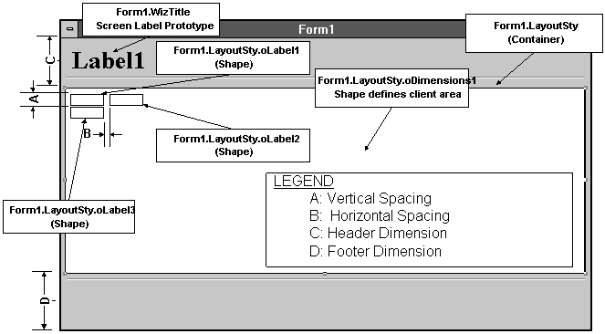

## Builders and Wizards (and Bears, Oh My!)

Visual FoxPro comes with things called builders and wizards.
Other Microsoft products, like Access for example, are bundled with only
wizards. The difference? Mostly parlance. Builders and wizards are very
similar. The difference depends on which part of the development process you're
working on.

Here's how Microsoft defines wizards:

>"Visual FoxPro ships with several wizards. Wizards are interactive programs that help you quickly accomplish common tasks such as creating forms, formatting reports, setting up queries, importing and upsizing data, graphing, creating mail merge output, generating pivot tables, creating crosstab reports, and publishing in HTML format for the Web.  
>"By answering questions or choosing options on the series of wizard screens, you are telling the wizard to build a file or perform a task based on your responses."  
>&mdash;VFP Help, under "Wizards, overview"

And builders:

>"Builders are tools that aid in setting properties of controls on a form. Unlike wizards, builders are reentrant, so you can reopen a builder on a particular control repeatedly.  
>"Visual FoxPro includes a number of generic builders for many of the common form controls including grids, list boxes, combo boxes, check boxes, command groups, and option groups."  
>&mdash;VFP Help, under "Builders, introduction"

The party line at Microsoft is that builders and wizards are
dialogs in which the user answers questions or makes selections, and then
chooses "OK". This is coincidentally commensurate with the FoxPro
skills of most of Microsoft's field sales staff. Builders and wizards make easy
whizzy demos! Nobody reading this book begrudges that, right?

And the hacker's view of all this? The native builders and
wizards are automated development mechanisms that exploit Visual FoxPro's open
architecture. They are extensible, which means we can supplement or substitute
our own builders and wizards. This implies that builders and wizards could be
much more than (to paraphrase) "friendly dialogs to help bewildered users
set properties." Builders and wizards, emblematic of Visual FoxPro's open
architecture, represent a huge opportunity for automated development, be it
dialog-based or not.

So here is a wider, more developer-centric definition: A
builder is any tool that helps us construct software. This includes native and
custom wizards, native and custom builders, and any process that automates
building and maintaining software.

So, given all this, what's the distinction between builders
and wizards? They are, in fact, incarnations of the same basic mechanisms, and
they have much in common. Here are some simple rules of thumb: 

* A builder is any mechanism used to construct software.

* A wizard is a builder that starts a construction task.
In other words, a wizard is a special form of builder. If it
gets you started on something, you can call it a wizard. Otherwise, it's a
builder. 

And forget all that nonsense in the help file about the need
for dialog boxes and "setting properties." That's ridiculously
myopic. Builders are programs, interactive or not, that audit, beautify,
construct, document, edit, format, generate, hide, iterate, join, kludge, look
up, measure, name, open, peek and poke, quantify, resize, style, test, undo,
verify, warn, x-reference, nothing that begins with "y," zip, and
zap.

What's notable is this: Support for custom tools like
builders is built into the language, and furthermore, their proliferation is
encouraged by the product's developers. Hacking FoxPro has come of age.
Moreover, starting with VFP 6, the source code for the wizards and builders is
included in the Tools\xSource\VfpSource subdirectory below your root VFP
installation (after you unzip xSource.ZIP in Tools\xSource).

## Builders

One of the best things about Visual FoxPro is the way the
Class and Form designers interact with the development environment. All Visual
FoxPro base classes are endowed with both design-time and runtime
manifestations, each with distinct programming interfaces. 

If you place a control on a form while in design mode, you
are actually running an instance of that class&mdash;one that has been hobbled to not
run events. So unlike prior versions of FoxPro, what you see is the real
enchilada, and not just a graphical image (or proxy) of the control. This means
that custom programs (builders), written in FoxPro, can manipulate our
design-time work. 

To convince yourself of this, place any subclass on a form,
and then try to modify the subclass definition. It cannot be done&mdash;you get error
1948: "Cannot modify a class that is in use." The form instance has a
lock on the class even though you're only in design mode.

### How Builders are Engineered in VFP

Visual FoxPro gives us access to extend and configure many
of its mechanisms, including builders and wizards. In this section, we'll look
at how the builder and wizard mechanisms are engineered to allow for our
access.

#### The _BUILDER System Memory Variable

Like `_GENMENU`, `_BROWSER` and the others, `_BUILDER` is a system
memory variable used to specify a builder application. You may, as always, substitute
your own builder manager for the native Builder.APP. The value of `_BUILDER`
defaults to `HOME()+"Wizards\Builder.APP"`. You can set the default
`_BUILDER` to anything you want in the "File Locations" page of the
Tools | Options dialog or by editing your Config.FPW file, or you can change it
temporarily in the Command Window or a program.

#### The Builder.APP Builder Manager Program

The Builder.APP program that comes with Visual FoxPro isn't
a builder, but a builder manager. Its function is to take stock of the
situation, save the environment, invoke the appropriate builder program, clean
up, and return you cleanly back to FoxPro.

#### Invoking Builders

There are three standard hooks for invoking builders from
within FoxPro: 

* Builder Lock on the Form Controls toolbar

* On the Forms page of the Options dialog, check the Builder Lock check box

* The "Builder" option on the Form and Class Designer context menus
These mechanisms are readily available whenever the Form
Designer or Class Designer is active. Of course, since our definition of
"builder" is much wider than Microsoft's, how can we invoke a builder
when the Form and Class designers are not active? Three ways:

* Manual invocation from the Command Window.

* From our own custom toolbars&mdash;equivalent to manual invocation, only easier.

* By drag and drop to `_SCREEN` from the Class Browser or the Component Gallery.
Invoking builders from custom toolbars is a good approach.
Calling builders from within click events of toolbar controls is easy to set
up. A nice variant: Create a `_SCREEN.Timer` as a voyeur class that reacts to the
activation and deactivation of the Form Designer by showing and hiding the
appropriate toolbars, including your builder toolbar.

Browser drag and drop builders are created by placing
builder code in the Init method of builder classes stored in VCX or SCX
structures, with the Init ultimately returning .F. so no object is created.
Presto: To run a builder, drag its class from the Class Browser or Component
Gallery to the desktop. The Init code fires (which runs the builder) and
returns False. A variant: Several builders can be combined into a container.
Here the builder elements execute in Z-order.

#### The Builder.DBF Registry Table

The builder registration table, Builder.DBF, lives in the
`HOME()+"Wizards"` directory. VFP's Builder.APP checks this table for
builders of a particular type. If more than one record of the same type is
present, a picklist dialog is presented to you. Otherwise the program specified
in the Program field is invoked without fanfare.

Builder.APP does not provide services for registering and
unregistering builders. You must maintain registration records interactively. 

Tip: Using the Form Wizard, create a Builder.DBF viewer, and
then register it as a Type="ALL" builder. You can then use any convenient
builder hook to manage the behavior of Builder.APP. For more details, see
"Registering Builders" below.

The structure of Builder.DBF is the same as Wizard.DBF,
which lets you register wizards.

<table>
<tr>
  <td width="25%" valign="top">
  <p><b>Field Name</b></p>
  </td>
  <td width="15%" valign="top">
  <p><b>Type</b></p>
  </td>
  <td width="60%" valign="top">
  <p><b>Description</b></p>
  </td>
 </tr>
<tr>
  <td width="25%" valign="top">
  <p>Name</p>
  </td>
  <td width="15%" valign="top">
  <p>C(45)</p>
  </td>
  <td width="60%" valign="top">
  <p>Name of the builder. This appears in the picklist displayed by the standard Builder.APP when there's more than one builder for this class of object.</p>
  </td>
 </tr>
<tr>
  <td width="25%" valign="top">
  <p>Descript  </td> <td width="15%" valign="top"> <p>M</p>
  </td>
  <td width="60%" valign="top">
  <p>Long description for the builder. This is also displayed by the standard Builder.APP when there is more than one builder for this class of object.</p>
  </td>
 </tr>
<tr>
  <td width="25%" valign="top">
  <p>Bitmap</p>
  </td>
  <td width="15%" valign="top">
  <p>M</p>
  </td>
  <td width="60%" valign="top">
  <p>Not currently used by builders.</p>
  </td>
 </tr>
<tr>
  <td width="25%" valign="top">
  <p>Type</p>
  </td>
  <td width="15%" valign="top">
  <p>C(20)</p>
  </td>
  <td width="60%" valign="top">
  <p>Contains a keyword, such as a FoxPro base class name, &quot;ALL&quot;, or some other moniker that identifies the type of builder or the context in which it is to be called. </p>
  </td>
 </tr>
<tr>
  <td width="25%" valign="top">
  <p>Program</p>
  </td>
  <td width="15%" valign="top">
  <p>M</p>
  </td>
  <td width="60%" valign="top">
  <p>The program to invoke.</p>
  </td>
 </tr>
<tr>
  <td width="25%" valign="top">
  <p>ClassLib</p>
  </td>
  <td width="15%" valign="top">
  <p>M</p>
  </td>
  <td width="60%" valign="top">
  <p>The class library that contains the builder (if in a VCX).</p>
  </td>
 </tr>
<tr>
  <td width="25%" valign="top">
  <p>ClassName</p>
  </td>
  <td width="15%" valign="top">
  <p>M</p>
  </td>
  <td width="60%" valign="top">
  <p>Name of the class of the builder.</p>
  </td>
 </tr>
<tr>
  <td width="25%" valign="top">
  <p>Parms</p>
  </td>
  <td width="15%" valign="top">
  <p>M</p>
  </td>
  <td width="60%" valign="top">
  <p>Parameters to pass to the program.</p>
  </td>
 </tr>
</table>

Builder.APP contains a copy of the original Builder.DBF
table, so if you accidentally erase this table, it's re-created the next time
you run a builder.

#### Registering Builders

Visual FoxPro's native Builder.APP program relies on the
Builder.DBF table that lives in the VFP Wizards directory. To register a
builder, add a record to this table. The native Builder.APP offers no help for
maintaining Builder.DBF. 

The following steps show an easy way to give a registration
interface to Builder.APP: 

1. Use the Form Wizard to create a form to converse with Builder.DBF. Register this form as a builder. You'll need a wrapper program for this because Builder.APP can't call an SCX directly. Here is the wrapper:

```foxpro
* BLDRUTIL.PRG
PARAMETERS X, Y, Z
DO FORM BUILDER.SCX
```
2. Create the following record in Builder.DBF:

<table>
<tr>
  <td width="34%" valign="top">
  <p>Name</p>
  </td>
  <td width="66%" valign="top">
  <p>Builder.DBF Maintenance</p>
  </td>
 </tr>
<tr>
  <td width="34%" valign="top">
  <p>Descript</p>
  </td>
  <td width="66%" valign="top">
  <p>Edit Builder.DBF</p>
  </td>
 </tr>
<tr>
  <td width="34%" valign="top">
  <p>Type</p>
  </td>
  <td width="66%" valign="top">
  <p>ALL</p>
  </td>
 </tr>
<tr>
  <td width="34%" valign="top">
  <p>Program</p>
  </td>
  <td width="66%" valign="top">
  <p>Bldrutil.PRG</p>
  </td>
 </tr>
</table>

Now you can converse with Builder.DBF just by launching
Builder.APP, because the "ALL" builder type is, as you might expect,
universal. Whenever you click a Builder button or choose Builder from the
right-click menu, Builder.DBF Maintenance appears as one of the choices.

Doug has a neat trick to self-register builders. Use the
following code as a template for your main builder program. 

```foxpro
LPARAMETERS uP1, uP2, uP3, uP4, uP5, uP6, ;
            uP7, uP8, uP9, uP10, uP11, uP12
* Accept parameters passed by the builder system.
 
#DEFINE ccMAIN "MYGREATBUILDER"  && This is what you've named the
                                 && builder PRG.
 
LOCAL nOldSelect
 
* Self-register if called directly.
IF PROGRAM(0) == ccMAIN
    nOldSelect = SELECT()
    SELECT 0
    USE HOME() + "Wizards\Builder" AGAIN
    LOCATE FOR Name = "My Great Builder"
    IF NOT FOUND()
        m.Name = "My Great Builder"
        m.Descript = "<describe My Great Builder>"
        m.Type = "ALL"
        m.Program = SYS(16)
        INSERT INTO Builder FROM MEMVAR
    ENDIF
    
    USE IN Builder
    SELECT (nOldSelect)
ENDIF
 
* Run the actual builder.
DO FORM ADDBS(JUSTPATH(SYS(16))) + "MyGreatBuilder" WITH ;
   uP1, uP2, uP3, uP4, uP5, uP6, ;
   uP7, uP8, uP9, uP10, uP11, uP12
 
RETURN
```
When you call this builder code directly, it goes through
the process to register it. (Do make sure you change the name and description
strings in the code to describe what your builder does.) Once registered, it
runs the builder. If this program is not called directly, it skips the
registration process and runs the builder.

#### "Builder" Custom Property

If you add a Builder property to your class, Builder.APP
recognizes it and invokes the builder specified there. This means you can
assign a specific builder to work with the objects you `CREATE FROM` classes.

If the builder program specified by the object's Builder
property is missing or invalid, Builder.APP generates a friendly warning, and
then the usual Builder.APP program executes, which is as graceful a recovery as
one could expect.

One disadvantage of using a Builder property: Builder.APP
executes this builder without ever presenting a picklist of other registered
builders that may apply. The Builder property is interpreted by Builder.APP as
an exclusive builder, which is regrettable.

#### Native Builders

At the time of this writing, Visual FoxPro lists the
following builders in Builder.DBF:

<table>
<tr>
  <td width="33%" valign="top">
  <p><b>Builder</b></p>
  </td>
  <td width="67%" valign="top">
  <p><b>Description</b></p>
  </td>
 </tr>
<tr>
  <td width="33%" valign="top">
  <p>Application Builder</p>
  </td>
  <td width="67%" valign="top">
  <p>Sets properties specific to an application built by the Application Wizard (see &quot;Wizards in VFP 7&quot; later in this section). These properties include those for splash screens, About dialogs, visual styles, production credits, and files (tables, reports, forms) needed for the application.</p>
  </td>
 </tr>
<tr>
  <td width="33%" valign="top">
  <p>AutoFormat Builder</p>
  </td>
  <td width="67%" valign="top">
  <p>Applies a style to selected controls on a form. There are two entries for this builder: The entry with type &quot;multiselect&quot; is used when the builder is invoked with multiple objects selected, while the entry with type &quot;autoformat&quot; responds to the AutoFormat button on the Form Designer toolbar.</p>
  </td>
 </tr>
<tr>
  <td width="33%" valign="top">
  <p>Combo Box Builder</p>
  </td>
  <td width="67%" valign="top">
  <p>Sets properties for a combo box control.</p>
  </td>
 </tr>
<tr>
  <td width="33%" valign="top">
  <p>Command Group Builder</p>
  </td>
  <td width="67%" valign="top">
  <p>Sets properties for buttons in a command group.</p>
  </td>
 </tr>
<tr>
  <td width="33%" valign="top">
  <p>Edit Box Builder  </td> <td width="67%" valign="top"> <p>Sets properties for an edit box control.</p>
  </td>
 </tr>
<tr>
  <td width="33%" valign="top">
  <p>Form Builder</p>
  </td>
  <td width="67%" valign="top">
  <p>Adds controls to a form using fields and a style the user specifies.</p>
  </td>
 </tr>
<tr>
  <td width="33%" valign="top">
  <p>Grid Builder</p>
  </td>
  <td width="67%" valign="top">
  <p>Sets properties for a grid control.</p>
  </td>
 </tr>
<tr>
  <td width="33%" valign="top">
  <p>List Box Builder</p>
  </td>
  <td width="67%" valign="top">
  <p>Sets properties for a list box control.</p>
  </td>
 </tr>
<tr>
  <td width="33%" valign="top">
  <p>Option Group Builder</p>
  </td>
  <td width="67%" valign="top">
  <p>Sets properties for buttons in an option group.</p>
  </td>
 </tr>
<tr>
  <td width="33%" valign="top">
  <p>Referential Integrity Builder</p>
  </td>
  <td width="67%" valign="top">
  <p>Creates triggers and stored procedures that enforce referential integrity between tables in your database.</p>
  </td>
 </tr>
<tr>
  <td width="33%" valign="top">
  <p>Text Box Builder</p>
  </td>
  <td width="67%" valign="top">
  <p>Sets properties for a text box control.</p>
  </td>
 </tr>
</table>

#### How Builder.APP Handles Multiple Selections

Builders can act on multiple objects as selected in the Form
or Class designers. The `ASELOBJ()` function can be used to populate an array
with object references. The sequence of preselection is irrelevant, and the
array is sequenced in object Z-order.

The only native builder with multiple object capability is
the AutoFormat Builder, which you see if you invoke FoxPro's standard
Builder.APP while many objects are selected.

#### Parameters Passed to _BUILDER by VFP

VFP passes two parameters to the program designated by
_BUILDER. The first parameter is an object reference to the selected object
(see `ASELOBJ()` in the Reference section), and the second parameter varies
according to how the builder was invoked, as in the following table:

<table>
<tr>
  <td width="41%" valign="top">
  <p><b>Invocation</b></p>
  </td>
  <td width="59%" valign="top">
  <p><b>Second Parameter Passed fromVFP to Builder</b></p>
  </td>
 </tr>
<tr>
  <td width="41%" valign="top">
  <p>Builder Lock on the Form Controls toolbar</p>
  </td>
  <td width="59%" valign="top">
  <p>&quot;TOOLBOX&quot;</p>
  </td>
 </tr>
<tr>
  <td width="41%" valign="top">
  <p>Right-click menu</p>
  </td>
  <td width="59%" valign="top">
  <p>&quot;RTMOUSE&quot;</p>
  </td>
 </tr>
<tr>
  <td width="41%" valign="top">
  <p>Form Design Toolbar</p>
  </td>
  <td width="59%" valign="top">
  <p>&quot;QFORM&quot;</p>
  </td>
 </tr>
<tr>
  <td width="41%" valign="top">
  <p>Manual invocation</p>
  </td>
  <td width="59%" valign="top">
  <p>Whatever you pass upon invocation</p>
  </td>
 </tr>
</table>

#### Parameters Passed to Builders by Builder.APP

If _BUILDER is set to Builder.APP, then Builder.APP passes
three character type parameters to registered builders.

The first parameter is the string "wbReturnValue",
which is puzzling unless you know the following: Sometimes Builder.APP or
Wizard.APP needs to return a value to the calling routine. Fine, except that
someone decided that builders and wizards should not be called as procedures or
functions (something we do all the time!). "WbReturnValue" is the
name of a memory variable created by Builder.APP and Wizard.APP that can be
updated with the return value. In practice you'll probably never need to know
this fact.

The second parameter is whatever is contained in the PARMS
field of Wizard.DBF or Builder.DBF.

The third parameter is supposed to contain the keyword
information that may have been passed into Builder.APP (see the table in the
previous section), but actually contains the empty string.

So far, we've never needed to use the parameters passed to
builders. `ASELOBJ()` can tell us everything we need to know.

#### Problems with Builder.APP

After working with Builder.APP for some time, we find
ourselves working around it more than with it. Here are the things that really
bug us about Builder.APP.

You cannot flexibly specify the Type of the builder in the
Registry. You are limited to a base class name, "ALL",
"MULTISELECT", "RI", or "AUTOFORMAT".

When selecting several items of the same type, say three
text boxes, Builder.APP doesn't present a selection of builders for the
selected class (in this case, text boxes), but instead invokes the AutoFormat
builder. This is somewhat understandable&mdash;it's highly unlikely that one would
want to set the same data properties for several text boxes on a form. Who's to
say, however, that a given builder sets only data properties? 

### What Custom Builders Can Do

#### Builders Can Set Properties

According to the help file, setting properties is the
primary function of builders. Maybe so for the native Visual FoxPro builders,
but that's just the beginning.

#### Builders Can Add Objects 

Builders can add objects to container classes (such as
Forms, Pageframes, Containers, and so forth). For example, executing the
following code adds a label named lblHello and a command button named cmdQuit
to a form in the Form Designer session:

```foxpro
*-- You can execute this builder from the 
*-- command window without touching _BUILDER
*-- or BUILDER.DBF.
*-- Start a Form Designer session.
MODI FORM Junk NOWAIT
 
*-- Find the parent container, in this case the form.
=ASELOBJ( laObjectArray, 1)
 
*-- Add a label named lblHello.
laObjectArray[1].AddObject( "lblHello", "Label")
 
*-- Add a command button named cmdQuit.
laObjectArray[1].AddObject( "cmdQuit", "Commandbutton")
 
*-- Set some properties. 
WITH laObjectArray[1].lblHello
  .Caption= "Hello"
  .Top= 10
ENDWITH
WITH laObjectArray[1].cmdQuit
  .Caption= "Quit"
  .Top= 100
ENDWITH
```
#### Builders Can Load Array Members 

A weakness in the Form Designer and Class Designer
interfaces is that array member properties cannot be changed in the Property
Sheet. Builders, on the other hand, can change the contents of array member
properties.

#### Builders Can Add Custom Members

Starting with VFP 6, you can use the `AddProperty()` method to
add new custom properties to any object in the Form Designer or Class Designer.
However, until VFP 7, custom methods could only be added to forms in the Form
Designer, and to the "outermost" class in the Class Designer. To add
a custom method programmatically, you needed to use `KEYBOARD` commands to open
the appropriate menu item and to fill the New Method dialog. It wasn't pretty
but it worked. For example, with a form open in the Form Designer, run the
following program to add a method named FooFoo3, add a description, and close
the New Method dialog.

```foxpro
*-- Open the New Method dialog.
KEYBOARD "{f10}cm"
*-- Input the new method name.
KEYBOARD "FooFoo3"
*-- Navigate to, and fill, the description field.
KEYBOARD( "{Tab}{Tab}FooFoo description")
*-- Hit the Add button.
KEYBOARD( "{Tab}{enter}")
*-- Navigate to, and select, the Close button.
KEYBOARD( "{Tab}{Tab}{Tab}{Tab}{Enter}")
```
Thankfully, the guys in Redmond gave us a better way to add
custom methods in VFP 7. The WriteMethod method accepts another parameter to
optionally create the method if it doesn't exist.

#### Builders Can Manipulate the Data Environment

You can create a DataEnvironment reference (and gain access
to the Cursor and Relation objects therein) by using 2 as the second parameter
in `ASELOBJ()`. For example:

```foxpro
 
*-- Start the Form Designer. This will do.
MODIFY FORM JUNK NOWAIT
*-- Store the DataEnvironment reference in MyArray[1].
=ASELOBJ( MyArray, 2)
? MyArray[1].Baseclass     && "Dataenvironment"
```
#### Builders Can "Drill Down" to Members Inside Container Classes

Drill-down builders act on an object and, if the object is a
container, act on the objects that may be contained therein. Implication:
Forget the notion that builders should work only on selected objects.

Visual FoxPro comes with a handy `SetAll` method for setting
properties (see "Globally Set Properties of Many Objects Using
SetAll" below), but there are times when you need better control than SetAll
can give.

Drill-downs are useful when we need to affect everything, at
whatever the level, in a container. For example, a builder that changes the
font size on all objects in a form could ignore the selected objects and work
directly with the form and all its contents. A builder that enforces standards
and guidelines might be expected to audit an entire form, and wouldn't be
limited to what controls happened to be selected.

There are a variety of ways to structure a drill-down, all
of which employ one or more of the following steps:

1. Find the parent container (if required).

2. Process the container (if required).

3. Process every object in the container.

4. Repeat steps 2 and 3 as required.

In some cases, you'll want to switch steps 2 and 3, so that
you drill down to the bottom first, then operate on the containers on the way
out. You'd do that when the builder needs information from the contained
objects to process the container.

For example, here is a trick-or-treat builder that makes
everything in a container a random color. Note the variant: If an object isn't
selected (perhaps the builder is invoked from the Command Window), the builder
acts on everything.

```foxpro
**********************************************************
* Colormix.PRG
* Demonstrates a drill-down builder.
*
* Danger: This will randomly change colors in 
*         the Form Designer.
*
* Also an example of using recursion in builders.
*
*
PARAMETERS oSource, cOther
  LOCAL i
  LOCAL ARRAY laSelObj[1]
 
  * /////////////////////////////////////////////
  * Your recurring builder code goes here in this block.
  *-- If there's a Forecolor property, change it randomly.
  IF TYPE("oSource.ForeColor") <> "U"
    oSource.ForeColor= RAND() * 256^3-1
  ENDIF
  *-- If there's a Backcolor property...
  IF TYPE("oSource.BackColor") <> "U"
    oSource.BackColor= RAND() * 256^3-1
  ENDIF
  * End of your code
  * \\\\\\\\\\\\\\\\\\\\\\\\\\\\\\\\\\\\\\\\\\\\\
 
  * Are we in a container and, more to the point,
  * are there any objects inside?
  IF ( AMEMBERS( laSelObj, oSource, 2) > 0)
    FOR EACH oObject in oSource
      
      *-- Recursion hook.
      =colormix( oObject )
    ENDFOR
  ENDIF
RETURN
```
#### Referential Integrity (RI) Builder ... and Future Wrappers

Unconvinced of the power of builders? Then note that
Referential Integrity in Visual FoxPro is enforced by code written by a
builder. Not too shabby for power, we'd say. To convince yourself of this,
invoke and run the RI Builder from the Database Designer (DD) with a
right-mouse click. Then look at the Stored Procedures, also available through a
right-mouse click on the DD. All that delineated code was written by the RI
Builder (see the "WriteExpression" and "WriteMethod" topics
below).

This means that, among other things, if you don't like
FoxPro's implementation of Referential Integrity, you can put a wrapper around
the current RI Builder, or even create your own. For example, Doug has created
a replacement for the RI Builder that doesn't give an error if the database
hasn't been packed, doesn't ask if you're sure you want to save your changes
(why would you click OK if you didn't want to save?), and fixes a few bugs in
the generated code. You can download the source code for his builder from the
Technical Papers page at <a href="http://doughennig.com/" target="_blank">http://doughennig.com</a>.

<table>
<tr>
  <td width="20%" valign="top">

  </td>
  <td width="80%">
  <p>When multiple copies of a function are found in the same FoxPro source file, the last one gets executed. This means that you can append code to the RI code in the Stored Procedures, and your versions of duplicated functions will execute.</p>
  </td>
 </tr>
</table>

#### Query Property Expressions with `ReadExpression`

`ReadExpression` is a method that returns the expression
stored in a property. To write expressions to properties, use `WriteExpression`.

### Example

```foxpro
CREATE FORM SYS(3) NOWAIT
=ASELOBJ( aForm, 1)
oForm=aForm[1]

oForm.Caption= "Form Title"
? oForm.Caption                  && "Form Title"
? oForm.ReadExpression("Caption")&& "" -- Take Note!

oForm.Caption= CDOW(DATE())
? oForm.Caption                  && "Monday"
? oForm.ReadExpression("Caption")&& "" -- Take Note!

oForm.WriteExpression("Caption", "=CDOW( DATE())")
? oForm.Caption                  && "Monday" -- Take Note!
? oForm.ReadExpression("Caption")&& "=CDOW( DATE()+1)" ;
  + CHR(0)
```

As shown, it's possible to store an expression to a property
and have `ReadExpression` return blank. This is not a bug. When we say:

```foxpro
oForm[1].Caption= CDOW(DATE())
```
we are storing the *value*
of `CDOW(DATE())` to the `Caption` property. To store an *expression* to a property, use `WriteExpression`. Conversely, to
determine whether a property is set by value or by an expression, test
`ReadExpression`&mdash;if blank, the property was set by value explicitly.

#### Read Method Code with `ReadMethod`

`ReadMethod` is a method that returns method code as text. Use
`ReadMethod` to grab the code (if any) in an object code snippet. All the code in
the specified method is returned as a string with embedded character returns,
tabs, comments, and whatever else is in the method code.

#### Reset Events and Methods to Default

When the cursor is on the Properties section of the Property
Sheet, the context menu contains, among other things, a "Reset to
Default" pad that restores the ParentClass's properties, events, and
methods. To reset events and methods to default programmatically, use the
`ResetToDefault` method.

#### Save a VCX-based Form or FormSet with SaveAs

SaveAs is a design-time and runtime function that saves a
VCX-based form or form set  as an SCX
file. (The form or form set you're saving can be either an SCX or a VCX, but it
has to have started out visually, not in code.) You could use the SaveAs method
to store all the PEMs associated with an object to another SCX file. Also, you
can use `CREATEOBJECT()` to create an object or even a whole form, customize it
from the Command Window, and use SaveAs to programmatically save it for future
use.

#### Create New Classes with `SaveAsClass`

`SaveAsClass` is a design-time and runtime method that saves
any VCX/SCX-based class in a class library.

Here's an interesting thing about `SaveAsClass`: As long as
the class is VCX-based, programmatic class transformations can happen and
`SaveAsClass` will work downstream. This is useful for importing classes
developed in code into a VCX. That is, if you subclass a VCX-based class in
code, you can still apply `SaveAsClass` to instances of your subclass. 

### Example

```foxpro
*-- Create a VCX-Based form class called MyForm
Foo= CREATEOBJECT("Form")
Foo.SaveAsClass("MyClasses","MyForm")
*-- MyForm is now VCX-based.

SET CLASSLIB TO MyClasses
*-- A code grandchild of MyForm
Foo= CREATEOBJECT("MyExpandDialogForm")

*-- Create a VCX of the grandchild.
Foo.SaveAsClass("MyClasses","MyExpandedDialogForm")
*-- SUPPORTING CLASSES
*-- Code transformation, creating a code class
*-- from MyForm VCX class.
DEFINE CLASS MyDialogForm as MyForm
  Width    = 200
  Height   = 200
  Caption  = "Dialog Form"
  BackColor= RGB(192, 192, 192)
ENDDEFINE

*-- Subsequent transformation, creating a code class
*-- from another code class.
DEFINE CLASS MyExpandDialogForm as MyDialogform
  Width    = 400
ENDDEFINE
```

#### Globally Set Properties of Many Objects with `SetAll`

The `SetAll` method sets a property for all, or a certain
class of, controls in a Container object. 

The following code makes all the current form's page frame
pages use green ink:

```foxpro
_SCREEN.ActiveForm.SetAll('ForeColor', RGB(0,255,0), 'Page')
```
Very useful and powerful! See also the "Drilling
Down" topic. 

A bummer: If you issue `SetAll` for a user-defined class (that
is, not a base class) that isn't instantiated or doesn't otherwise exist, VFP
generates error 1733, "Class definition ClassName not found."
Curiously, the error doesn't appear if you use `SetAll` on a base class with no
instances. So you'll need to trap the error if you use `SetAll` for custom
classes.

#### Write Property Expressions with `WriteExpression`

`WriteExpression` is a method to write expressions to
properties. This function is not as straightforward as is seems because of the
special way expressions are stored. VFP expects the expression as a stream of
characters preceded by "=". For example, to place the current date
expression in a button's Caption, do as follows:

```foxpro
*-- WriteExpression() Example
*--   Places a date expression inside a command button.
 
*-- Start the Form Designer. This will do.
MODI FORM Junk91 NOWAIT
 
*-- Find the parent container of the selected object.
=ASELOBJ( laObjectArray, 1)
*-- Add a command button.
laObjectArray[1].ADDOBJECT( "Command1", "CommandButton")
 
*-- Take Note!  VFP expects "=".
laObjectArray[1].Command1.WriteExpression( "Caption","=DTOC(DATE())")
```
See "Query Property Expressions With
ReadExpression" above for more on this.

#### Write Code to Methods with `WriteMethod`

`WriteMethod` is a design-time-only method that writes the
specified text to the specified method. Strange as it seems at first, use `WriteMethod`
to concatenate strings to build method code at design-time. Use `CHR(13)`
wherever you need a new line; it's good practice to use `CHR(13)` at the
beginning and end of the streams to avoid unexpected line concatenations. VFP 7
adds a new parameter that optionally allows you to create a method if it
doesn't exist.

This program appends code to the Form.Click event to bring
forth a "Hello World" message:

```foxpro
* AppendClick.PRG
* Skeleton builder demonstrating
* adding "Hello World" to Form.Click.
PARAMETERS toPassedObject, tcContextString
LOCAL loForm, lcMessage
 
*-- Create the Hello World code.
*-- Begin and end with a CR for safety's sake.
lcMessage= CHR(13)+ ;
           "=MESSAGEBOX('Hello World')"+ ;
           CHR(13)
 
*-- Locate the Form object.
loForm= toPassedObject
DO WHILE loForm.Baseclass <> "Form"
  loForm= loForm.Parent
ENDDO
 
*-- Append the 'Hello World' code to any existing code
*-- in the Click method.
loForm.WriteMethod( "Click", ;
                    loForm.ReadMethod("Click") + lcMessage)
```
#### Create a Builder Framework

Ken Levy has created a framework for builders, called
BuilderD, that is an excellent demonstration of how a little preparation in the
design of your base classes can be leveraged with the builder technology.

### What Builders Cannot Do

Just as in interactive Visual FoxPro, there are a number of
things you can't do with builders. Here is one of them.

#### Builders Cannot Modify Certain Properties

Everything you can do interactively from the Command Window
is possible with builders. You cannot use builders to modify the following
properties.

Class hierarchy properties, including BaseClass, Class,
ClassLibrary, OLEClass, and ParentClass, can't be modified using builders. To
change an object's class, you need to either substitute a new object with the
correct pedigree, or close the Form Designer or Class Designer and then open
and change the underlying SCX. There's no way to reconfigure class pointers of
in-situ objects because they are full-blown, live objects, even when seemingly
just displayed by the design tools.

The properties of collections such as Buttons, Columns,
Controls, Forms, Objects and Pages cannot be modified at design-time. The
collection sequence is a function of the Z-order, and the length of the
collection is determined by the number of instantiated objects. 

Collection Count properties, like `ControlCount`, `FormCount`
and `ListCount`, are read-only and determined by the number of objects present.

These program-status properties have no tangible meaning at
design-time and cannot be set by builders: `ActiveColumn`, `ActiveForm`, `ActiveRow`,
`ActiveControl`, `Docked`, `DockPosition`, `FormIndex`, `ItemData`, `ItemIdData`, `List`,
`ListIndex`, `ListItem`, `ListItemId`, `RelativeColumn`, `RelativeRow`, `Selected`,
`SelLength`, `SelStart`, `SelText`, `TopIndex`, and `TopItemId`. 

## Wizards

In Visual FoxPro, a wizard is a program that begins a task
and produces output that serves as a basis for further customization; it helps
with a common task you might perform when creating an application. To see some
of the wizards provided with Visual FoxPro, select the Wizards option from the
Tools menu.

### The `_WIZARD` System Memory Variable

Like the `_BUILDER` system memory variable, `_WIZARD` points to
the wizard management application. By default, this application is called
Wizard.APP and lives in the VFP `HOME()` directory. You can substitute your own
wizard-management program by changing this system memory variable.

### The Wizard.APP Wizard Manager Program

Wizard.APP isn't a wizard, it's a wizard invoker. Unlike the
native builders, which are completely bound inside Builder.APP, the wizards
have many customizable features. The customizable elements are stored in the
WizStyle.VCX class library.

### Invoking Wizards

There are a number of places in Visual FoxPro where you can easily invoke a wizard. Many of the wizards can be invoked from the File | New dialog in the main menu. Similarly, in the Project Manager, the New button leads to wizards for many types of files.

A wizard can be called programmatically using a call like:

```foxpro
DO (_WIZARD) WITH 'FORM'
```
Wizard.APP looks for wizard types that match the parameter
passed. If you choose to design your own wizards, you can pass a number of
additional parameters, which Wizard.APP will pass along for you.

### The Wizard.DBF Metadata Table

The wizard registration table, Wizard.DBF, lives in
`HOME()+"WIZARDS"` directory. This structure is the same as that of
Builder.DBF, and the registration workings for Wizard.APP are similar to those
of Builder.APP. So to add your own wizard program, simply add a new record to
the table. Like Builder.APP, Wizard.APP contains a copy of the original
Wizard.DBF table, so if you accidentally erase this table it will be
re-created.

### Wizards In VFP 7

Here's a list of the wizards that come with VFP 7:

<table>
<tr>
  <td width="41%" valign="top">
  <p><b>Wizard</b></p>
  </td>
  <td width="59%" valign="top">
  <p><b>Description</b></p>
  </td>
 </tr>
<tr>
  <td width="41%" valign="top">
  <p>Application Wizard</p>
  </td>
  <td width="59%" valign="top">
  <p>Creates a Visual FoxPro application using the Visual FoxPro application framework and foundation classes.</p>
  </td>
 </tr>
<tr>
  <td width="41%" valign="top">
  <p>Cross-Tab</p>
  </td>
  <td width="59%" valign="top">
  <p>Creates a new cross-tab table based on existing data.</p>
  </td>
 </tr>
<tr>
  <td width="41%" valign="top">
  <p>Database Wizard</p>
  </td>
  <td width="59%" valign="top">
  <p>Creates a new database containing the tables and views you specify.</p>
  </td>
 </tr>
<tr>
  <td width="41%" valign="top">
  <p>Documenting</p>
  </td>
  <td width="59%" valign="top">
  <p>Documents and formats FoxPro source files.</p>
  </td>
 </tr>
<tr>
  <td width="41%" valign="top">
  <p>Form</p>
  </td>
  <td width="59%" valign="top">
  <p>Creates a form based on a single table.</p>
  </td>
 </tr>
<tr>
  <td width="41%" valign="top">
  <p>Graph</p>
  </td>
  <td width="59%" valign="top">
  <p>Creates a new graph using MS Graph.</p>
  </td>
 </tr>
<tr>
  <td width="41%" valign="top">
  <p>Import</p>
  </td>
  <td width="59%" valign="top">
  <p>Imports a file in a foreign format to a FoxPro table.</p>
  </td>
 </tr>
<tr>
  <td width="41%" valign="top">
  <p>Label</p>
  </td>
  <td width="59%" valign="top">
  <p>Creates a mailing-label report based on predefined styles.</p>
  </td>
 </tr>
<tr>
  <td width="41%" valign="top">
  <p>Local View</p>
  </td>
  <td width="59%" valign="top">
  <p>Creates a view using local data.</p>
  </td>
 </tr>
<tr>
  <td width="41%" valign="top">
  <p>Mail Merge</p>
  </td>
  <td width="59%" valign="top">
  <p>Creates a Word mail-merge document based on FoxPro data.</p>
  </td>
 </tr>
<tr>
  <td width="41%" valign="top">
  <p>One-To-Many Form  </td> <td width="59%" valign="top"> <p>Creates a one-to-many form with a grid control for the child table.</p>
  </td>
 </tr>
<tr>
  <td width="41%" valign="top">
  <p>One-To-Many Report</p>
  </td>
  <td width="59%" valign="top">
  <p>Creates a one-to-many report.</p>
  </td>
 </tr>
<tr>
  <td width="41%" valign="top">
  <p>Oracle Upsizing Wizard</p>
  </td>
  <td width="59%" valign="top">
  <p>Creates an Oracle version of a Visual FoxPro database.</p>
  </td>
 </tr>
<tr>
  <td width="41%" valign="top">
  <p>Pivot Table</p>
  </td>
  <td width="59%" valign="top">
  <p>Creates an Excel pivot table based on FoxPro data.</p>
  </td>
 </tr>
<tr>
  <td width="41%" valign="top">
  <p>Query</p>
  </td>
  <td width="59%" valign="top">
  <p>Creates a standard query.</p>
  </td>
 </tr>
<tr>
  <td width="41%" valign="top">
  <p>Remote View</p>
  </td>
  <td width="59%" valign="top">
  <p>Creates a view using remote data.</p>
  </td>
 </tr>
<tr>
  <td width="41%" valign="top">
  <p>Report</p>
  </td>
  <td width="59%" valign="top">
  <p>Creates a report based on a single table.</p>
  </td>
 </tr>
<tr>
  <td width="41%" valign="top">
  <p>SQL Server Upsizing Wizard</p>
  </td>
  <td width="59%" valign="top">
  <p>Creates a SQL Server version of a Visual FoxPro database.</p>
  </td>
 </tr>
<tr>
  <td width="41%" valign="top">
  <p>Table</p>
  </td>
  <td width="59%" valign="top">
  <p>Creates a new table.</p>
  </td>
 </tr>
<tr>
  <td width="41%" valign="top">
  <p>Web Publishing Wizard</p>
  </td>
  <td width="59%" valign="top">
  <p>Publishes Visual FoxPro data to the Web.</p>
  </td>
 </tr>
<tr>
  <td width="41%" valign="top">
  <p>Web Services Publisher Wizard</p>
  </td>
  <td width="59%" valign="top">
  <p>Creates and registers Web Services for a VFP COM component.</p>
  </td>
 </tr>
</table>

Wizards are, by their nature, mostly self-explanatory.
That's helpful because there is little documentation provided for Visual
FoxPro's wizards. However, not only is the source code provided but the class
structures are public, which gives us a simpler way to customize and extend
certain aspects of wizard behavior than modifying code.

### Parameters Passed to _WIZARD by VFP

In most cases, VFP passes a single parameter to `_WIZARD`: a
string to look up in the TYPE field of Wizard.DBF. If the wizard is invoked
from the Project Manager, three parameters are passed: a string to look up in
the TYPE field of Wizard.DBF, a string of length zero, and the string
"NOTASK". The "NOTASK" string is probably used internally
by VFP to aid in updating the Project Manager. 

### Parameters Passed to Wizards by Wizard.APP

Visual FoxPro's native Wizard.APP passes nine parameters to
its wizards. 

<b>Parameter1</b>:
Reference to a variable containing the name of the wizard-generated file. This
memory variable gets passed back to VFP when the wizard is finished so other
resources, like the Project Manager, can be refreshed upon return from a wizard
launched there.

<b>Parameter2</b>: The
contents of the Parms field in the wizard registration table. 

<b>Parameter3</b> &ndash; <b
style='mso-bidi-font-weight:normal'>Parameter9</b>: Extra parameters passed to
Wizard.APP. They're optional parameters that aren't used by the wizards
included with VFP, but can be used by your custom wizards.

Implications for wizard writers:

* Your wizards must provide a nine-element `PARAMETER` statement to handle the call from Wizard.APP.

* The first parameter is useful only if you want to have the wizard output reflected in the Project Manager, and if the wizard emanates from the Wizard button on the New dialog in the Project Manager.

### Extending the Form Wizard

The FrmStyle.DBF table and the WizStyle.VCX class library
are the hooks we use to extend the Form Wizard. In this section, we'll look at
undocumented features of the native Form Wizards. 

#### The FrmStyle.DBF Styles Registry Table

The native Form Wizard offers a number of visual styles with
names like "Standard", "Embossed" and "Chiseled".
It also gives us the ability to choose between button styles like "Text
Buttons" and "Picture Buttons". This style information is stored
in FrmStyle.DBF, and the actual style classes are stored in the WizStyle.VCX
class library.

You can't find FrmStyle.DBF, you say? That's because it
isn't there! The Form Wizard has an internal version of this table. The Form
Wizard (WZFORM.APP) attempts to locate a FrmStyle.DBF when it is launched. If
none is found, it uses its own internal version of the styles table.

Here are the steps to hack your own version of FrmStyle.DBF:

1. Set the default directory to `HOME()`+"Wizards"
2. Start the Form Wizard with DO WZFORM.APP&mdash;this trick won't work otherwise.
3. From the Program menu, choose "Suspend".
4. In the Command Window, execute the following commands:

```foxpro
SELECT FormStyles
COPY TO HOME()+"Wizards\FrmStyle"
```
Voila! You now have a copy of FrmStyle.DBF, correctly placed
in your Wizards directory, and from here on, the Form Wizard will use this
table for its styles. (At this point a real hacker would try other things, like
LIST OBJECT, `LIST MEMORY`, and other commands to reckon how the wizards are
engineered.) 

The structure of FrmStyle.DBF is:

<table>
<tr>
  <td width="21%" valign="top"> <p><b>Field Name</b></p>
  </td>
  <td width="18%" valign="top">
  <p><b>Data Type</b></p>
  </td>
  <td width="11%" valign="top">
  <p><b>Width</b></p>
  </td>
  <td width="49%" valign="top">
  <p><b>Description</b></p>
  </td>
 </tr>
<tr>
  <td width="21%" valign="top">
  <p>StyleName</p>
  </td>
  <td width="18%" valign="top">
  <p>Char</p>
  </td>
  <td width="11%" valign="top">
  <p>20</p>
  </td>
  <td width="49%" valign="top">
  <p>Name of style class (must be Form).</p>
  </td>
 </tr>
<tr>
  <td width="21%" valign="top">
  <p>VCXFile</p>
  </td>
  <td width="18%" valign="top">
  <p>Memo</p>
  </td>
  <td width="11%" valign="top">
  <p>10</p>
  </td>
  <td width="49%" valign="top">
  <p>VCX file name where style class exists.</p>
  </td>
 </tr>
<tr>
  <td width="21%" valign="top">
  <p>StyleDesc</p>
  </td>
  <td width="18%" valign="top">
  <p>Char</p>
  </td>
  <td width="11%" valign="top">
  <p>30</p>
  </td>
  <td width="49%" valign="top">
  <p>Description for wizard listbox.</p>
  </td>
 </tr>
<tr>
  <td width="21%" valign="top">
  <p>StyleType</p>
  </td>
  <td width="18%" valign="top">
  <p>Char</p>
  </td>
  <td width="11%" valign="top">
  <p>1</p>
  </td>
  <td width="49%" valign="top">
  <p>Type of style.</p>
  </td>
 </tr>
<tr>
  <td width="21%" valign="top">
  <p>Wizard</p>
  </td>
  <td width="18%" valign="top">
  <p>Logical</p>
  </td>
  <td width="11%" valign="top">
  <p>1</p>
  </td>
  <td width="49%" valign="top">
  <p>Is this used by wizards?</p>
  </td>
 </tr>
<tr>
  <td width="21%" valign="top">
  <p>OneMany</p>
  </td>
  <td width="18%" valign="top">
  <p>Logical</p>
  </td>
  <td width="11%" valign="top">
  <p>1</p>
  </td>
  <td width="49%" valign="top">
  <p>Is this used by One-To-Many Wizard?</p>
  </td>
 </tr>
<tr>
  <td width="21%" valign="top">
  <p>Builder</p>
  </td>
  <td width="18%" valign="top">
  <p>Logical</p>
  </td>
  <td width="11%" valign="top">
  <p>1</p>
  </td>
  <td width="49%" valign="top">
  <p>Is this used by builders?</p>
  </td>
 </tr>
<tr>
  <td width="21%" valign="top">
  <p>BMPFile</p>
  </td>
  <td width="18%" valign="top">
  <p>Memo</p>
  </td>
  <td width="11%" valign="top">
  <p>10</p>
  </td>
  <td width="49%" valign="top">
  <p>BMP file name for wizard visual style.</p>
  </td>
 </tr>
<tr>
  <td width="21%" valign="top">
  <p>PreMethod</p>
  </td>
  <td width="18%" valign="top">
  <p>Char</p>
  </td>
  <td width="11%" valign="top">
  <p>20</p>
  </td>
  <td width="49%" valign="top">
  <p>Method to call before style generation. </p>
  </td>
 </tr>
<tr>
  <td width="21%" valign="top">
  <p>PostMethod</p>
  </td>
  <td width="18%" valign="top">
  <p>Char</p>
  </td>
  <td width="11%" valign="top">
  <p>20</p>
  </td>
  <td width="49%" valign="top">
  <p>Method to call after style generation. </p>
  </td>
 </tr>
</table>

The StyleType field describes the styles used by the Form
Wizard. Visual styles all have a StyleType = 'V' for visual. The StyleType for
the three button styles that come with the Form Wizard is '1', '2', or '3'. You
can provide your own button-style references using a StyleType = 'B' (for
Button). Use the TxtBtns class in WizStyle.VCX as your guide to creating your
own button styles.

The Form Wizard automatically consults the WizStyle.VCX class library. Therefore, this is a good place to add your own custom styles. If you decide to use your own VCX, you need to specify that in the VCXFile field. Make sure to include a path so the Form Wizard can locate it.

#### The WizStyle.VCX Class Library

All the native styles used by the Form Wizard are stored in
the WizStyle.VCX library. Feel free to edit these styles or add your own.
Better still, subclass those that are already there. Don't forget to back up
your work *before* you muck around in
here. The open architecture of WizStyle.VCX offers as many pitfalls as there
are benefits, so beware.

A modification we recommend is to interactively change WizStyle.VCX to point the items based directly on base classes to use subclasses instead. This will make forms created with the Form Wizard more maintainable.

#### Creating Form Wizard Styles

The Form Wizard uses actual forms as visual prototypes to
specify layout attributes. The native prototype forms are subclasses of the
BaseForm class in WizStyle.VCX. 

The process for creating your own form styles is as follows:

1. Create your own custom style by subclassing BaseForm or one of its subclasses (for example, EmbossedForm) in WizStyle.VCX. This new form can be saved to WIZSTYLE or another class library of your choosing. We start with BaseForm or its subclasses because they contain all the custom properties required by WIZARD.APP.

2. Modify the LayoutSty object on the form to provide the configuration you want. The LayoutSty object is a container of shapes that controls the horizontal and vertical spacing of objects as they are laid out on the form. This is the "prototype" referred to earlier. See Figure 5-17 for an interpretation of the layout determinants. This figure shows the default styles, shapes and sizes for most of the objects to be placed upon the generated form. Your custom form title can be based upon the style and positioning of the default label. Three shapes are added to the body of the form to specify the styles and horizontal and vertical placement of objects on the form.

3. Create and register data type classes. Each visual form style specifies a set of classes used for adding fields based on data type. For example, a class containing an edit box is used for Memo fields. Logical fields use check boxes, and so on. Once you have created a set of your data classes, they need to be registered under specific custom properties of the form style. 

4. Finally, register this new style in FrmStyle.DBF so the Form Wizard can display a reference to it in its selection dialogs.



#### Figure 5-17: Spacing in Wizard forms is determined by the LayoutSty object.

#### Rules for Creating Form Wizard Styles

Here are guidelines for creating new Form Wizard styles: 

* Derive your form style from the BaseForm form class. Why? BaseForm contains the properties needed by the wizard.

* Be aware that your event code (Init, Load, Activate, Deactivate, Destroy) can interfere with code placed there by the Form Wizard, which could cause puzzling errors. Since we don't have the source to the Form Wizard, there isn't much we can do but keep this in mind and hope for the best.

* A form uses an object derived from the LayoutSty class to provide dimensional information for field layout. There are four shapes and custom properties in the LayoutSty container class: 

* The LayoutSty.oLabel1 property contains a reference to the object in LayoutSty, representing the starting position for the field layout. 

* The LayoutSty.oLabel2 property contains an object reference and represents the vertical spacing between fields (difference between oLabel1 and oLabel2).

* The LayoutSty.oCol2 property is used with LayoutSty.oLabel1 to determine the column width. The Form Wizard attempts to lay out fields vertically if it can fit all of the fields on the form; otherwise, it reverts to laying them out horizontally in columns based on the column width derived from this property. 

* The LayoutSty.oDimensions property references the shape representing the physical boundary on which fields can be laid out. 
BaseForm and its subclasses have a number of custom properties which let you specify the classes to be used for your style and other characteristics of the style:

* The form can stretch to the Maximum Design area setting in your Options dialog if the WizFormStretch property on the form is set (.T.). Only this portion of the form stretches. The header and footer remained fixed in height. The Form Wizard supports only vertical stretching.

* The LayoutSty class included in WizStyle.VCX is referenced by the WizLayout custom property on your form. Your form must have this property set to a valid layout class such as LayoutSty.

* The Form.WizField property contains a reference to a class having a normal text box used for fields with character, number and date data types. Similarly, the Form.WizMemo property points to an edit box class, and so on. The Form.WizLogic property is optional&mdash;without this class reference, the Form Wizard defaults to using the Form.WizField class.

* Style objects can come from singular or composite classes. Singular classes (such as Standard and Embossed) consist of a single control like a text box. The label style that accompanies singular style classes is specified by the form's WizLabel property.

* You can place a number of objects inside a container to form a composite style class. Composite style classes are used by styles like Shadow to create special effects. Each container must have a label and a data control (such as a text box). Because the label is stored in the container, the object specified by the form's WizLabel property is ignored. 

* You cannot mix singular and composite classes in a visual style.

* When the wizard places an object on the form, its width is based on the underlying table field or caption width.

The WizShape class that is stored in WIZSTYLE should be used for prototyping container objects for composite classes. Put a box based on WizShape around the label/control combination. WizShape has a custom property called WizEffect that controls stretching (see Table 5-5).

#### Table 5-5: The WizEffect property takes these values to control stretching.

<table>
<tr>
  <td width="10%" valign="top"> <p><b>Value</b></p>
  </td>
  <td width="90%" valign="top">
  <p><b>Description</b></p>
  </td>
 </tr>
<tr>
  <td width="10%" valign="top">
  <p>0</p>
  </td>
  <td width="90%" valign="top">
  <p>Stretch and move with field&mdash;commonly used for adding a special effect to just the data-bound control. For example, see the Shadow style.</p>
  </td>
 </tr>
<tr>
  <td width="10%" valign="top">
  <p>1</p>
  </td>
  <td width="90%" valign="top">
  <p>Stretch with label/field&mdash;causes stretching for vertically oriented objects as in the Boxed style. </p>
  </td>
 </tr>
<tr>
  <td width="10%" valign="top">
  <p>2</p>
  </td>
  <td width="90%" valign="top">
  <p>Stretch over all&mdash;commonly used to place a flexible border shape around both label and field.</p>
  </td>
 </tr>
</table>

The BaseForm class has a number of wizard-related properties
that control the behavior of forms based on it (see Table 5-6).

#### Table 5-6: Custom properties contained in the BaseForm class. 

<table>
<tr>
  <td width="20%" valign="top">
  <p><b>Property</b></p>
  </td>
  <td width="14%" valign="top">
  <p><b>Type</b></p>
  </td>
  <td width="66%" valign="top">
  <p><b>Description</b></p>
  </td>
 </tr>
<tr>
  <td width="20%" valign="top">
  <p>WizBtnLayout</p>
  </td>
  <td width="14%" valign="top">
  <p>Character</p>
  </td>
  <td width="66%" valign="top">
  <p>By default, the Form Wizard centers buttons in the footer area. You can place them elsewhere by including an object (such as a shape) on the form style and referencing it through this property. When the Form Wizard places the buttons, it will do so at the object position. Use this in conjunction with WizBtnPos.</p>
  </td>
 </tr>
<tr>
  <td width="20%" rowspan="4" valign="top">
  <p>WizBtnPos</p>
  </td>
  <td width="14%" valign="top">
  <p>0</p>
  </td>
  <td width="66%" valign="top">
  <p>Do not center buttons. By default, buttons are centered in the footer. </p>
  </td>
 </tr>
<tr>
  <td width="17%" valign="top">
  <p>1</p>
  </td>
  <td width="83%" valign="top">
  <p>Center buttons horizontally.</p>
  </td>
 </tr>
<tr>
  <td width="17%" valign="top">
  <p>2</p>
  </td>
  <td width="83%" valign="top">
  <p>Center buttons vertically.</p>
  </td>
 </tr>
<tr>
  <td width="17%" valign="top">
  <p>3</p>
  </td>
  <td width="83%" valign="top">
  <p>Center buttons both vertically and horizontally.</p>
  </td>
 </tr>
<tr>
  <td width="20%" rowspan="5" valign="top">
  <p>WizBuffering</p>
  </td>
  <td width="14%" valign="top">
  <p>1</p>
  </td>
  <td width="66%" valign="top">
  <p>No buffering. </p>
  </td>
 </tr>
<tr>
  <td width="17%" valign="top">
  <p>2</p>
  </td>
  <td width="83%" valign="top">
  <p>Pessimistic record buffering.</p>
  </td>
 </tr>
<tr>
  <td width="17%" valign="top">
  <p>3</p>
  </td>
  <td width="83%" valign="top">
  <p>Optimistic record buffering.</p>
  </td>
 </tr>
<tr>
  <td width="17%" valign="top">
  <p>4</p>
  </td>
  <td width="83%" valign="top">
  <p>Pessimistic table buffering.</p>
  </td>
 </tr>
<tr>
  <td width="17%" valign="top">
  <p>5</p>
  </td>
  <td width="83%" valign="top">
  <p>Optimistic table buffering.</p>
  </td>
 </tr>
<tr>
  <td width="20%" valign="top">
  <p>WizButtons</p>
  </td>
  <td width="14%" valign="top">
  <p>Character</p>
  </td>
  <td width="66%" valign="top">
  <p>Name of button class. You can override the button style chosen by the user in the wizard by including a reference to a class containing buttons (or anything else). Use this in conjunction with WizBtnPos for positioning.</p>
  </td>
 </tr>
<tr>
  <td width="20%" rowspan="2" valign="top">
  <p>WizCaptions</p>
  </td>
  <td width="14%" valign="top">
  <p>.T.</p>
  </td>
  <td width="66%" valign="top">
  <p>Automatically use DBC field captions.</p>
  </td>
 </tr>
<tr>
  <td width="17%" valign="top">
  <p>.F.</p>
  </td>
  <td width="83%" valign="top">
  <p>Do not automatically use DBC field captions.</p>
  </td>
 </tr>
<tr>
  <td width="20%" valign="top">
  <p>WizCBoxLbl</p>
  </td>
  <td width="14%" valign="top">
  <p>Character</p>
  </td>
  <td width="66%" valign="top">
  <p>Controls which object is used for check box labels. If you are using the WizLogic class, which contains a check box, you can choose to use the check box caption or that of the label object (for example, WizLabel).</p>
  </td>
 </tr>
<tr>
  <td width="20%" rowspan="2" valign="top">
  <p>WizCodeStyle</p>
  </td>
  <td width="14%" valign="top">
  <p>.T.</p>
  </td>
  <td width="66%" valign="top">
  <p>Buttons are automatically added to the form.</p>
  </td>
 </tr>
<tr>
  <td width="17%" valign="top">
  <p>.F.</p>
  </td>
  <td width="83%" valign="top">
  <p>Buttons are not automatically added to the form.</p>
  </td>
 </tr>
<tr>
  <td width="20%" valign="top">
  <p>WizField</p>
  </td>
  <td width="14%" valign="top">
  <p>Character</p>
  </td>
  <td width="66%" valign="top">
  <p>Text box class reference for character, numeric and date fields.</p>
  </td>
 </tr>
<tr>
  <td width="20%" rowspan="2" valign="top">
  <p>WizFormStretch</p>
  </td>
  <td width="14%" valign="top">
  <p>.T.</p>
  </td>
  <td width="66%" valign="top">
  <p>Allow the form height to shrink or expand based on the number of fields selected. </p>
  </td>
 </tr>
<tr>
  <td width="17%" valign="top">
  <p>.F.</p>
  </td>
  <td width="83%" valign="top">
  <p>Do not allow the form to stretch to accommodate more fields.</p>
  </td>
 </tr>
<tr>
  <td width="20%" valign="top">
  <p>WizGrid</p>
  </td>
  <td width="14%" valign="top">
  <p>Character</p>
  </td>
  <td width="66%" valign="top">
  <p>Name of class for a Grid (1-Many).</p>
  </td>
 </tr>
<tr>
  <td width="20%" valign="top">
  <p>WizGridForm</p>
  </td>
  <td width="14%" valign="top">
  <p>Logical</p>
  </td>
  <td width="66%" valign="top">
  <p>Use a separate form for Grid.</p>
  </td>
 </tr>
<tr>
  <td width="20%" valign="top">
  <p>WizLabel</p>
  </td>
  <td width="14%" valign="top">
  <p>Character</p>
  </td>
  <td width="66%" valign="top">
  <p>Name of class for label object.</p>
  </td>
 </tr>
<tr>
  <td width="20%" valign="top">
  <p>WizLayout</p>
  </td>
  <td width="14%" valign="top">
  <p>Character</p>
  </td>
  <td width="66%" valign="top">
  <p>Name of class for layout object.</p>
  </td>
 </tr>
<tr>
  <td width="20%" valign="top">
  <p>WizLblCap</p>
  </td>
  <td width="14%" valign="top">
  <p>&quot;Proper&quot;, &quot;Upper&quot;, &quot;Lower&quot; </p>
  </td>
  <td width="66%" valign="top">
  <p>Label capitalization.</p>
  </td>
 </tr>
<tr>
  <td width="20%" valign="top">
  <p>WizLblDefWid</p>
  </td>
  <td width="14%" valign="top">
  <p>L</p>
  </td>
  <td width="66%" valign="top">
  <p>Controls whether each label is sized with a fixed width or whether all labels are autosized. For right-aligned labels, set this option .T. so the fields align evenly.</p>
  </td>
 </tr>
<tr>
  <td width="20%" valign="top">
  <p>WizLblSpace</p>
  </td>
  <td width="14%" valign="top">
  <p>Numeric</p>
  </td>
  <td width="66%" valign="top">
  <p>Space between label and field.</p>
  </td>
 </tr>
<tr>
  <td width="20%" valign="top">
  <p>WizLblSuffix</p>
  </td>
  <td width="14%" valign="top">
  <p>Character</p>
  </td>
  <td width="66%" valign="top">
  <p>Suffix that can be added to each field label.</p>
  </td>
 </tr>
<tr>
  <td width="20%" valign="top">
  <p>WizLogic</p>
  </td>
  <td width="14%" valign="top">
  <p>Character</p>
  </td>
  <td width="66%" valign="top">
  <p>Name of class for a logical field (optional&mdash;if not used default to WizField).</p>
  </td>
 </tr>
<tr>
  <td width="20%" valign="top">
  <p>WizMaxCharFld</p>
  </td>
  <td width="14%" valign="top">
  <p>Numeric</p>
  </td>
  <td width="66%" valign="top">
  <p>Maximum width of character type field before converting it to memo (edit box) style.</p>
  </td>
 </tr>
<tr>
  <td width="20%" valign="top">
  <p>WizMemo</p>
  </td>
  <td width="14%" valign="top">
  <p>Character</p>
  </td>
  <td width="66%" valign="top">
  <p>Name of class for a Memo field.</p>
  </td>
 </tr>
<tr>
  <td width="20%" valign="top">
  <p>WizOLE</p>
  </td>
  <td width="14%" valign="top">
  <p>Character</p>
  </td>
  <td width="66%" valign="top">
  <p>Name of class for a General field.</p>
  </td>
 </tr>
<tr>
  <td width="20%" valign="top">
  <p>WizTitle</p>
  </td>
  <td width="14%" valign="top">
  <p>Character</p>
  </td>
  <td width="66%" valign="top">
  <p>Name of class for title (usually a label).</p>
  </td>
 </tr>
<tr>
  <td width="20%" valign="top">
  <p>WizUser</p>
  </td>
  <td width="14%" valign="top">
  <p>Any</p>
  </td>
  <td width="66%" valign="top">
  <p>For use by user.</p>
  </td>
 </tr>
<tr>
  <td width="20%" valign="top">
  <p>WizVerify</p>
  </td>
  <td width="14%" valign="top">
  <p>Logical</p>
  </td>
  <td width="66%" valign="top">
  <p>Indicates whether to verify that class objects exist (use for testing but can improve performance if turned off).</p>
  </td>
 </tr>
</table>

If you follow these guidelines of style creation, then you've got all the flexibility you need to make the Form Wizard `CREATE FORM`s just as you like them. In the end, it is easiest to just subclass an existing style and modify the subclass to suit.

The builders and wizards supplied by Microsoft do indeed
simply set some properties or present a series of dialogs to complete a task.
But the underlying technologies these tools demonstrate&mdash;an ability to
manipulate the design-time environment through the use of flexible, modifiable
and extensible programs&mdash;give FoxPro developers a rich environment in which to
build powerful, complex applications. The Wizard and Builder techniques are
ones you should consider for any large development task.