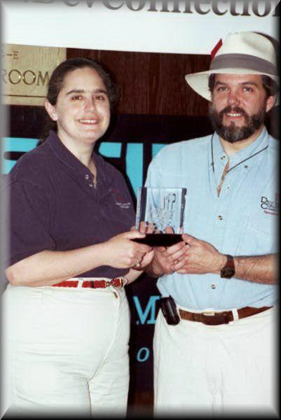
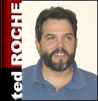
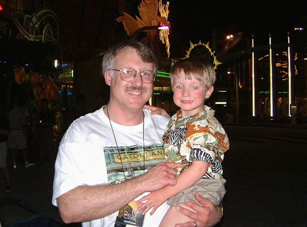

## Tamar Granor

*Tamar and
Ted win the Developer's Choice award for Best VFP Book for "The Hacker's
Guide to Visual FoxPro 6.0" at the 2000 VFP DevConnections conference in
New Orleans.*

Tamar E. Granor, Ph.D., has developed and enhanced numerous
FoxPro and Visual FoxPro applications for businesses and other organizations.
She currently focuses on working with other developers through consulting,
mentoring and subcontracting. Tamar served as Editor of *FoxPro Advisor* magazine
from 1994 to 2000, where she is currently Technical Editor and co-author of the
magazine's popular *Advisor Answers* column.
Tamar is co-author of *What's New in Visual FoxPro 7.0*,
*Microsoft Office Automation with Visual FoxPro*, and the *Hacker's
Guide to Visual FoxPro 6.0*, winner of the Visual FoxPro Developer's Choice
award. She is the Technical Editor of *Visual FoxPro Certification Exams
Study Guide*. All of these books are available from Hentzenwerke Publishing
[www.hentzenwerke.com](http://www.hentzenwerke.com).   

Tamar is a Microsoft Certified Professional and a Microsoft
Support Most Valuable Professional. Tamar speaks frequently about Visual FoxPro
at conferences and user groups in Europe and North America. She served as
Technical Content Manager for the 1997-1999 Visual FoxPro DevCons and was part
of the coordination team for the Visual FoxPro Excellence Awards.  You can reach Tamar at [tamar@tomorrowssolutionsllc.com](mailto:tamar@tomorrowssolutionsllc.com).

## Ted Roche

*Tamar and
Ted win the Developer's Choice award for Best VFP Book for "The Hacker's
Guide to Visual FoxPro 6.0" at the 2000 VFP DevConnections conference in
New Orleans.*

Ted Roche develops standalone, client-server and Web
applications using Microsoft Visual FoxPro, Microsoft SourceSafe, SQL Server,
and other best-of-breed tools. He is a consultant with Ted Roche &amp;
Associates, LLC, [http://www.tedroche.com](http://www.tedroche.com),
based in New Hampshire. Ted is author of "Essential SourceSafe"
(Hentzenwerke Publishing), co-author of the award-winning "Hacker's Guide
to Visual FoxPro" series, and a contributor to five other FoxPro books. In
addition to numerous magazine articles, he has spoken at conferences worldwide.
Ted is a Microsoft Certified Solution Developer, Microsoft Certified System
Engineer, and Microsoft Support Most Valuable Professional.
You can reach Ted at [tedroche@tedroche.com](mailto:tedroche@tedroche.com).

## Doug Hennig
<table>
<tr>
  <td width="50%" valign="top">

  </td>
  <td width="50%" valign="top">

  </td>
 </tr>
<tr>
  <td width="50%" valign="top">
  
<i>Doug Hennig, with son Nicholas, at VFP DevConnections in Orlando, 2001.</i>

  </td>
  <td width="50%" valign="top">
  
<i>Developer's Choice awards for both Stonefield Database Toolkit and Stonefield Reports.</i>

  </td>
 </tr>
</table>

Doug Hennig is a partner with Stonefield Software Inc. He is the author of the award-winning <a href="https://stonefieldquery.com" target="_blank">Stonefield Query</a>; the award-winning <a href="https://www.stonefieldquery.com/sdt.aspx" target="_blank">Stonefield Database Toolkit (SDT)</a>; the <a href="https://github.com/VFPX/MemberDataEditor" target="_blank">MemberData Editor</a>, <a href="https://github.com/VFPX/Wizards" target="_blank">Anchor Editor</a>, and <a href="https://github.com/VFPX/Wizards" target="_blank">CursorAdapter and DataEnvironment builders</a> that come with Microsoft Visual FoxPro; and the <a href="https://github.com/VFPX/My" target="_blank">My namespace</a> and updated <a href="https://github.com/VFPX/UpsizingWizard" target="_blank">Upsizing Wizard</a> in Sedna.

Doug is co-author of <i><a href="http://foxrockx.com/GetVFPX.htm" target="_blank">VFPX: Open Source Treasure for the VFP Developer</a></i>, <i>Making Sense of Sedna and SP2</i>, <i><a href="http://hentzenwerke.com/catalog/vfpbp10.htm" target="_blank">Visual FoxPro Best Practices For The Next Ten Years</a></i>, the <i><a href="http://hentzenwerke.com/catalog/wnvfp9.htm" target="_blank">What&#39;s New in Visual FoxPro</a></i> series, and <i><a href="http://hentzenwerke.com/catalog/hackfox7.htm" target="_blank">The Hacker&#39;s Guide to Visual FoxPro 7.0</a></i>. He was the technical editor of <i><a href="http://hentzenwerke.com/catalog/hackfox6.htm" target="_blank">The Hacker&#39;s Guide to Visual FoxPro 6.0</a></i> and <i><a href="http://hentzenwerke.com/catalog/fund6.htm" target="_blank">The Fundamentals</a></i>. Doug wrote hundreds of articles in 20 years for <i><a href="http://www.foxrockx.com" target="_blank">FoxRockX</a></i>, <i>FoxTalk</i>, <i>FoxPro Advisor</i>, <i>Advisor Guide to Visual FoxPro</i>, and <i>CoDe</i> magazines.

Doug spoke at every Microsoft FoxPro Developers Conference (DevCon) starting in 1997 and at user groups and developer conferences all over the world. He is one of the organizers of the annual <a href="http://www.swfox.net" target="_blank">Southwest Fox</a> conference. He is one of the administrators for the <a href="http://vfpx.org" target="_blank">VFPX</a> VFP community extensions Web site. He was a Microsoft Most Valuable Professional (MVP) from 1996 through 2011. Doug was awarded the <a href="http://fox.wikis.com/wc.dll?Wiki~FoxProCommunityLifetimeAchievementAward~Wiki" target="_blank">2006 FoxPro Community Lifetime Achievement Award</a>.

Personal email: <a href="mailto:doug@doughennig.com">doug@doughennig.com</a>  
Business email: <a href="mailto:dhennig@stonefield.com">dhennig@stonefield.com</a>  
Web: <a href="https://www.stonefieldquery.com" target="_blank">https://www.stonefieldquery.com</a>  
Blog: <a href="http://doughennig.blogspot.com" target="_blank">https://doughennig.blogspot.com</a>  
Twitter: <a href="https://twitter.com/DougHennig" target="_blank">https://www.twitter.com/DougHennig</a>  
Personal Web site: <a href="http://DougHennig.com" target="_blank">http:/www./DougHennig.com</a>

## Della Martin

*Della
(right), along with co-authors Tamar Granor and Ted Roche.*

Della Martin has worked on some of the most unusual FoxPro
and Visual FoxPro applications. She got her start writing a recruiting database
for Duke Basketball while attending Duke University. She has a degree with a
double major in Design and History.
Continuing in the line of non-traditional database
applications, Della worked for Woolpert, an architectural and engineering firm,
where she specialized in GIS work for such diverse applications as water
distribution systems, military master planning, oil well evacuation plans, and
facility management programs. She moved on to the University of Tennessee to
work on a military logistics application, JFAST, perhaps the most well known
VFP application in the world. At nearly every DevCon since 1994, attendees have
seen this cutting-edge application, which includes sophisticated briefing and
analysis tools developed by Della using Automation with many Microsoft
products.
Della now works for TakeNote Technologies ([http://www.takenote.com/](http://www.takenote.com/)), a Developer's Choice
Award winning training and consulting firm, as a developer and instructor.
Della has written for FoxPro Advisor and FoxTalk magazine, and served as a
judge for the 1998 and 1999 Visual FoxPro Excellence Awards. She speaks at
various conferences, including the Great Lakes Great Developers Workshop, VFP
DevConnections, and the Essential Fox conference. The Hacker's Guide to Visual
FoxPro is her second book; she co-authored Microsoft Office Automation with
Visual FoxPro, with Tamar Granor. Della lives in Cary, North Carolina, with her
husband and two children. You can reach Della at [dmartin2@nc.rr.com](mailto:dmartin2@nc.rr.com).
