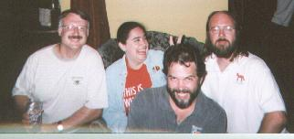
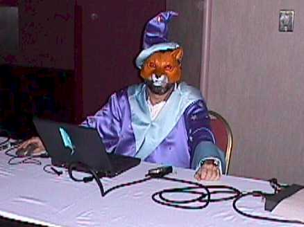
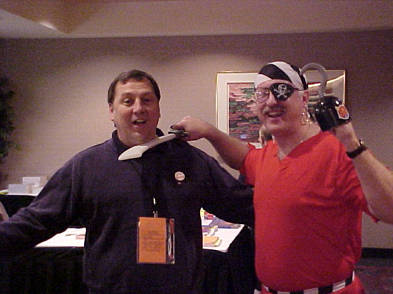
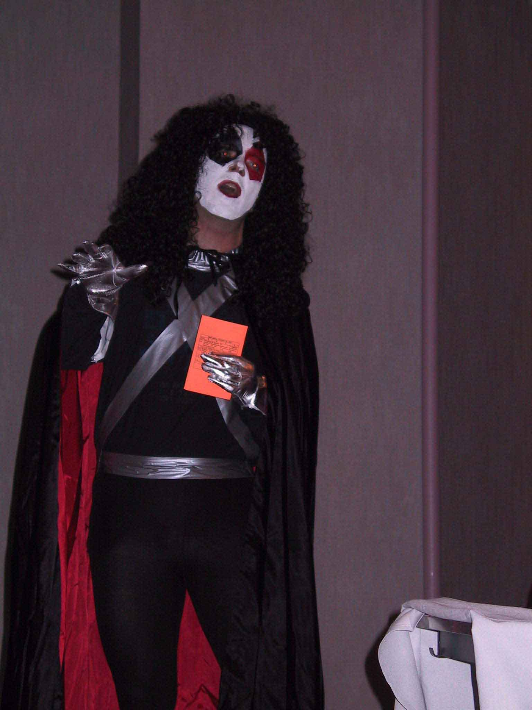

## The Official HackFox Easter Egg

  
With friends like these...
*l to r:* Co-authors Doug Hennig, Tamar E. Granor, and Ted Roche, Publishing Magnet Whil Hentzen  
DevCon, 1998

  
Ted, shown here preparing for a client meeting, is truly the HackFox wizard.  
Great Lakes Great Database Workshop, 2001

  
"Avast, ye landlubbers! Buy our book or Wayne will taste cold steel!"  
Wayne Willingham and The Love Pirate, Great Lakes Great Database Workshop, 2001

  
Our esteemed publisher, sans beard (and, apparently, dignity).  
Great Lakes Great Database Workshop, 2001
